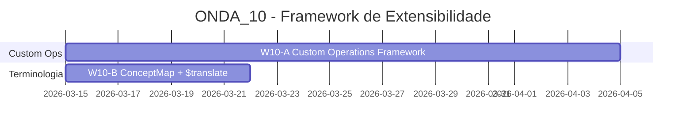

# 🏥 ONDA_10 — Framework de Extensibilidade

**Data:** 2026-02-24
**Status:** ✅ Concluída (W10-A + W10-B entregues)
**Filosofia:** **"Tenants criam suas próprias operações FHIR"**

---

## Visão Geral

A ONDA_10 habilita **extensibilidade** para que tenants criem operações FHIR customizadas e mapeiem terminologias entre sistemas:

1. **Custom Operations Framework** — Registry de operações por tenant
2. **ConceptMap Import + $translate** — Mapeamento de códigos entre terminologias



---

## Objetivos por Workstream

### W10-A — Custom Operations Framework (21 dias)

> **Responsável:** DEV0 | **Módulo:** `intellicare-grahame` + `intellicare-core`

**Objetivo:** Permitir que tenants registrem operações FHIR customizadas (instance-level e system-level).

**Entregas:**
- Registry de operações customizadas por tenant
- `POST /fhir/{ResourceType}/{id}/$custom-op` (instance)
- `POST /fhir/$custom-op` (system)
- Admin UI ou API para registrar operações
- Execução em sandbox (segurança)

**Critérios de Aceite:**
- Tenant registra operação "Patient/$exames-laboratoriais"
- Chamada executa lógica definida
- Operações isoladas por tenant

**Status de Execução (2026-02-25):** ✅ Concluída por DEV2

---

### W10-B — ConceptMap Import + $translate (7 dias)

> **Responsável:** DEV1 | **Módulo:** `intellicare-grahame` (Terminology)

**Objetivo:** Importar ConceptMap e expor operação `$translate` para mapeamento de códigos.

**Entregas:**
- Import de ConceptMap (Bundle ou recurso)
- Operação `ConceptMap/$translate`
- Mapeamento de códigos entre terminologias (ex: CID-10 ↔ SNOMED)

**Critérios de Aceite:**
- ConceptMap importado e indexado
- $translate retorna código equivalente
- Suporte a múltiplos ConceptMaps

**Status de Execução (2026-02-25):** ✅ Concluída por DEV2

---

## Estrutura de Documentação

```
ONDA_10/
├── README.md
├── W10-A_CUSTOM_OPERATIONS_FRAMEWORK/
│   ├── ESPECIFICACAO_FUNCIONAL.md
│   ├── ESPECIFICACAO_TECNICA.md
│   ├── PLANO_IMPLEMENTACAO.md
│   └── DIARIO_EXECUCAO.md
└── W10-B_CONCEPTMAP_TRANSLATE/
    ├── ESPECIFICACAO_FUNCIONAL.md
    ├── ESPECIFICACAO_TECNICA.md
    ├── PLANO_IMPLEMENTACAO.md
    └── DIARIO_EXECUCAO.md
```

---

## Pré-requisitos

- [x] ONDAS 1-9
- [x] Multi-tenancy (tenant context)
- [x] Terminology Service (W5-C)

---

**Planejado por:** DEV0
**Atualizado por:** DEV2
**Data:** 2026-02-25
**Versão:** 1.2.0
