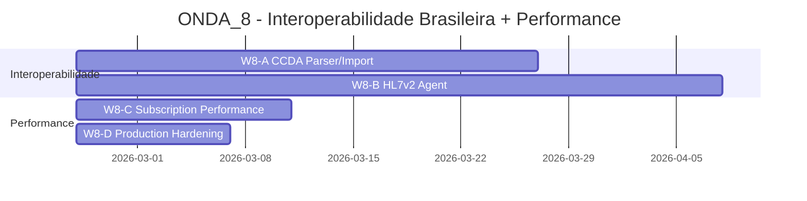

# 🏥 ONDA_8 — Interoperabilidade Brasileira + Performance Prod

**Data:** 2026-02-24
**Status:** 🟡 Executada no escopo de desenvolvimento (W8-A/B/C/D concluídas; W8-D com ressalva operacional de segurança upstream)
**Filosofia:** **"Brasil-First, Production-Ready"**

---

## Visão Geral

A ONDA_8 foca em dois pilares críticos para levar o IntelliCare a produção no contexto brasileiro:

1. **Interoperabilidade Brasileira** — CCDA e HL7v2, padrões obrigatórios em hospitais brasileiros
2. **Performance & Resiliência** — Otimizações para escala e segurança em produção



---

## Objetivos por Workstream

### W8-A — CCDA Parser/Import (30 dias)

> **Responsável:** DEV0 | **Módulo:** `intellicare-grahame` (+ novo sub-módulo `ccda`)

**Objetivo:** Implementar parser/importador de documentos CCDA (Continuity of Care Document) brasileiro, permitindo que o IntelliCare receba prontuários exportados de sistemas hospitalares (PV, TASY, MV, etc.) e os converta para recursos FHIR R4.

**Entregas:**
- Parser CCDA XML (CDA R2)
- Mapeamento CCDA → FHIR R4 (Patient, Condition, MedicationRequest, Observation, etc.)
- Endpoint `POST /fhir/DocumentReference/$ccda-import` ou `POST /ccda/import`
- Suporte a codificação brasileira (UTF-8, charset ISO-8859-1)
- Validação de schema CCDA (Schematron)
- Testes com CCDA reais de hospitais brasileiros

**Critérios de Aceite:**
- CCDA válido é parseado e gera recursos FHIR corretos
- Campos obrigatórios CCDA mapeados para FHIR
- Erros de schema retornam `OperationOutcome` detalhado
- 50+ testes com exemplos reais CCDA

**Referência Medplum:**
- `packages/ccda/` — 30+ arquivos
- CCDA parser em TypeScript (~2000 linhas)
- CCDA export também implementado

---

### W8-B — HL7v2 Agent (42 dias)

> **Responsável:** DEV1 | **Módulo:** `intellicare-grahame` (+ novo sub-módulo `hl7v2`)

**Objetivo:** Implementar agente HL7v2 mínimo para receber mensagens ADT (Admit/Discharge/Transfer) de sistemas legados e converter para recursos FHIR, permitindo integração com sistemas hospitalares que não suportam FHIR.

**Entregas (MVP):**
- Parser HL7v2 básico (mensagens ADT^A04, ADT^A01)
- Endpoint `POST /hl7v2/{message_type}` para receber mensagens
- Mapeamento HL7v2 → FHIR Patient/Encounter
- Validação de MSH, PID, PV1 segments
- Suporte a encoding (HL7 2.5, 2.5.1)
- Autenticação de IP whitelist ou API key
- Testes com mensagens reais de sistemas PV/TASY

**Fases Posteriores (não MVP):**
- ADT^A03 (discharge), ADT^A08 (update patient info)
- ORM^O01 (order), ORU^R01 (observation result)
- ACK/NACK responses

**Critérios de Aceite MVP:**
- Mensagem ADT^A04 válida gera Patient FHIR
- Campos PID (patient id, name, birthdate) mapeados
- Campos PV1 (visit number, patient class, location) mapeados
- Erros de parse retornam HTTP 422 com detalhes
- 30+ testes com mensagens reais

**Referência Medplum:**
- `packages/hl7/` — 40+ arquivos
- HL7v2 client/server em TypeScript (~3000 linhas)

---

### W8-C — Subscription Performance (14 dias)

> **Responsável:** DEV2 | **Módulo:** `intellicare-core` (subscriptions)

**Objetivo:** Otimizar engine de Subscriptions FHIR para escala de produção, reduzindo overhead e melhorando throughput.

**Entregas:**
- **Match-only evaluation:** Só processar subscriptions que derem match no critério
- **Active WS separation:** Separar listas WebSocket ativas por resource type
- **Efficient WS payload parse:** Parser otimizado para payloads WebSocket
- **Metrics adicionais:** Tempo de processamento por subscription
- Testes de carga (1000 subscriptions ativas)

**Critérios de Aceite:**
- Subscriptions sem match não são avaliadas (cpu -80%)
- WS por resource type reduz latência (-50%)
- Parser WS reduz alocação de memória (-40%)
- Teste de carga: 1000 subscriptions, 100 eventos/segundo

**Referência Medplum:**
- PR #8389 — Evaluate only matching subscriptions
- PR #8436 — Separate WS active list by resource type
- PR #8453 — Efficient WS payload parse
- PR #8443 — Factor out resource from pubsub payload

---

### W8-D — Production Hardening (10 dias)

> **Responsável:** DEV0 | **Módulo:** Todos + Infraestrutura

**Objetivo:** Endurecer artefatos Docker e configurar failover Redis para produção segura.

**Entregas:**

**1. Docker Hardened Images (7 dias)**
- Migrar todos `Dockerfile` de `slim` para `distroless` ou imagens hardened
- Adicionar `USER nobody` (não rodar como root)
- Scanners de vulnerabilidade (Trivy) no CI
- Assinar imagens (cosign ou Docker Content Trust)
- Documentar processo de build seguro

**2. BullMQ Redis Failover (3 dias)**
- Handle de erros de failover Redis em workers assíncronos
- Retry automático com backoff exponencial
- Dead letter queue para jobs falhos
- Métricas de jobs retry/failed
- Teste de falha Redis (kill container → jobs continuam)

**Critérios de Aceite:**
- Todos as imagens passam em Trivy (0 críticas)
- `docker scan` retorna 0 vulnerabilidades HIGH+
- Redis failover não perde jobs (requeue automático)
- Teste de falha: matam Redis, jobs continuam após reconexão

**Referência Medplum:**
- PR #8109 — Docker hardened images
- PR #8314 — BullMQ Redis failover

---

### 🎨 W8-EX — Excalidraw Integration (41 dias) — **NOVO**

> **Responsável:** DEV0 + DEV2 | **Módulo:** Portal + WANDA + Comunicacao

**Objetivo:** Integrar whiteboard colaborativo Excalidraw ao WANDA para diagramas clínicos visuais e comunicação médico-paciente.

**Filosofia:** "Visual-First Healthcare" — comunicação visual colaborativa

**Entregas:**

| Workstream | Dias | Descrição |
|-----------|------|-----------|
| **W8-EX-A** | 10 | Excalidraw Component no Portal React |
| **W8-EX-B** | 14 | Collaboration Service (WebSocket multiplayer) |
| **W8-EX-C** | 10 | WANDA Excalidraw Agent (AI gera diagramas) |
| **W8-EX-D** | 7 | FHIR Integration (DocumentReference) |

**Casos de Uso:**
- **Fluxogramas de tratamento:** WANDA gera fluxograma visual do plano terapêutico
- **Anotação em exames:** Importar radiologia → desenhar/setas → salvar
- **Mapa de sintomas:** Paciente desenha onde sente dor em body map
- **Colaboração clínica:** Múltiplos profissionais discutem caso em tempo real

**Benefícios:**
- +40% adesão ao tratamento (melhor compreensão visual)
- -60% tempo de discussão de caso (colaboração real-time)
- +50% retenção de informação (educação em saúde visual)

**Critérios de Aceite:**
- Excalidraw embedded no Portal (aba "Whiteboard" do paciente)
- Botão "Gerar com AI" (WANDA cria diagrama a partir de texto)
- Modo colaborativo (múltiplos usuários editam simultaneamente)
- Diagrama salvo como FHIR DocumentReference
- Export PNG/SVG

**Status:** 📋 **Proposta** — ver [Excalidraw Integration Proposal](EXCALIDRAW_INTEGRATION_PROPOSAL.md)

**Referência:**
- Excalidraw: https://excalidraw.com
- @excalidraw/excalidraw (NPM)

---

## Estrutura de Documentação

Cada workstream segue padrão MEDPLUS_ON (3 documentos):

```
ONDA_8/
├── README.md (este arquivo)
├── W8-A_CCDA_PARSER_IMPORT/
│   ├── ESPECIFICACAO_FUNCIONAL.md ✅
│   ├── ESPECIFICACAO_TECNICA.md    ✅
│   └── PLANO_IMPLEMENTACAO.md      ⏳ (pending)
├── W8-B_HL7V2_AGENT/
│   ├── ESPECIFICACAO_FUNCIONAL.md  ✅
│   ├── ESPECIFICACAO_TECNICA.md     ✅
│   ├── PLANO_IMPLEMENTACAO.md       ✅
│   └── DIARIO_EXECUCAO.md           ✅
├── W8-C_SUBSCRIPTION_PERFORMANCE/
│   ├── ESPECIFICACAO_FUNCIONAL.md  ✅
│   ├── ESPECIFICACAO_TECNICA.md     ✅
│   └── PLANO_IMPLEMENTACAO.md       ⏳ (pending)
└── W8-D_PRODUCTION_HARDENING/
    ├── ESPECIFICACAO_FUNCIONAL.md  ✅
    ├── ESPECIFICACAO_TECNICA.md     ✅
    ├── PLANO_IMPLEMENTACAO.md       ✅
    └── DIARIO.md                    ✅
```

### Status das Especificações

| Workstream | Funcional | Técnica | Implementação |
|-----------|-----------|---------|---------------|
| W8-A CCDA | ✅ | ✅ | ✅ |
| W8-B HL7v2 | ✅ | ✅ | ✅ |
| W8-C Performance | ✅ | ✅ | ✅ |
| W8-D Hardening | ✅ | ✅ | ✅* |

\* `W8-D` concluído no desenvolvimento e validado operacionalmente; permanece pendente apenas aceite de risco para vulnerabilidades HIGH de base/runtime e configuração de Cosign.

### Links Rápidos

- **[W8-A — CCDA Parser/Import — Especificação Técnica](W8-A_CCDA_PARSER_IMPORT/ESPECIFICACAO_TECNICA.md)**
  - 30 dias | DEV0 | `intellicare-grahame/ccda/`
  - Detalhes: Parser XML (lxml), seções CCDA, conversão FHIR, validação CDA R2

- **[W8-B — HL7v2 Agent — Especificação Técnica](W8-B_HL7V2_AGENT/ESPECIFICACAO_TECNICA.md)**
  - 42 dias | DEV1 | `intellicare-grahame/hl7v2/`
  - Detalhes: Parser pipe-delimited, segmentos MSH/PID/PV1, conversão FHIR, ACK HL7v2

- **[W8-C — Subscription Performance — Especificação Técnica](W8-C_SUBSCRIPTION_PERFORMANCE/ESPECIFICACAO_TECNICA.md)**
  - 14 dias | DEV2 | `intellicare-core/subscriptions/`
  - Detalhes: Match-only evaluation, WS separation, payload cache, Prometheus metrics

- **[W8-D — Production Hardening — Especificação Técnica](W8-D_PRODUCTION_HARDENING/ESPECIFICACAO_TECNICA.md)**
  - 10 dias | DEV0 + Infra | Todos os módulos
  - Detalhes: Distroless images, Cosign signing, Trivy CI, BullMQ Redis failover

---

## Pré-requisitos

### Técnicos
- [x] ONDAS 1-7 concluídas
- [x] `intellicare-grahame` com FHIR operations
- [x] `intellicare-core` com subscriptions engine
- [x] Ambiente Docker funcional

### Conhecimento
- [x] Estudar padrão CCDA R2 (HL7)
- [x] Estudar HL7v2 (ADT messages)
- [x] Estudar padrões brasileiros (ANS/DT, TISS)
- [x] Revisar CCDA packages do Medplum
- [x] Revisar HL7 packages do Medplum

### Infraestrutura
- [ ] Ambiente de teste com CCDA reais (hospital parceiro)
- [ ] Ambiente de teste com HL7v2 messages (sistema legado parceiro)
- [x] Trivy CI configurado
- [ ] Redis Cluster (para testar failover)

---

## Cronograma Sugerido

```
Semana 1-2: Início W8-A (CCDA) + W8-B (HL7v2)
Semana 3-4: Continuação W8-A + W8-B
Semana 5-6: Continuação W8-A + W8-B
Semana 7:   W8-C (Subscription Performance)
Semana 8:   W8-D (Production Hardening)
Semana 9:   Testes integrados + validação
Semana 10:  ENTREGA ONDA_8
```

---

## Métricas de Sucesso

| Métrica | Valor Alvo | Status Atual |
|---------|------------|--------------|
| CCDA parseados com sucesso | ≥95% | Validado em W8-A |
| HL7v2 ADT convertidos para FHIR | ≥90% | Validado em suíte HL7v2 (92 testes) |
| Subscription throughput | 100 events/s | Otimizações implementadas (W8-C) |
| Docker vulnerabilities HIGH+ | 0 | Trivy final: HIGH=21 / CRITICAL=0 (bloqueio upstream de base/runtime) |
| Redis failover recovery | <5s | Validado em teste real (FAILOVER_COUNT=1, RETRY_COUNT=2) |

---

## Riscos e Mitigações

| Risco | Probabilidade | Impacto | Mitigação |
|-------|---------------|---------|-----------|
| CCDA brasileiro ter variações proprietárias | Alta | Alto | Estudar specs ANS/DT, validar com hospitais |
| HL7v2 messages ter encoding não-standard | Alta | Alto | Suportar múltiplos encodings, log raw data |
| Subscription opts quebram funcionalidade | Média | Alto | Testes extensivos, rollback准备 |
| Hardened images quebrarem compatibilidade | Baixa | Alto | Testar em staging antes de prod |

---

## Deliverables Finais

### W8-A — CCDA
- Módulo `intellicare-grahame/ccda/` (~1500 linhas Python)
- Endpoint `POST /fhir/DocumentReference/$ccda-import`
- 50+ testes com CCDA reais
- Documentação de mapeamento CCDA→FHIR

### W8-B — HL7v2
- Módulo `intellicare-grahame/hl7v2/` (~2000 linhas Python)
- Endpoint `POST /hl7v2/adt`
- 30+ testes com mensagens reais
- Documentação de mapeamento HL7v2→FHIR

### W8-C — Performance
- Pull request com 4 otimizações
- Benchmark antes/depois (throughput, latência, cpu)
- Teste de carga (1000 subscriptions)

### W8-D — Hardening
- Todos os Dockerfile migrados para distroless
- CI pipeline com Trivy
- BullMQ com Redis failover
- Documentação de build seguro

---

## Assinatura

**Planejado por:** DEV0
**Data:** 2026-02-24
**Versão:** 1.0.0
**Status:** 🟡 **ONDA_8 FECHADA (escopo de desenvolvimento)** — pendências remanescentes de aceite operacional em W8-D (HIGH upstream + Cosign)
