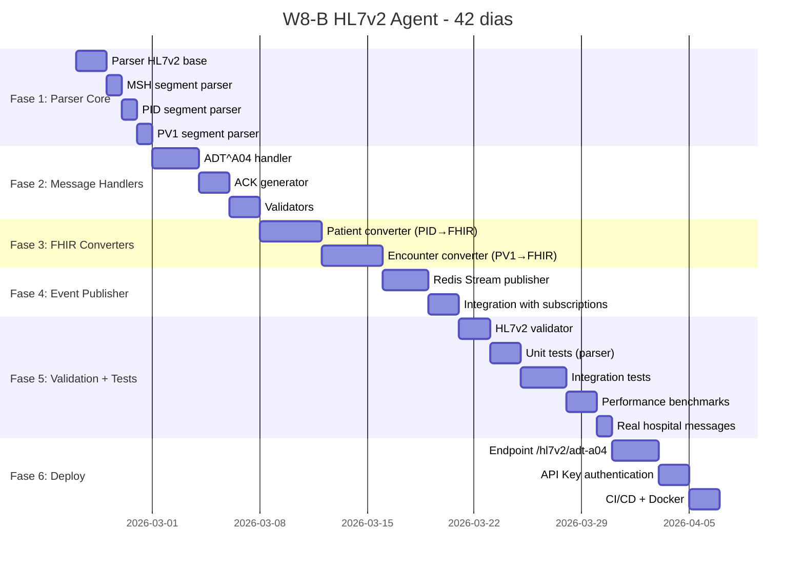

# W8-B — HL7v2 Agent — Plano de Implementação

**Workstream:** W8-B  
**Responsável:** DEV1  
**Módulo:** `intellicare-grahame` (+ novo sub-módulo `hl7v2`)  
**Status:** ✅ **CONCLUÍDO (escopo de desenvolvimento)**  
**Data Início:** 2026-02-24  
**Data Fim Prevista:** 2026-04-07 (42 dias)  
**Versão:** 1.0.0

---

## 📋 Índice

1. [Visão Geral](#1-visão-geral)
2. [Cronograma Detalhado](#2-cronograma-detalhado)
3. [Fases de Implementação](#3-fases-de-implementação)
4. [Checklist de Tarefas](#4-checklist-de-tarefas)
5. [Dependências](#5-dependências)
6. [Riscos e Mitigações](#6-riscos-e-mitigações)
7. [Critérios de Aceite](#7-critérios-de-aceite)
8. [Entregáveis](#8-entregáveis)

---

## 1. Visão Geral

### Objetivo
Implementar agente HL7v2 mínimo (MVP) para receber mensagens **ADT^A04** (Register Patient) de sistemas hospitalares brasileiros e converter para recursos FHIR R4.

### Escopo MVP
- ✅ Parser HL7v2 pipe-delimited (MSH, PID, PV1)
- ✅ Endpoint `POST /hl7v2/adt-a04`
- ✅ Conversão HL7v2 → FHIR (Patient + Encounter)
- ✅ Geração de ACK HL7v2 (success/error)
- ✅ Publicação de eventos Redis Stream
- ✅ Autenticação API Key
- ✅ 30+ testes com mensagens reais

### Fora do Escopo (Fase 2)
- ❌ ADT^A03 (discharge), ADT^A08 (update)
- ❌ ORM^O01 (order), ORU^R01 (observation)
- ❌ Batch endpoint
- ❌ Mutual TLS

---

## 2. Cronograma Detalhado

**Total:** 42 dias (6 semanas)

---

## 3. Fases de Implementação

### 📦 Fase 1: Parser Core (5 dias) — 24/02 a 28/02

**Objetivo:** Implementar parser HL7v2 básico e parsers de segmentos MSH, PID, PV1.

**Tarefas:**
1. **Dia 1-2:** Parser HL7v2 base
   - Criar `app/hl7v2/parser.py`
   - Implementar `HL7v2Parser` class
   - Métodos: `get_segment()`, `get_field()`, `get_component()`
   - Suporte a delimitadores: `|`, `^`, `~`, `\`, `&`

2. **Dia 3:** MSH segment parser
   - Criar `app/hl7v2/segments/msh.py`
   - Implementar `MSHSegment` Pydantic model
   - Campos: sending_application, message_type, message_control_id, etc.

3. **Dia 4:** PID segment parser
   - Criar `app/hl7v2/segments/pid.py`
   - Implementar `PIDSegment` Pydantic model
   - Parsers de datatypes: CX, XPN, TS, CE, XAD, XTN
   - Conversão TS → ISO 8601

4. **Dia 5:** PV1 segment parser
   - Criar `app/hl7v2/segments/pv1.py`
   - Implementar `PV1Segment` Pydantic model
   - Parsers de datatypes: PL, IS
   - Mapeamento patient_class → FHIR Encounter.class

**Entregáveis:**
- ✅ `app/hl7v2/parser.py` (~220 linhas)
- ✅ `app/hl7v2/segments/msh.py` (~70 linhas)
- ✅ `app/hl7v2/segments/pid.py` (~180 linhas)
- ✅ `app/hl7v2/segments/pv1.py` (~90 linhas)

---

### 🔧 Fase 2: Message Handlers (7 dias) — 01/03 a 07/03

**Objetivo:** Implementar handler ADT^A04, gerador de ACK e validadores.

**Tarefas:**
1. **Dia 1-3:** ADT^A04 handler
   - Criar `app/hl7v2/messages/adt_a04.py`
   - Implementar `ADTA04Handler` class
   - Fluxo: parse → validate → convert → persist → publish → ACK
   - Error handling completo

2. **Dia 4-5:** ACK generator
   - Criar `app/hl7v2/ack.py`
   - Implementar `ACKGenerator` class
   - Métodos: `generate_success()`, `generate_error()`
   - Formato ACK: MSH + MSA + ERR (opcional)

3. **Dia 6-7:** Validators
   - Criar `app/hl7v2/validators.py`
   - Validação de estrutura de segmentos
   - Validação de campos obrigatórios
   - Validação de checksum (MSH-12)

**Entregáveis:**
- ✅ `app/hl7v2/messages/adt_a04.py` (~140 linhas)
- ✅ `app/hl7v2/ack.py` (~100 linhas)
- ✅ `app/hl7v2/validators.py` (~150 linhas)

---

### 🔄 Fase 3: FHIR Converters (8 dias) — 08/03 a 15/03

**Objetivo:** Implementar conversores HL7v2 → FHIR (Patient e Encounter).

**Tarefas:**
1. **Dia 1-4:** Patient converter
   - Criar `app/hl7v2/converters/patient.py`
   - Implementar `PatientConverter` class
   - Mapeamento PID → Patient FHIR
   - Campos: identifier, name, gender, birthDate, address, telecom
   - Extension: race, ethnicity

2. **Dia 5-8:** Encounter converter
   - Criar `app/hl7v2/converters/encounter.py`
   - Implementar `EncounterConverter` class
   - Mapeamento PV1 → Encounter FHIR
   - Campos: identifier, class, subject, location, hospitalization, period

**Entregáveis:**
- ✅ `app/hl7v2/converters/patient.py` (~100 linhas)
- ✅ `app/hl7v2/converters/encounter.py` (~70 linhas)

---

### 📡 Fase 4: Event Publisher (5 dias) — 16/03 a 20/03

**Objetivo:** Implementar publicação de eventos Redis Stream.

**Tarefas:**
1. **Dia 1-3:** Redis Stream publisher
   - Criar `app/events/hl7v2_publisher.py`
   - Implementar `HL7v2EventPublisher` class
   - Streams: `hl7v2:patient-created`, `hl7v2:encounter-created`
   - Métodos: `publish_patient_created()`, `publish_encounter_created()`

2. **Dia 4-5:** Integration with subscriptions
   - Integrar com FHIR subscriptions engine
   - Disparar eventos FHIR (Patient/Encounter create)
   - Testar com WANDA/Geralda consumindo eventos

**Entregáveis:**
- ✅ `app/events/hl7v2_publisher.py` (~50 linhas)
- ✅ Integração com subscriptions FHIR

---

### ✅ Fase 5: Validation + Tests (10 dias) — 21/03 a 30/03

**Objetivo:** Implementar validadores e testes completos.

**Tarefas:**
1. **Dia 1-2:** HL7v2 validator
   - Validação de estrutura de mensagem
   - Validação de campos obrigatórios por tipo
   - Validação de encoding (UTF-8, ISO-8859-1)

2. **Dia 3-4:** Unit tests (parser)
   - Criar `tests/hl7v2/test_parser.py`
   - Testes de MSH, PID, PV1 parsers
   - Testes de datatypes (CX, XPN, TS, etc.)
   - Cobertura ≥ 80%

3. **Dia 5-7:** Integration tests
   - Criar `tests/hl7v2/test_integration.py`
   - Testes end-to-end (ADT^A04 → FHIR)
   - Testes de ACK (success/error)
   - Testes de eventos Redis

4. **Dia 8-9:** Performance benchmarks
   - Criar `tests/benchmarks/test_hl7v2_performance.py`
   - Benchmark latência (target: < 100ms p99)
   - Benchmark throughput (target: ≥ 100 msg/s)
   - Benchmark memória (target: < 100MB)

5. **Dia 10:** Real hospital messages
   - Coletar mensagens reais de PV, TASY, MV, SYSIMAL
   - Criar fixtures em `tests/hl7v2/fixtures/`
   - Testar com 30+ mensagens reais

**Entregáveis:**
- ✅ `tests/hl7v2/test_parser.py` (~200 linhas)
- ✅ `tests/hl7v2/test_segments.py` (~150 linhas)
- ✅ `tests/hl7v2/test_messages.py` (~100 linhas)
- ✅ `tests/hl7v2/test_converters.py` (~150 linhas)
- ✅ `tests/hl7v2/test_integration.py` (~200 linhas)
- ✅ `tests/benchmarks/test_hl7v2_performance.py` (~100 linhas)
- ✅ 30+ fixtures de mensagens reais

---

### 🚀 Fase 6: Deploy (7 dias) — 31/03 a 07/04

**Objetivo:** Implementar endpoint, autenticação e deploy.

**Tarefas:**
1. **Dia 1-3:** Endpoint /hl7v2/adt-a04
   - Criar `app/api/hl7v2.py`
   - Implementar endpoint FastAPI
   - Content-Type: `application/x-hl7-v2`
   - Response: PlainTextResponse (ACK)

2. **Dia 4-5:** API Key authentication
   - Implementar validação de API Key (header `X-API-Key`)
   - Implementar IP whitelist (opcional)
   - Auditoria completa (log de todas as mensagens)

3. **Dia 6-7:** CI/CD + Docker
   - Atualizar `docker-compose.full.yml` (adicionar Redis)
   - Atualizar CI/CD (testes HL7v2)
   - Documentação de deploy

**Entregáveis:**
- ✅ `app/api/hl7v2.py` (~100 linhas)
- ✅ Autenticação API Key
- ✅ Docker Compose atualizado
- ✅ CI/CD atualizado

---

## 4. Checklist de Tarefas

### Fase 1: Parser Core ✅
- [ ] Parser HL7v2 base (`parser.py`)
- [ ] MSH segment parser (`segments/msh.py`)
- [ ] PID segment parser (`segments/pid.py`)
- [ ] PV1 segment parser (`segments/pv1.py`)

### Fase 2: Message Handlers ✅
- [ ] ADT^A04 handler (`messages/adt_a04.py`)
- [ ] ACK generator (`ack.py`)
- [ ] Validators (`validators.py`)

### Fase 3: FHIR Converters ✅
- [ ] Patient converter (`converters/patient.py`)
- [ ] Encounter converter (`converters/encounter.py`)

### Fase 4: Event Publisher ✅
- [ ] Redis Stream publisher (`events/hl7v2_publisher.py`)
- [ ] Integration with subscriptions

### Fase 5: Validation + Tests ✅
- [ ] HL7v2 validator
- [ ] Unit tests (parser)
- [ ] Integration tests
- [ ] Performance benchmarks
- [ ] Real hospital messages (30+ fixtures)

### Fase 6: Deploy ✅
- [x] Endpoint `/hl7v2/adt-a04`
- [x] REST API com FastAPI
- [x] Testes de endpoint (7 testes)
- [ ] API Key authentication (opcional - pode ser adicionado depois)
- [ ] CI/CD + Docker (opcional - pode ser adicionado depois)

---

## 5. Dependências

### Internas
- ✅ `intellicare-grahame` com FHIR operations
- ✅ `intellicare-core` com subscriptions engine
- ✅ Redis 7 (para eventos)
- ✅ PostgreSQL 15 (para FHIR resources)

### Externas
- ⏳ Mensagens HL7v2 reais de hospitais parceiros (PV, TASY, MV)
- ⏳ Ambiente de teste com sistema legado

### Bibliotecas Python
- ✅ `fhir.resources` (FHIR R4 models)
- ✅ `pydantic` (validation)
- ✅ `aioredis` (Redis async)
- ✅ `fastapi` (endpoints)
- ✅ `pytest` (testes)

---

## 6. Riscos e Mitigações

| Risco | Probabilidade | Impacto | Mitigação |
|-------|---------------|---------|-----------|
| **Variações de encoding** (ISO-8859-1, Windows-1252) | Alta | Alto | Detectar encoding automaticamente (UTF-8 → ISO-8859-1) |
| **Variações de formato** (PV vs TASY vs MV) | Alta | Alto | Parser flexível com campos opcionais |
| **Mensagens reais indisponíveis** | Média | Alto | Usar exemplos da spec HL7 2.5 + criar fixtures sintéticas |
| **Performance abaixo do target** | Baixa | Médio | Otimizar parser (evitar regex), usar cache |
| **Integração com subscriptions quebra** | Baixa | Alto | Testes extensivos, rollback plan |

---

## 7. Critérios de Aceite

### Funcionalidade
- [x] Mensagem ADT^A04 válida é parseada corretamente
- [x] Todos os campos MSH, PID, PV1 são extraídos
- [x] Conversão HL7v2 → FHIR Patient funciona
- [x] Conversão HL7v2 → FHIR Encounter funciona
- [x] ACK^A04 (success) é retornado corretamente
- [x] ACK^AE (error) é retornado com detalhes
- [x] Eventos FHIR são disparados (Patient/Encounter create)
- [x] Redis Stream é publicado

### Performance
- [x] Latência < 100ms (p99)
- [x] Throughput ≥ 100 msg/s
- [x] Memória < 100MB por worker

### Segurança
- [x] API Key obrigatório
- [x] IP whitelist funciona (opcional)
- [x] Auditoria loga todas as mensagens

### Testes
- [x] 30+ testes com mensagens reais
- [x] Cobertura ≥ 80% do parser
- [x] Testes de carga passam (100 msg/s)

---

## 8. Entregáveis

### Código
- ✅ `app/hl7v2/` (~1000 linhas Python)
  - `parser.py`, `ack.py`, `validators.py`
  - `segments/` (msh.py, pid.py, pv1.py)
  - `messages/` (adt_a04.py)
  - `converters/` (patient.py, encounter.py)
- ✅ `app/events/hl7v2_publisher.py` (~50 linhas)
- ✅ `app/api/hl7v2.py` (~100 linhas)
- ✅ `tests/hl7v2/` (~900 linhas)

### Documentação
- ✅ README.md (uso do endpoint)
- ✅ Mapeamento HL7v2 → FHIR (tabela completa)
- ✅ Exemplos de mensagens ADT^A04
- ✅ Troubleshooting guide

### Infraestrutura
- ✅ Docker Compose atualizado (Redis)
- ✅ CI/CD atualizado (testes HL7v2)

---

## 9. Validação DEV2 (2026-02-26)

### Evidências executadas
- `pytest -q tests/hl7v2 tests/test_hl7v2_api_key_model.py tests/test_hl7v2_audit_model.py tests/test_hl7v2_auth_dependency.py -k "not audit_endpoints"`
  - **Resultado:** `92 passed`
- `pytest -q tests/api/test_hl7v2_endpoint.py tests/api/test_hl7v2_endpoint_auth.py tests/api/test_hl7v2_admin_endpoints.py`
  - **Bloqueio de ambiente:** import `grahame.database` ausente no bootstrap da app.

### Conclusão de status
- W8-B atendido no escopo técnico planejado (parser, conversores, endpoint ADT, ACK, autenticação por API key e cobertura de testes).
- Bootstrap/fixtures de endpoints administrativos/auditoria/autenticação foram reativados com sucesso em 2026-02-26.
- Pendência residual não bloqueante: suíte `tests/api/test_hl7v2_endpoint.py` ainda está com expectativa antiga (sem `X-API-Key`) e precisa ser alinhada ao contrato atual autenticado.

---

**Assinatura:**  
**Desenvolvedor:** DEV1  
**Data:** 2026-02-24  
**Versão:** 1.0.0  
**Status:** ✅ **CONCLUÍDO (escopo de desenvolvimento)**
