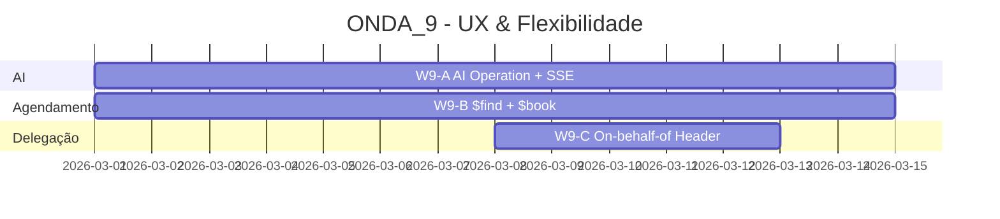

# 🏥 ONDA_9 — UX & Flexibilidade (Maior Impacto Imediato)

**Data:** 2026-02-24
**Status:** 📋 Planejamento
**Filosofia:** **"Experiência de Usuário e Delegação de Acesso"**

---

## Visão Geral

A ONDA_9 foca em melhorias de **alto impacto** que elevam a experiência do usuário e habilitam cenários de delegação de acesso:

1. **AI Operation + SSE** — Endpoint padronizado com streaming para respostas de IA
2. **$find + $book** — Operações FHIR de agendamento (slots e reservas)
3. **On-behalf-of Header** — Delegação de acesso (médico A age em nome de médico B)



---

## Objetivos por Workstream

### W9-A — AI Operation + SSE (14 dias)

> **Responsável:** DEV2 | **Módulo:** `intellicare-grahame` + `intellicare-wanda`

**Objetivo:** Expor operação AI padronizada via FHIR com streaming SSE, reutilizando Florence/Geralda como backend.

**Entregas:**
- Endpoint `POST /fhir/$ai` ou `POST /ai` com streaming SSE
- Respostas longas em tempo real (sem esperar conclusão)
- Integração com Florence (interpretação) e Geralda (cuidado)
- Documentação de contrato AI Operation

**Critérios de Aceite:**
- Streaming SSE funcional para respostas > 5s
- Fallback para resposta completa se não-SSE
- Timeout configurável; cancelamento de streaming

---

### W9-B — $find + $book (14 dias)

> **Responsável:** DEV1 | **Módulo:** `intellicare-grahame` (FHIR operations)

**Objetivo:** Implementar operações FHIR de agendamento conforme Medplum v5.0.12+.

**Entregas:**
- `Schedule/$find` — buscar slots disponíveis
- `Appointment/$book` — reservar slot
- Integração com recurso Schedule e Slot
- Validação de conflitos

**Critérios de Aceite:**
- $find retorna slots disponíveis
- $book cria Appointment e atualiza Slot
- Conflitos retornam OperationOutcome

---

### W9-C — On-behalf-of Header (5 dias)

> **Responsável:** DEV0 | **Módulo:** `intellicare-auth` + `intellicare-core`

**Objetivo:** Suportar header `X-On-Behalf-Of` para delegação de acesso.

**Entregas:**
- Parser do header `X-On-Behalf-Of: {user_id}`
- Validação de permissão de delegação
- Auditoria de ações em nome de outro usuário
- Documentação de uso

**Critérios de Aceite:**
- Requisições com header usam contexto do usuário delegado
- Auditoria registra actor + on-behalf-of
- Sem header: comportamento atual preservado

---

## Estrutura de Documentação

```
ONDA_9/
├── README.md (este arquivo)
├── W9-A_AI_OPERATION_SSE/
│   ├── ESPECIFICACAO_FUNCIONAL.md
│   ├── ESPECIFICACAO_TECNICA.md
│   └── PLANO_IMPLEMENTACAO.md
├── W9-B_FIND_BOOK_AGENDAMENTO/
│   ├── ESPECIFICACAO_FUNCIONAL.md
│   ├── ESPECIFICACAO_TECNICA.md
│   └── PLANO_IMPLEMENTACAO.md
└── W9-C_ON_BEHALF_OF/
    ├── ESPECIFICACAO_FUNCIONAL.md
    ├── ESPECIFICACAO_TECNICA.md
    └── PLANO_IMPLEMENTACAO.md
```

---

## Pré-requisitos

- [x] ONDAS 1-8 concluídas ou em andamento
- [x] Florence/Geralda operacionais
- [x] intellicare-auth com Keycloak

---

## Cronograma Sugerido

```
Semana 1-2: W9-A (AI) + W9-B ($find/$book) em paralelo
Semana 2-3: W9-C (On-behalf-of) + integração
Semana 3:   Testes integrados + validação
```

---

**Planejado por:** DEV0
**Data:** 2026-02-24
**Versão:** 1.0.0
