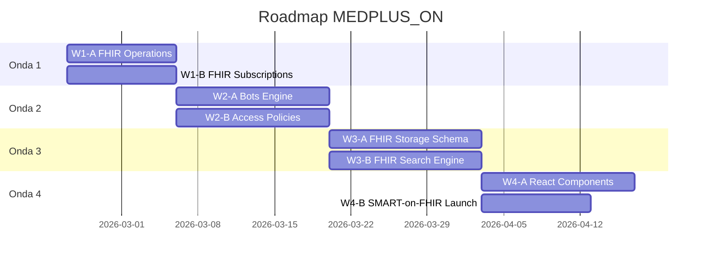

# 🗺️ Roadmap de Absorção — Medplum → IntelliCare
**Criado:** 2026-02-23 | **Filosofia:** FHIR-First, Python-Native

---

## Princípios

1. **Absorver a filosofia, não copiar código** — Medplum é TypeScript, nós somos Python
2. **Ondas sequenciais, workstreams paralelos** — Cada onda tem workstreams independentes para 4 devs
3. **Manter microserviços** — Não copiar o monolito do Medplum
4. **Cada workstream tem 3 documentos** — `ESPECIFICACAO_FUNCIONAL.md`, `ESPECIFICACAO_TECNICA.md`, `PLANO_IMPLEMENTACAO.md`

---

## Visão Geral das Ondas

---

## Onda 1 — FHIR Operations + Subscriptions

> **Pré-requisito:** Grahame e Core existentes
> **Resultado:** CDR com operações FHIR reais e notificações event-driven

| Workstream | Dev | Módulo Alvo | Descrição |
|---|---|---|---|
| **W1-A** | Dev 1-2 | `intellicare-grahame` | 5 operações FHIR: `$everything`, `$summary`, `$evaluate-measure`, `$validate`, `$expand` |
| **W1-B** | Dev 3-4 | `intellicare-core` + `intellicare-comunicacao` | Engine de Subscriptions FHIR com REST-hook, WebSocket, filtros FHIR |

📁 [W1-A: FHIR Operations](file:///C:/User\egara/INTELLICARE/docs/PLANNER-ANTIGRAVITY/MEDPLUS_ON/ONDA_1/W1-A_FHIR_OPERATIONS/)
📁 [W1-B: FHIR Subscriptions](file:///C:/User\egara/INTELLICARE/docs/PLANNER-ANTIGRAVITY/MEDPLUS_ON/ONDA_1/W1-B_FHIR_SUBSCRIPTIONS/)

---

## Onda 2 — Bots Engine + Access Policies

> **Pré-requisito:** Onda 1 (operações e subscriptions básicas)
> **Resultado:** Lógica configurável por tenant + controle de acesso granular

| Workstream | Dev | Módulo Alvo | Descrição |
|---|---|---|---|
| **W2-A** | Dev 1-2 | `intellicare-core` (novo sub-módulo `bots`) | Engine de automações Python executadas em resposta a eventos FHIR |
| **W2-B** | Dev 3-4 | `intellicare-core` + `intellicare-auth` | Access Policies FHIR com controle por recurso, campo, compartment e FHIRPath |

📁 [W2-A: Bots Engine](file:///C:/User\egara/INTELLICARE/docs/PLANNER-ANTIGRAVITY/MEDPLUS_ON/ONDA_2/W2-A_BOTS_ENGINE/)
📁 [W2-B: Access Policies](file:///C:/User\egara/INTELLICARE/docs/PLANNER-ANTIGRAVITY/MEDPLUS_ON/ONDA_2/W2-B_ACCESS_POLICIES/)

---

## Onda 3 — FHIR-Native Storage + Search Engine

> **Pré-requisito:** Onda 2 (bots e access policies)
> **Resultado:** Dados clínicos nativamente FHIR no PostgreSQL

| Workstream | Dev | Módulo Alvo | Descrição |
|---|---|---|---|
| **W3-A** | Dev 1-2 | `intellicare-core` (FHIR storage) | Schema PostgreSQL para armazenamento nativo de recursos FHIR com versionamento |
| **W3-B** | Dev 3-4 | `intellicare-core` (FHIR search) | SQL builder que traduz FHIR Search para consultas otimizadas |

📁 [W3-A: FHIR Storage](file:///C:/User\egara/INTELLICARE/docs/PLANNER-ANTIGRAVITY/MEDPLUS_ON/ONDA_3/W3-A_FHIR_STORAGE/)
📁 [W3-B: FHIR Search Engine](file:///C:/User\egara/INTELLICARE/docs/PLANNER-ANTIGRAVITY/MEDPLUS_ON/ONDA_3/W3-B_FHIR_SEARCH/)

---

## Onda 4 — React Components + SMART-on-FHIR

> **Pré-requisito:** Onda 3 (dados FHIR nativos)
> **Resultado:** UI clínica rica e ecossistema de apps terceiros

| Workstream | Dev | Módulo Alvo | Descrição |
|---|---|---|---|
| **W4-A** | Dev 1-3 | Portal frontend | Componentes React médicos adaptados do Medplum |
| **W4-B** | Dev 4 | `intellicare-auth` + Keycloak | SMART-on-FHIR launch protocol para apps de terceiros |

📁 [W4-A: React Components](file:///C:/User\egara/INTELLICARE/docs/PLANNER-ANTIGRAVITY/MEDPLUS_ON/ONDA_4/W4-A_REACT_COMPONENTS/)
📁 [W4-B: SMART-on-FHIR](file:///C:/User\egara/INTELLICARE/docs/PLANNER-ANTIGRAVITY/MEDPLUS_ON/ONDA_4/W4-B_SMART_ON_FHIR/)

---

## Referência Cruzada — Medplum Source Code

| Componente | Arquivo Medplum | Tamanho | Nota |
|---|---|---|---|
| Patient $everything | `server/src/fhir/operations/patienteverything.ts` | 220 linhas | Compartment search + ref resolution |
| Patient $summary | `server/src/fhir/operations/patientsummary.ts` | 875 linhas | IPS builder com 18 seções clínicas |
| Access Policies | `server/src/fhir/accesspolicy.ts` | 318 linhas | Parameterized ABAC + SMART scopes |
| FHIR Repository | `server/src/fhir/repo.ts` | 107KB | CRUD + search + versions + compartments |
| FHIR Search | `server/src/fhir/search.ts` | 69KB | FHIR Search → SQL translation |
| SQL Builder | `server/src/fhir/sql.ts` | 37KB | Query builder with joins/filters |
| Subscriptions Worker | `server/src/workers/subscription.ts` | 782 linhas | BullMQ + rest-hook + WebSocket + Bot |
| WebSocket Subscriptions | `server/src/subscriptions/websockets.ts` | 18KB | Real-time pub/sub via Redis |
| Bot Execution | `server/src/bots/execute.ts` | 59 linhas | Dispatch: Lambda / VM / Fission |
| Bot Utilities | `server/src/bots/utils.ts` | 312 linhas | Secrets, auth, storage for bots |
| SMART-on-FHIR | `server/src/fhir/smart.ts` | 8KB | Scope-to-AccessPolicy translation |
| OAuth/Token | `server/src/oauth/token.ts` | 22KB | Full OAuth2/OIDC token endpoint |
| React Components | `packages/react/src/` | 118 dirs | Full medical UI library |
