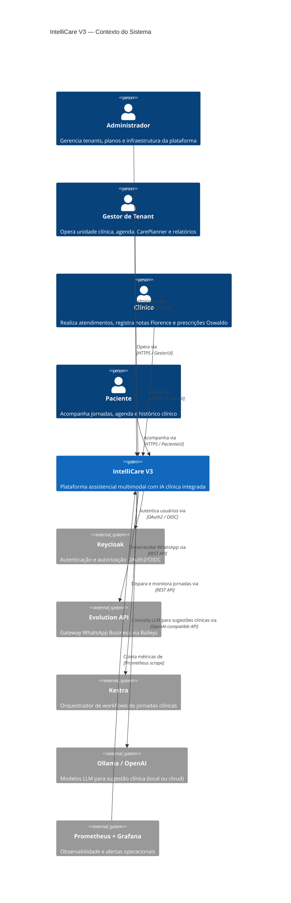
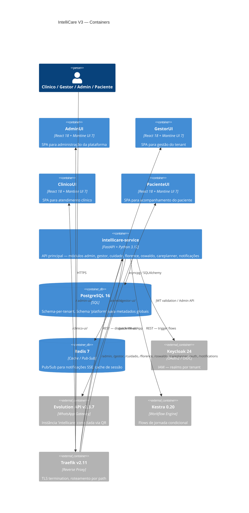

# IntelliCare V3 — Visão Geral do Sistema

> Documentação técnica de arquitetura. Mantida pelo ARQUITETO.
> Última atualização: 2026-03-21 | Sprint 2026-04-18

---

## Contexto C4 — Nível 1: Sistema no Mundo

---

## Containers C4 — Nível 2: Componentes Principais

---

## Stack tecnológica

| Camada | Tecnologia | Versão | Papel |
|--------|-----------|--------|-------|
| Frontend | React + Mantine UI | 18 / 7 | 4 SPAs (Admin, Gestor, Clínico, Paciente) |
| Build Frontend | Vite | 5 | Bundler com `optimizeDeps` para Docker |
| Backend | FastAPI | 0.111 | API assíncrona — módulos por domínio |
| Runtime | Python | 3.12 | Async-first com `asyncpg` |
| ORM | SQLAlchemy | 2.x async | Schema-per-tenant via `search_path` |
| Migrations | Alembic | 1.13 | Programático para provisionamento automático |
| Banco | PostgreSQL | 16 | Schema-per-tenant + schema `platform` global |
| Cache/PubSub | Redis | 7 | SSE notifications + push subscriptions |
| Auth | Keycloak | 24 | OAuth2/OIDC, realms por tenant |
| Proxy | Traefik | v2.11 | TLS Let's Encrypt, routing por path |
| WhatsApp | Evolution API | v2.3.7 | Baileys v7 — único compatível com QR estável |
| Workflows | Kestra | 0.20 | Flows condicionais com Switch nativo |
| LLM | Ollama / OpenAI | — | `shared/llm.py` wrapper com fallback rule-based |
| PDF | WeasyPrint + Jinja2 | — | Relatórios clínicos e de jornada |
| Observabilidade | Prometheus + Grafana | v2.51 / v10.4 | 9 alert rules, 13+ panels |
| Containerização | Docker + Compose | — | Multi-stage builds, profiles por ambiente |
| CI/CD | GitHub Actions | — | pytest + build dos 3 frontends |
