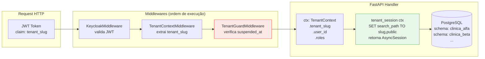

# IntelliCare V3 — Mapa de Módulos e Dependências

> Última atualização: 2026-03-21 | Sprint 2026-04-18

---

## Grafo de dependências entre módulos

```mermaid
graph TD
    subgraph CORE ["📦 intellicare-core (pacote base)"]
        TENANT[tenant_session / TenantContext]
        PROVISIONER[tenant_provisioner]
        LLM[shared/llm.py]
        STORAGE[storage.py 🔬 futuro]
        PUSH[push_sender.py]
    end

    subgraph MODULES ["🧩 Módulos FastAPI"]
        ADMIN[admin\nTenants, Servidores\nFinanceiro, Usuários]
        GESTOR[gestor\nPacientes, Agenda\nUnidades, Equipe]
        CUIDADO[cuidado\nEncounters, SOAP\nPortal Paciente]
        FLORENCE[florence\nNotas SOAP/FREE\nIA suggest]
        OSWALDO[oswaldo\nPrescrições\nCID-10 + IA]
        CAREPLANNER[careplanner\nJornadas multicanal\nFlows Kestra]
        NOTIF[notifications\nSSE + Push PWA]
    end

    subgraph FRONTENDS ["🖥 Frontends React"]
        ADMINUI[AdminUI]
        GESTORUI[GestorUI]
        CLINICOUI[ClinicoUI]
        PACIENTEUI[PacienteUI]
    end

    subgraph INFRA ["🏗 Infraestrutura"]
        PG[(PostgreSQL\nschema-per-tenant)]
        REDIS[(Redis\nPub/Sub + Cache)]
        KC[Keycloak\nIAM]
        EVO[Evolution API\nWhatsApp]
        KESTRA_SVC[Kestra\nWorkflow Engine]
        PROM[Prometheus\n+ Grafana]
    end

    %% Core → Módulos
    TENANT -->|injetado em| ADMIN
    TENANT -->|injetado em| GESTOR
    TENANT -->|injetado em| CUIDADO
    TENANT -->|injetado em| FLORENCE
    TENANT -->|injetado em| OSWALDO
    TENANT -->|injetado em| CAREPLANNER
    TENANT -->|injetado em| NOTIF
    PROVISIONER -->|usado por| ADMIN
    LLM -->|consumido por| FLORENCE
    LLM -->|consumido por| OSWALDO
    PUSH -->|consumido por| NOTIF

    %% Módulos → Infra
    ADMIN -->|schema CRUD| PG
    GESTOR -->|dados tenant| PG
    CUIDADO -->|encounters| PG
    FLORENCE -->|clinical_notes| PG
    OSWALDO -->|prescriptions| PG
    CAREPLANNER -->|journeys, tasks| PG
    NOTIF -->|notifications\npush_subscriptions| PG
    NOTIF -->|pub/sub| REDIS
    CAREPLANNER -->|pub/sub| REDIS
    ADMIN -->|Admin API| KC
    PROVISIONER -->|cria realm/client| KC
    CAREPLANNER -->|dispatch WA| EVO
    CAREPLANNER -->|trigger flows| KESTRA_SVC
    NOTIF -->|métricas| PROM

    %% Módulos → Frontends
    ADMIN -->|serve| ADMINUI
    GESTOR -->|serve| GESTORUI
    CUIDADO -->|serve| CLINICOUI
    FLORENCE -->|serve| CLINICOUI
    OSWALDO -->|serve| CLINICOUI
    CAREPLANNER -->|serve| GESTORUI
    CAREPLANNER -->|serve| CLINICOUI
    CUIDADO -->|serve| PACIENTEUI
    NOTIF -->|SSE + Push| CLINICOUI
    NOTIF -->|SSE + Push| GESTORUI

    %% Dependências inter-módulo
    FLORENCE -.->|encontro ref| CUIDADO
    OSWALDO -.->|encontro ref| CUIDADO
    CAREPLANNER -.->|appointment link| GESTOR

    style STORAGE fill:#f5f5f5,stroke:#999,stroke-dasharray: 5 5
    style CORE fill:#e8f4fd,stroke:#1a73e8
    style MODULES fill:#e8f5e9,stroke:#34a853
    style FRONTENDS fill:#fce8e6,stroke:#ea4335
    style INFRA fill:#fef7e0,stroke:#fbbc04
```



---

## Classificação Executor Matrix (ADR-001)

```mermaid
quadrantChart
    title Executor Matrix — Componentes IntelliCare V3
    x-axis Baixa Autonomia --> Alta Autonomia
    y-axis Baixo Esforço Computacional --> Alto Esforço Computacional

    quadrant-1 Agent
    quadrant-2 Hybrid
    quadrant-3 Human
    quadrant-4 Worker

    shared/llm.py: [0.75, 0.80]
    Florence IA suggest: [0.65, 0.70]
    Oswaldo IA suggest: [0.65, 0.68]
    Kestra jornada_com_fallback: [0.80, 0.45]
    Kestra retry_backoff: [0.85, 0.35]
    Kestra urgencia_clinica: [0.78, 0.50]
    Redis PubSub: [0.90, 0.20]
    push_sender.py: [0.88, 0.18]
    tenant_provisioner: [0.82, 0.42]
    WeasyPrint PDF: [0.92, 0.30]
    Clínico (humano): [0.10, 0.85]
    Gestor (humano): [0.15, 0.60]
    Marie (futuro): [0.90, 0.92]
```

---

## Módulos — responsabilidades e endpoints principais

| Módulo | Path base | Migrations | Principais endpoints |
|--------|-----------|-----------|---------------------|
| `admin` | `/admin` | 001–006, 015 | tenants CRUD, servidores, módulos, financeiro, auditoria |
| `gestor` | `/gestor` | 007–009 | pacientes, agenda, unidades, equipe, RAG |
| `cuidado` | `/cuidado` | 010–011 | encounters, SOAP, portal paciente (me/journeys, me/clinical-notes) |
| `florence` | `/florence` | 013 | notes CRUD, `POST /suggest` (IA SOAP) |
| `oswaldo` | `/oswaldo` | 014 | prescriptions, CID-10 search, `POST /suggest` (IA) |
| `careplanner` | `/careplanner` | 008, 012 | journeys, tasks, dispatch multicanal, templates, health/adapters |
| `notifications` | `/notifications` | 007, 016 | SSE stream, CRUD notifications, push subscribe/vapid |

---

## Padrão de isolamento multi-tenant



> **Regra de ouro:** nunca usar `ctx.db` diretamente — sempre `tenant_session(ctx)`. `ctx.db` é padrão V2 e não seta o `search_path`.
