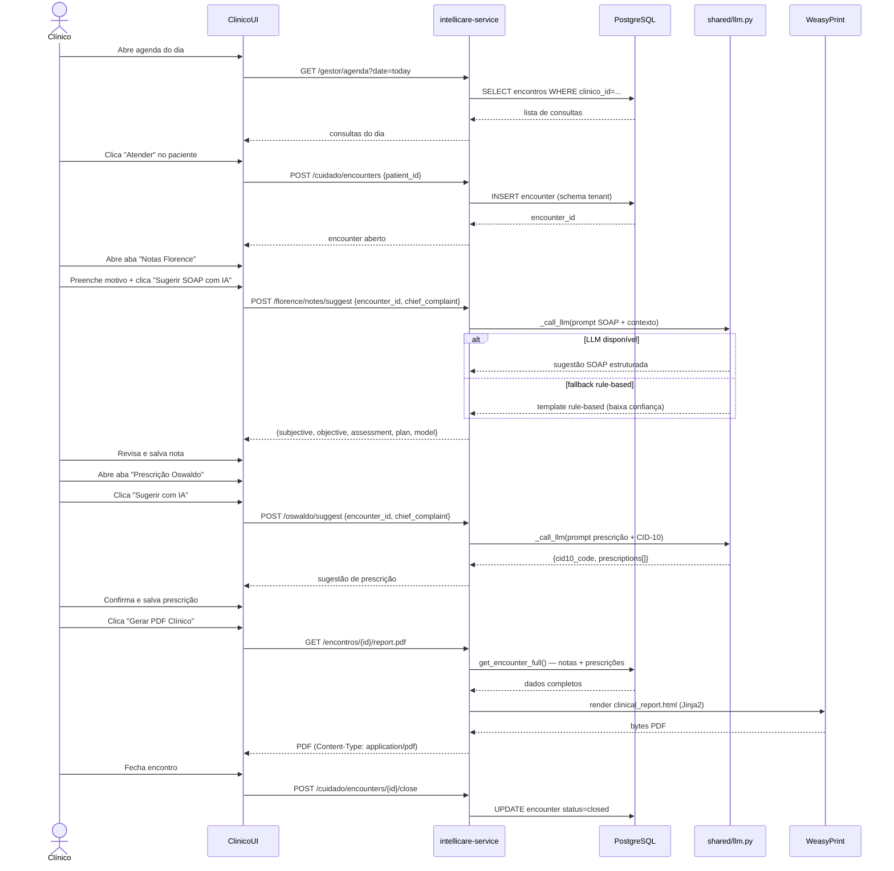
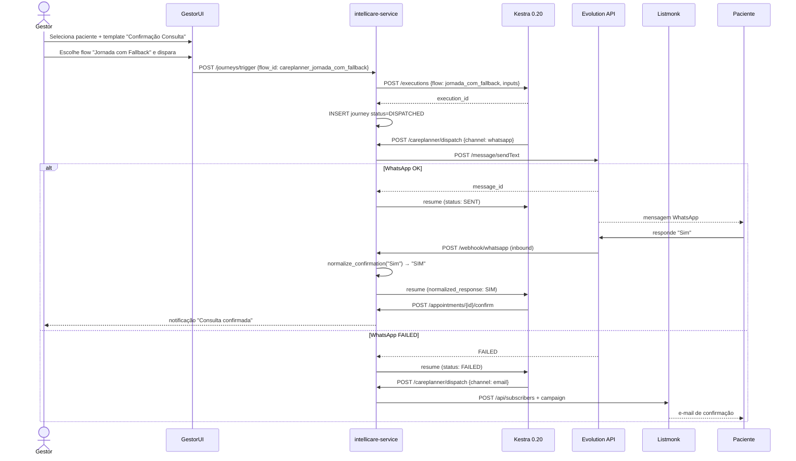
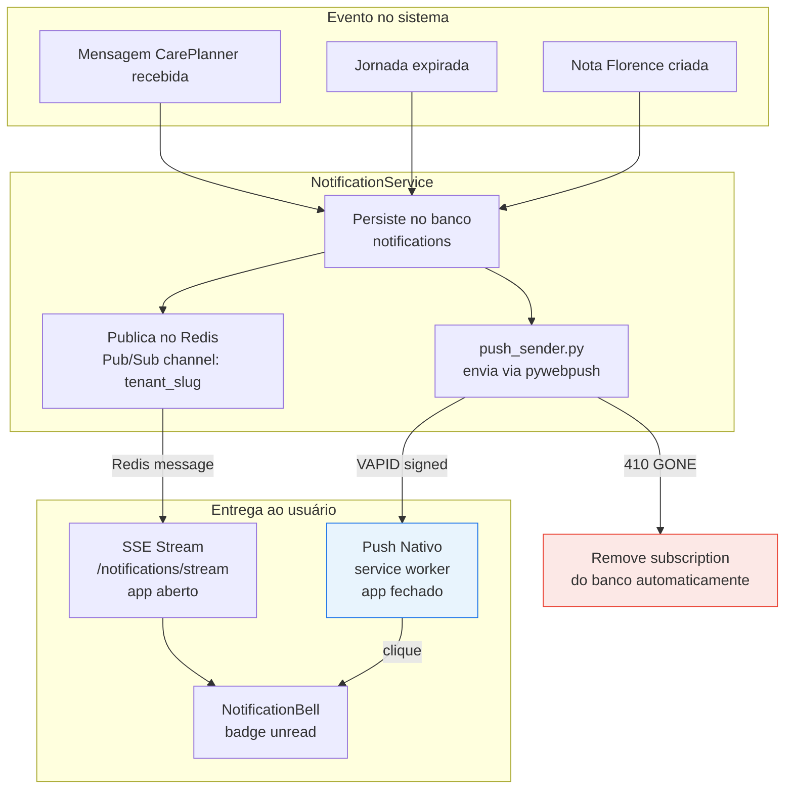
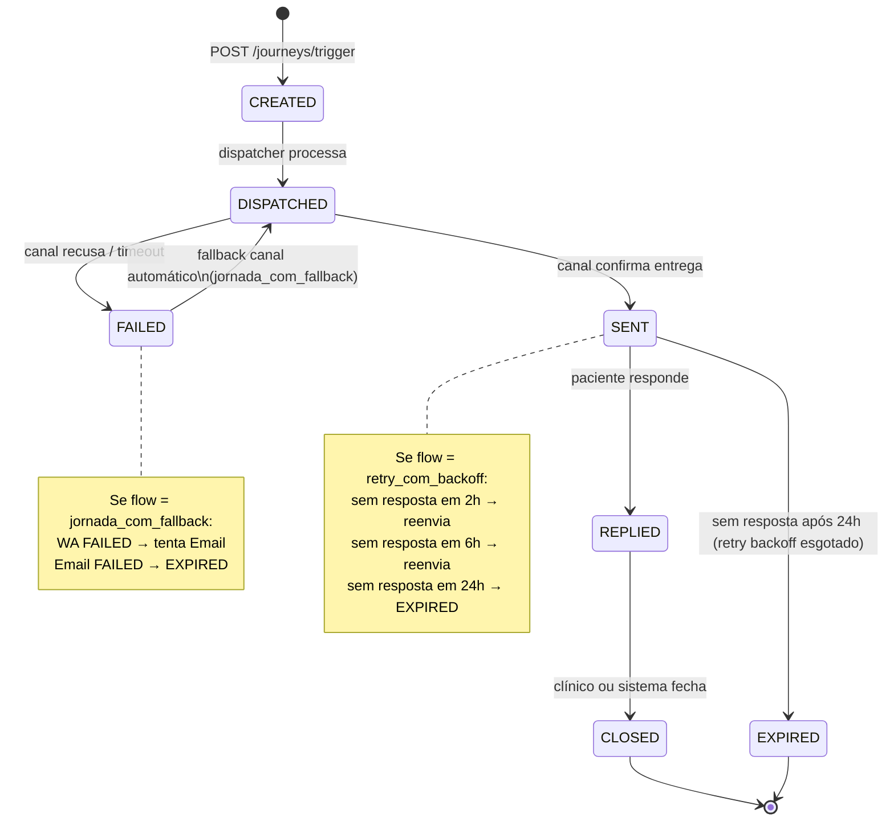

# IntelliCare V3 — Fluxos Clínicos

> Última atualização: 2026-03-21 | Sprint 2026-04-18

---

## Fluxo completo de atendimento clínico

---

## Fluxo CarePlanner — jornada com fallback de canal

---

## Fluxo de notificações — SSE + Push PWA

---

## Estados de jornada CarePlanner

