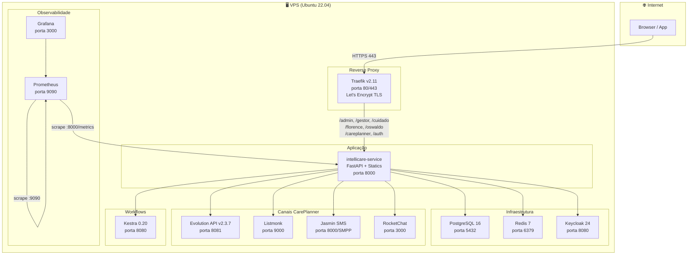
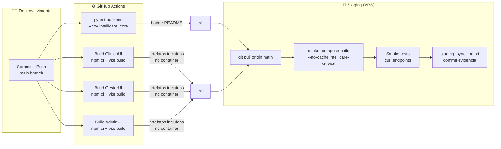
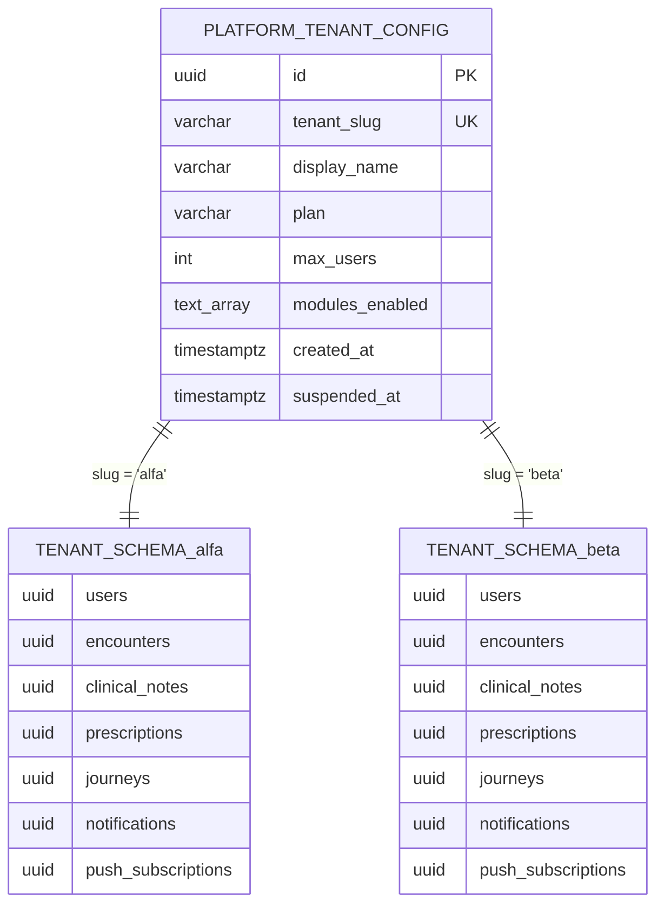

# IntelliCare V3 — Infraestrutura e Deploy

> Última atualização: 2026-03-21 | Sprint 2026-04-18

---

## Serviços Docker em produção/staging



---

## Pipeline CI/CD



---

## Estratégia de banco de dados — Schema-per-tenant



**Convenção de acesso:**
```python
# ✅ Correto — V3
async with tenant_session(ctx) as db:
    # SET search_path TO clinica_alfa, public
    result = await db.execute(select(ClinicalNote))

# ❌ Errado — V2 legacy
db = ctx.db  # não seta search_path
```

---

## Migrations — histórico

| Migration | DEM | Conteúdo |
|-----------|-----|---------|
| 001–006 | DEMs iniciais | Estrutura base — users, tenants, módulos |
| 007 | DEM-026 | notifications, SSE |
| 008 | DEM-038 | careplanner — journeys, tasks, channels |
| 009 | DEM-029 | appointments |
| 010–011 | DEM-022 | portal paciente |
| 012 | DEM-054 | appointment_id em journeys |
| 013 | DEM-055 | clinical_notes (Florence) |
| 014 | DEM-058 | prescriptions (Oswaldo) |
| 015 | DEM-065 | platform.tenant_config (schema global) |
| 016 | DEM-066 | push_subscriptions (por tenant) |

---

## Gotchas de infraestrutura — histórico de incidentes

| Incidente | Causa raiz | Fix | Commit |
|-----------|-----------|-----|--------|
| Evolution API QR count:0 | Baileys v6 race condition em v2.2.x | Trocar para `evoapicloud/v2.3.7` | `06a0b1e` |
| Redis `ValueError: Port could not be cast` | `#` na senha truncava URL Redis | `REDIS_PASSWORD_URLENC` com senha URL-encoded | `c7fabecc` |
| ClinicoUI Docker build falha | Vite não pré-bundlava `@tanstack/react-query` em SSR/Docker | `optimizeDeps.include` no `vite.config.ts` | `055e883` |
| Traefik 404 em produção | v3.2 incompatível com Docker API 1.24 no VPS | Downgrade para v2.11.31 | `59fd4c1` |
| `TenantContext has no attribute db` | Padrão V2 `ctx.db` usado em módulo V3 | Usar `tenant_session(ctx)` — gotcha documentado | `19799a2` |
| VAPID keys rotacionadas | Subscriptions antigas invalidadas silenciosamente | **Nunca rotacionar** sem `TRUNCATE push_subscriptions` | — |
