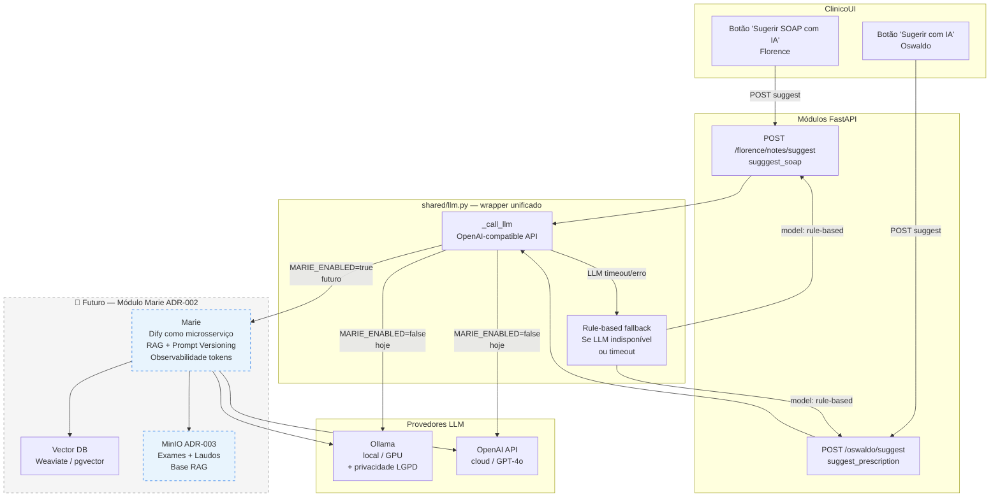
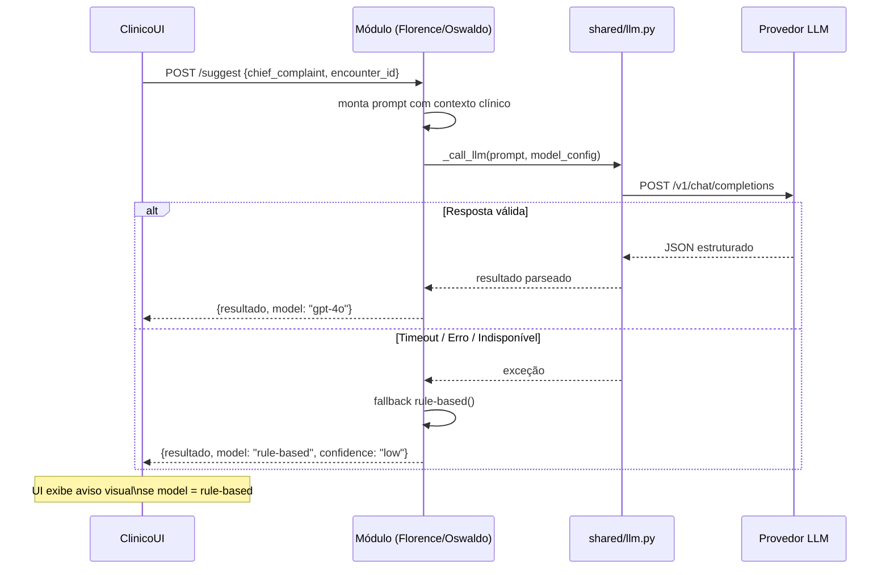
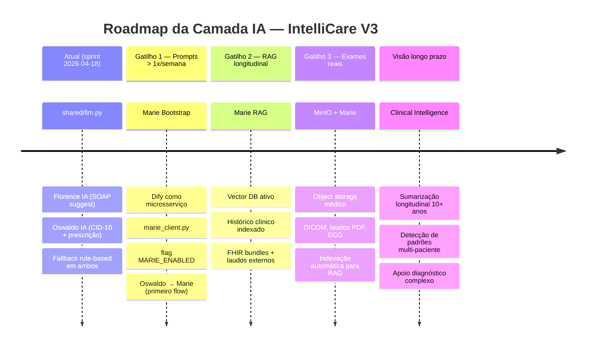

# IntelliCare V3 — Camada de Inteligência Artificial

> Última atualização: 2026-03-21 | Sprint 2026-04-18

---

## Arquitetura atual da camada IA

---

## Padrão Hybrid — como Florence e Oswaldo consomem IA

---

## Visão futura — Roadmap IA

---

## Classificação dos modelos de execução IA (ADR-001)

| Componente | Executor | Justificativa |
|-----------|----------|---------------|
| `shared/llm.py` | **Agent** | Alta autonomia, alto esforço computacional — decide modelo e fallback |
| Florence `suggest_soap` | **Hybrid** | IA sugere, humano revisa e salva |
| Oswaldo `suggest_prescription` | **Hybrid** | IA sugere CID-10 + prescrição, clínico confirma |
| Fallback rule-based | **Worker** | Determinístico, sem autonomia, executa regras fixas |
| Marie (futuro) | **Agent** | Orquestra múltiplos LLMs + RAG + Vector DB autonomamente |

---

## Variáveis de ambiente — camada IA

| Variável | Obrigatória | Default | Descrição |
|----------|------------|---------|-----------|
| `OPENAI_API_KEY` | Não (se Ollama) | — | Chave OpenAI/compatível |
| `OPENAI_BASE_URL` | Não | `https://api.openai.com/v1` | Base URL — trocar para Ollama se local |
| `LLM_MODEL` | Não | `gpt-4o-mini` | Modelo padrão para chamadas |
| `LLM_TIMEOUT_SECONDS` | Não | `30` | Timeout antes do fallback |
| `MARIE_ENABLED` | Não | `false` | Liga/desliga Módulo Marie sem redeploy |
| `MARIE_ENDPOINT` | Se Marie ativo | — | `http://marie-api:5001` |
