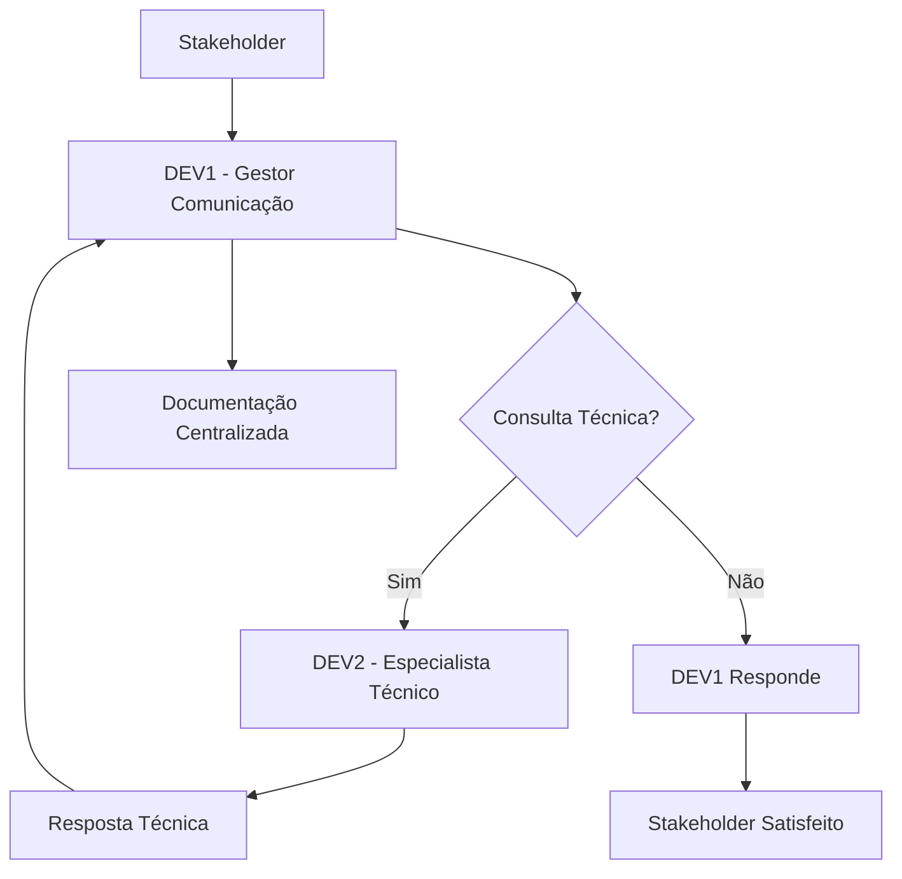

# 🎯 ESTRATÉGIA DE COMUNICAÇÃO - DEV1 COMO GESTOR DE RELACIONAMENTO

## 📌 OBJETIVO
Transformar o DEV1 no **ponto focal de comunicação** do projeto INTELLICARE, aproveitando sua experiência na **primeira etapa de validação e configuração**.

## 🏆 POR QUE DEV1 É PERFEITO PARA ESTE PAPEL

### ✅ Experiência Comprovada:
```
✅ Concluiu Semana 1 da Separação Dados com sucesso
✅ Tem visão completa da infraestrutura (OLTP/OLAP)
✅ Entende requisitos técnicos e de negócio
✅ Já passou pelo processo de validação inicial
```

### ✅ Habilidades Demonstradas:
```
📋 Planejamento detalhado (cronogramas dia a dia)
🎯 Execução disciplinada (entregas no prazo)
📊 Documentação completa (código + processos)
🔧 Solução de problemas (infra complexa)
```

## 🗣️ PAPÉIS DE COMUNICAÇÃO PARA DEV1

### 1. Gestor de Relacionamento com Especialistas
```
Responsabilidades:
- Agendar e conduzir reuniões de validação
- Traduzir requisitos clínicos para técnicos
- Garantir alinhamento entre especialistas e DEVs
- Documentar feedback e decisões

Habilidades necessárias:
- Comunicação clara e objetiva
- Conhecimento técnico do sistema
- Paciência para explicar conceitos complexos
- Organização para follow-up
```

### 2. Coordenador de Reuniões Online
```
Responsabilidades:
- Preparar agenda e materiais para reuniões
- Conduzir demos ao vivo do sistema
- Gerenciar tempo e pauta
- Capturar action items e responsáveis

Ferramentas sugeridas:
- Google Meet / Zoom para videochamadas
- Miro / Figma para colaboração visual
- Google Docs para notas compartilhadas
- Trello / Asana para acompanhamento
```

### 3. Apresentador Técnico
```
Responsabilidades:
- Criar apresentações para diferentes públicos
- Demonstrar funcionalidades do sistema
- Explicar arquitetura e decisões técnicas
- Responder perguntas técnicas

Materiais a preparar:
- Apresentação executiva (10 min)
- Demo ao vivo do sistema (20 min)
- Documentação de suporte
- FAQ técnico
```

### 4. Facilitador de Validações
```
Responsabilidades:
- Preparar casos de teste para especialistas
- Coletar feedback estruturado
- Garantir que validações sejam completas
- Documentar aprovações e assinaturas

Processo sugerido:
1. Pré-reunião: Enviar materiais preparatórios
2. Durante: Conduzir teste guiado + livre
3. Pós-reunião: Consolidar feedback + next steps
```

## 📅 CRONOGRAMA DE ATIVIDADES DE COMUNICAÇÃO

### Semana 1 (15-19/02): Preparação
```
Segunda (15/02):
- DEV1 cria template de apresentação
- Define agenda padrão para reuniões
- Prepara lista de stakeholders

Terça (16/02):
- Treina com DEV2 na demo do Florence
- Testa ferramentas de colaboração
- Cria checklist para reuniões

Quarta (17/02):
- Conduz reunião teste interna
- Ajusta materiais baseado no feedback
- Finaliza kit de comunicação

Quinta (18/02):
- Prepara casos de demo específicos
- Cria FAQ técnico
- Organiza documentação de suporte

Sexta (19/02):
- Revisão final com toda equipe
- Simulação completa da reunião
- Ajustes finais
```

### Semana 2 (22-26/02): Execução
```
Segunda (22/02):
- Primeira reunião real (validação LGPD)
- Coleta feedback inicial
- Ajusta abordagem se necessário

Terça (23/02):
- Reunião com especialista clínico
- Demo Florence + integração planejada
- Captura requisitos para Oswaldo

Quarta (24/02):
- Apresentação para gestores
- Foco em ROI e benefícios
- Discussão de próximos passos

Quinta (25/02):
- Reunião técnica com arquitetos
- Discussão de escalabilidade
- Planejamento de infraestrutura

Sexta (26/02):
- Consolidamento da semana
- Documentação de aprendizados
- Planejamento semana seguinte
```

## 🛠️ FERRAMENTAS E TEMPLATES

### Template de Apresentação:
```markdown
# [TÍTULO DA REUNIÃO]

## Agenda (45 min)
1. Abertura (5 min)
2. Contexto do projeto (5 min)
3. Demo ao vivo (15 min)
4. Discussão técnica (10 min)
5. Próximos passos (5 min)
6. Q&A (5 min)

## Materiais
- [Link para demo]
- [Documentação técnica]
- [Casos de uso]
- [FAQ]

## Participantes
- Especialista: [Nome]
- Técnico: DEV2
- Gestor: DEV1
- Observadores: [Nomes]

## Action Items
- [ ] Item 1 (Responsável: ___, Prazo: ___)
- [ ] Item 2 (Responsável: ___, Prazo: ___)
```

### Checklist Pré-Reunião:
```
[ ] Agenda enviada com 24h antecedência
[ ] Materiais compartilhados
[ ] Link da reunião configurado
[ ] Demo testada e funcionando
[ ] Backup plan preparado
[ ] Timebox definido para cada seção
[ ] Gravador configurado (se necessário)
[ ] Notetaker designado
```

### Template de Ata:
```
# ATA - [NOME DA REUNIÃO]
Data: [DATA]
Hora: [HORA]
Participantes: [LISTA]

## Decisões Tomadas
1. [Decisão 1]
2. [Decisão 2]

## Action Items
| Item | Responsável | Prazo | Status |
|------|-------------|-------|--------|
| [Item] | [Nome] | [Data] | [ ] |

## Próximos Passos
- [Passo 1]
- [Passo 2]

## Próxima Reunião
Data: [DATA]
Tópicos: [LISTA]
```

## 🎯 OBJETIVOS DE COMUNICAÇÃO

### Para Especialistas Clínicos:
```
🎯 Demonstrar valor clínico do sistema
🎯 Coletar feedback para melhorias
🎯 Validar algoritmos e fluxos
🎯 Engajar para adoção futura
```

### Para Gestores/Executivos:
```
🎯 Mostrar progresso e resultados
🎯 Justificar investimento (ROI)
🎯 Alinhar expectativas
🎯 Planejar expansão
```

### Para Equipe Técnica:
```
🎯 Compartilhar arquitetura e decisões
🎯 Alinhar desenvolvimento
🎯 Identificar dependências
🎯 Planejar integrações
```

## 📊 MÉTRICAS DE SUCESSO

### Quantitativas:
```
✅ Número de reuniões conduzidas
✅ Taxa de participação
✅ Tempo médio de reunião
✅ Action items completados
✅ Documentação gerada
```

### Qualitativas:
```
✅ Feedback dos participantes
✅ Clareza da comunicação
✅ Eficiência nas decisões
✅ Satisfação dos stakeholders
✅ Qualidade das documentações
```

## 🚀 BENEFÍCIOS DESTA ESTRATÉGIA

### Para o DEV1:
```
🌟 Desenvolvimento de habilidades de liderança
🌟 Visibilidade no projeto
🌟 Experiência em gestão de stakeholders
🌟 Crescimento profissional
🌟 Networking com especialistas
```

### Para o Projeto:
```
🌟 Comunicação mais eficiente
🌟 Alinhamento garantido
🌟 Decisões mais rápidas
🌟 Menor retrabalho
🌟 Maior satisfação dos stakeholders
```

### Para a Equipe:
```
🌟 DEV2 foca 100% em desenvolvimento
🌟 Especialistas têm ponto de contato único
🌟 Gestores têm visibilidade clara
🌟 Processo padronizado e previsível
```

## 🔄 PROCESSO DE COMUNICAÇÃO

### Fluxo Padrão:


### Reuniões Regulares:
```
📅 Diária (15 min): DEV1 + DEV2 - Alinhamento técnico
📅 Semanal (30 min): Equipe completa - Progresso + planejamento
📅 Quinzenal (45 min): Com especialistas - Validação + feedback
📅 Mensal (60 min): Com gestores - Visão estratégica
```

## 🎓 TREINAMENTO PARA DEV1

### Sessões com DEV2:
```
1. Demo completa do Florence (2h)
2. Arquitetura técnica do sistema (1h)
3. Casos de uso clínicos (1h)
4. FAQ técnico comum (1h)
5. Simulação de reuniões (2h)
```

### Auto-estudo:
```
📚 Comunicação não-violenta
📚 Facilitação de reuniões
📚 Apresentações eficazes
📚 Gestão de stakeholders
📚 Documentação técnica
```

## 🚨 PLANO DE CONTINGÊNCIA

### Se DEV1 não estiver disponível:
```
🔀 DEV2 assume comunicação temporariamente
🔀 Documentação serve como referência
🔀 Reuniões podem ser reagendadas
🔀 Comunicação assíncrona via documentação
```

### Se Ferramentas falharem:
```
📞 Backup: Chamada telefônica
📧 Backup: Email com screenshots
📹 Backup: Gravação prévia da demo
📄 Backup: Documentação impressa
```

### Se Especialista não entender:
```
🔄 Explicar de forma diferente
🎨 Usar visualizações
📊 Mostrar exemplos concretos
❓ Fazer perguntas para entender dúvida
```

---

## 📋 CHECKLIST DE IMPLEMENTAÇÃO

### Fase 1: Preparação (15-19/02)
- [ ] DEV1 aceita o papel
- [ ] Templates criados
- [ ] Ferramentas configuradas
- [ ] Treinamento realizado
- [ ] Kit de comunicação pronto

### Fase 2: Execução (22-26/02)
- [ ] Primeira reunião conduzida
- [ ] Feedback coletado
- [ ] Ajustes realizados
- [ ] Processo estabilizado
- [ ] Resultados documentados

### Fase 3: Otimização (a partir de 01/03)
- [ ] Métricas analisadas
- [ ] Processo refinado
- [ ] Habilidades desenvolvidas
- [ ] Conhecimento compartilhado
- [ ] Sucessor treinado (se necessário)

---

**STATUS**: 🎯 **ESTRATÉGIA DEFINIDA**
**PRÓXIMO PASSO**: **APRESENTAR PARA DEV1 E OBTER ACEITAÇÃO**
**BENEFÍCIO**: **DEV2 FOCA 100% EM DESENVOLVIMENTO, DEV1 CRESCE EM LIDERANÇA**
**IMPACTO**: **COMUNICAÇÃO MAIS EFICIENTE, DECISÕES MAIS RÁPIDAS**
