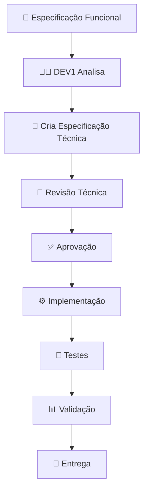

# 📋 PROCESSO DE ESPECIFICAÇÃO - DEV1 (Governança/Keycloak)

## 🏗️ FLUXO DE TRABALHO



## 📁 ESTRUTURA DE DOCUMENTAÇÃO

### 1. ESPECIFICAÇÕES FUNCIONAIS (Input do Product Owner)
- `01_ESPECIFICACAO_FUNCIONAL_*.md` - O QUE fazer
- Fornecidas pelo PO/Arquiteto
- Descrevem requisitos de negócio

### 2. ESPECIFICAÇÕES TÉCNICAS (Output do DEV1)
- `02_ESPECIFICACAO_TECNICA_*.md` - COMO fazer
- Criadas pelo DEV1 após análise
- Incluem: arquitetura, tecnologias, APIs, segurança

### 3. PLANOS DE IMPLEMENTAÇÃO
- `03_PLANO_*.md` - QUANDO/QUEM fazer
- Cronograma, dependências, recursos

### 4. DOCUMENTAÇÃO TÉCNICA
- `04_DOCUMENTACAO_*.md` - Para desenvolvedores
- APIs, configuração, deploy, troubleshooting

## 📋 TEMPLATES

### Template Especificação Funcional:
```markdown
# ESPECIFICAÇÃO FUNCIONAL: [NOME]

## 📌 ID: DEV1-FUNC-[NUMERO]
## 🎯 Objetivo: [Descrição breve]
## 📅 Data: [DATA]
## 👤 Responsável: [NOME]
## ⚠️ Prioridade: [ALTA/MÉDIA/BAIXA]

## 1. CONTEXTO
[Por que isso é necessário?]

## 2. REQUISITOS FUNCIONAIS
### RF-001: [Nome do requisito]
**Descrição**: [O que deve fazer]
**Critérios de Aceite**:
- [ ] Critério 1
- [ ] Critério 2

## 3. REQUISITOS NÃO FUNCIONAIS
### RNF-001: [Performance/Segurança/etc]
**Descrição**: [Requisito técnico]
**Métrica**: [Como medir]

## 4. REGRAS DE NEGÓCIO
- Regra 1: [Descrição]
- Regra 2: [Descrição]

## 5. INTERFACES/INTEGRAÇÕES
- Sistema A: [Descrição integração]
- Sistema B: [Descrição integração]

## 6. RESTRIÇÕES
- [Restrição técnica]
- [Restrição de tempo]
- [Restrição de orçamento]

## 7. ENTREGÁVEIS
- [ ] Código fonte
- [ ] Testes
- [ ] Documentação
- [ ] Deploy

## 8. MÉTRICAS DE SUCESSO
- Métrica 1: [Valor esperado]
- Métrica 2: [Valor esperado]
```

### Template Especificação Técnica:
```markdown
# ESPECIFICAÇÃO TÉCNICA: [NOME]

## 📌 ID: DEV1-TEC-[NUMERO]
## 📅 Data: [DATA]
## 👤 Responsável Técnico: [DEV1]
## ⏱️ Estimativa: [X horas/dias]

## 1. ANÁLISE TÉCNICA
### 1.1. Arquitetura Proposta
[Diagrama/Descrição]

### 1.2. Tecnologias
- Backend: [Tecnologia]
- Banco de Dados: [Tecnologia]
- Segurança: [Tecnologia]

### 1.3. Design Patterns
- [Pattern 1]: [Justificativa]
- [Pattern 2]: [Justificativa]

## 2. DESIGN DETALHADO
### 2.1. Componentes
```python
# Exemplo de código/estrutura
class Componente:
    def metodo(self):
        pass
```

### 2.2. APIs
```yaml
/api/endpoint:
  method: POST
  request:
    schema: {}
  response:
    schema: {}
```

### 2.3. Banco de Dados
```sql
-- Schema proposto
CREATE TABLE tabela (
    id SERIAL PRIMARY KEY
);
```

## 3. PLANO DE IMPLEMENTAÇÃO
### 3.1. Fases
1. Fase 1: [Descrição] (X dias)
2. Fase 2: [Descrição] (X dias)

### 3.2. Dependências
- [ ] Dependência 1
- [ ] Dependência 2

### 3.3. Riscos e Mitigações
- Risco 1: [Mitigação]
- Risco 2: [Mitigação]

## 4. TESTES
### 4.1. Testes Unitários
- [ ] Teste 1
- [ ] Teste 2

### 4.2. Testes de Integração
- [ ] Teste 1
- [ ] Teste 2

## 5. DEPLOY E OPERAÇÃO
### 5.1. Configuração
```bash
# Comandos de deploy
docker-compose up -d
```

### 5.2. Monitoramento
- Métrica 1: [Como monitorar]
- Métrica 2: [Como monitorar]

## 6. APROVAÇÕES
- [ ] Aprovação Técnica: _________
- [ ] Aprovação PO: _________
- [ ] Data: _________
```

## 🎯 PRÓXIMOS PASSOS

1. **DEV1 recebe** especificações funcionais
2. **DEV1 analisa** e cria especificações técnicas
3. **Revisão técnica** com arquiteto/PO
4. **Aprovação** formal
5. **Implementação** seguindo especificação
6. **Entrega** com documentação completa

---

**STATUS**: ✅ ESTRUTURA PRONTA PARA RECEBER ESPECIFICAÇÕES