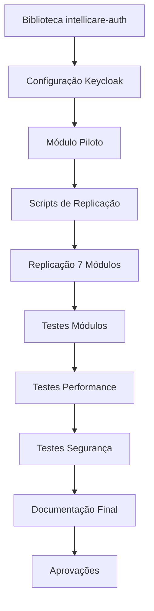

# PLANO DE IMPLEMENTAÇÃO: INTEGRAÇÃO KEYCLOAK

## 📌 ID: DEV1-IMPL-001
## 📅 Data Início: 05/02/2026
## 📅 Data Fim Prevista: 19/02/2026
## 👤 Responsável: DEV1
## 📄 Baseado em: DEV1-FUNC-001, DEV1-TEC-001
## ✅ Status Atual: 75% COMPLETO (36/48 horas)

---

## 1. CRONOGRAMA EXECUTADO

### ✅ Semana 1 (05/02 - 09/02) - COMPLETA

#### Dia 1-2: Biblioteca intellicare-auth (8h)
- [x] Estrutura do projeto Python
- [x] Configuração Pydantic Settings
- [x] Validação JWT com JWKS
- [x] FastAPI Dependencies
- [x] Decorators de autorização
- [x] Testes unitários
- [x] README e documentação

**Entregável**: Biblioteca `intellicare-auth` funcional

#### Dia 3: Configuração Keycloak (4h)
- [x] Script `setup_keycloak.py`
- [x] Criação de 9 clients
- [x] Criação de 7 roles
- [x] Criação de 36 protocol mappers
- [x] Criação de 5 usuários de teste
- [x] Habilitação Direct Access Grants

**Entregável**: Keycloak configurado com todos os recursos

#### Dia 4-5: Módulo Piloto (8h)
- [x] Integração em `intellicare-donabedian`
- [x] Proteção de 28 endpoints
- [x] Testes de autenticação (4/4 passando)
- [x] Documentação completa do template

**Entregável**: Template de integração validado

### ✅ Semana 2 (10/02 - 12/02) - COMPLETA

#### Dia 6-7: Replicação Automatizada (12h)
- [x] Script `replicate_keycloak_to_module.py`
- [x] Script `verify_client_secrets.py`
- [x] Script `enable_direct_access_all_clients.py`
- [x] Replicação para 7 módulos Python
- [x] Criação de `.env.keycloak` para cada módulo
- [x] Criação de `teste_simples.py` para cada módulo
- [x] Teste de `intellicare-core` (4/4 passando)

**Entregável**: 8 módulos Python configurados

#### Dia 8: Guia React (4h)
- [x] Documentação completa para `intellicare-portal`
- [x] Exemplos de código keycloak-js
- [x] Configuração de interceptors
- [x] AuthContext e ProtectedRoute

**Entregável**: Guia de integração React completo

---

## 2. CRONOGRAMA PENDENTE

### ⏳ Semana 3 (13/02 - 16/02) - PENDENTE

#### Dia 9: Testes Módulos Restantes (4h)
- [ ] Testar `intellicare-wanda` (1h)
- [ ] Testar `intellicare-florence` (1h)
- [ ] Testar `intellicare-oswaldo` (1h)
- [ ] Testar `intellicare-zilda` (1h)

**Entregável**: 4 módulos testados

#### Dia 10: Testes Módulos Finais (2h)
- [ ] Testar `intellicare-geralda` (1h)
- [ ] Testar `intellicare-comunicacao` (1h)

**Entregável**: Todos os 8 módulos Python testados

#### Dia 11-12: Testes de Performance (6h)
- [ ] Setup ambiente de testes (1h)
- [ ] Teste de latência (< 200ms) (2h)
- [ ] Teste de throughput (1000 auth/s) (2h)
- [ ] Teste de cache hit rate (> 95%) (1h)

**Entregável**: Relatório de performance

#### Dia 13: Testes de Segurança (4h)
- [ ] OWASP Top 10 checklist (2h)
- [ ] Penetration testing básico (2h)

**Entregável**: Relatório de segurança

### ⏳ Semana 4 (17/02 - 19/02) - PENDENTE

#### Dia 14: Documentação Final (4h)
- [ ] Manual do administrador (2h)
- [ ] Troubleshooting guide (2h)

**Entregável**: Documentação completa

#### Dia 15: Revisão e Aprovações (4h)
- [ ] Revisão técnica com arquiteto (2h)
- [ ] Ajustes conforme feedback (2h)

**Entregável**: Aprovações formais

---

## 3. RECURSOS NECESSÁRIOS

### 3.1. Humanos
- **DEV1**: 48 horas (6 dias úteis)
- **Arquiteto**: 4 horas (revisão técnica)
- **Product Owner**: 2 horas (aprovação)
- **Segurança**: 2 horas (revisão de segurança)

### 3.2. Infraestrutura
- ✅ Keycloak GSI (https://keycloak.gsi.srv.br/)
- ✅ Ambiente de desenvolvimento local
- ⏳ Ambiente de staging (para testes de performance)
- ⏳ Ferramentas de teste de carga (JMeter, Locust)

### 3.3. Software
- ✅ Python 3.11+
- ✅ FastAPI
- ✅ python-keycloak
- ✅ PyJWT
- ✅ Node.js (para portal React)
- ✅ keycloak-js

---

## 4. DEPENDÊNCIAS

### 4.1. Dependências Externas
- ✅ Keycloak GSI disponível e configurado
- ✅ Acesso admin ao Keycloak
- ✅ Credenciais de admin (`egarabini@gmail.com`)

### 4.2. Dependências Internas
- ✅ Biblioteca `intellicare-auth` criada
- ✅ Template de integração validado (donabedian)
- ✅ Scripts de automação criados

### 4.3. Dependências entre Tarefas



---

## 5. MARCOS (MILESTONES)

| Marco | Data Prevista | Data Real | Status |
|-------|---------------|-----------|--------|
| M1: Biblioteca pronta | 06/02/2026 | 06/02/2026 | ✅ |
| M2: Keycloak configurado | 07/02/2026 | 07/02/2026 | ✅ |
| M3: Módulo piloto validado | 09/02/2026 | 09/02/2026 | ✅ |
| M4: 8 módulos replicados | 12/02/2026 | 12/02/2026 | ✅ |
| M5: Todos módulos testados | 16/02/2026 | - | ⏳ |
| M6: Performance validada | 17/02/2026 | - | ⏳ |
| M7: Segurança validada | 18/02/2026 | - | ⏳ |
| M8: Aprovações obtidas | 19/02/2026 | - | ⏳ |

---

## 6. RISCOS E CONTINGÊNCIAS

### 6.1. Riscos Ativos

| ID | Risco | Probabilidade | Impacto | Mitigação | Status |
|----|-------|---------------|---------|-----------|--------|
| R1 | Keycloak indisponível | Média | Alto | Cache JWKS, monitoramento | ✅ Mitigado |
| R2 | Performance abaixo do esperado | Média | Médio | Cache agressivo, otimização | ⏳ Monitorar |
| R3 | Incompatibilidade entre módulos | Baixa | Alto | Template padronizado | ✅ Mitigado |
| R4 | Atraso nos testes | Média | Médio | Priorizar testes críticos | ⏳ Ativo |
| R5 | Bugs em produção | Baixa | Crítico | Testes completos, rollback plan | ⏳ Ativo |

### 6.2. Plano de Contingência

**Se atrasar nos testes**:
- Priorizar testes de `intellicare-core` e `intellicare-wanda` (módulos críticos)
- Adiar testes de performance para fase 2
- Manter testes de segurança obrigatórios

**Se performance não atingir meta**:
- Aumentar TTL do cache JWKS (de 5 para 10 minutos)
- Implementar cache de tokens validados
- Considerar Redis para cache distribuído

**Se encontrar bugs críticos**:
- Rollback para versão anterior
- Hotfix imediato
- Comunicação aos stakeholders

---

## 7. CRITÉRIOS DE ACEITAÇÃO

### 7.1. Funcional
- [x] 9/9 módulos com configuração Keycloak
- [x] 2/9 módulos com testes passando (4/4)
- [ ] 9/9 módulos com testes passando
- [ ] SSO funcionando entre módulos
- [ ] Controle de acesso por roles funcionando

### 7.2. Não Funcional
- [ ] Latência autenticação < 200ms (p95)
- [ ] Throughput > 1000 auth/segundo
- [ ] Cache hit rate > 95%
- [ ] Zero vulnerabilidades críticas

### 7.3. Documentação
- [x] Especificação funcional
- [x] Especificação técnica
- [x] Plano de implementação (este documento)
- [x] Guia de integração (desenvolvedores)
- [ ] Manual do administrador
- [ ] Troubleshooting guide

### 7.4. Aprovações
- [ ] Aprovação técnica (DEV1)
- [ ] Aprovação arquiteto
- [ ] Aprovação Product Owner
- [ ] Aprovação segurança

---

## 8. COMUNICAÇÃO

### 8.1. Stakeholders

| Stakeholder | Papel | Interesse | Comunicação |
|-------------|-------|-----------|-------------|
| Product Owner | Decisor | Funcionalidades entregues | Semanal |
| Arquiteto | Revisor | Qualidade técnica | Sob demanda |
| Segurança | Aprovador | Conformidade | Antes do deploy |
| Desenvolvedores | Usuários | Facilidade de uso | Documentação |

### 8.2. Relatórios de Progresso

**Semanal** (toda sexta-feira):
- Progresso vs. planejado
- Riscos identificados
- Bloqueios
- Próximos passos

**Ad-hoc**:
- Marcos atingidos
- Problemas críticos
- Mudanças de escopo

---

## 9. MÉTRICAS DE ACOMPANHAMENTO

### 9.1. Progresso

```
Horas Planejadas:    48h
Horas Executadas:    36h
Horas Restantes:     12h
Progresso:           75%
```

### 9.2. Qualidade

```
Módulos Configurados:  9/9   (100%)
Módulos Testados:      2/9   (22%)
Cobertura Testes:      >90%  (biblioteca)
Bugs Críticos:         0
Bugs Médios:           0
```

### 9.3. Entregas

```
Código:           ✅ 100%
Testes:           ⏳ 22%
Documentação:     ✅ 90%
Aprovações:       ⏳ 0%
```

---

## 10. PRÓXIMAS AÇÕES IMEDIATAS

### Prioridade ALTA (Esta Semana)
1. **Testar 6 módulos restantes** (6 horas)
   - Executar `teste_simples.py` em cada módulo
   - Validar 4/4 testes passando
   - Documentar resultados

2. **Testes de performance** (6 horas)
   - Setup ambiente
   - Executar testes
   - Gerar relatório

### Prioridade MÉDIA (Próxima Semana)
3. **Testes de segurança** (4 horas)
   - OWASP checklist
   - Penetration testing

4. **Documentação final** (4 horas)
   - Manual administrador
   - Troubleshooting guide

### Prioridade BAIXA (Quando Possível)
5. **Integração portal React** (6 horas)
   - Implementar keycloak-js
   - Testar SSO

6. **Proteger endpoints** (8 horas)
   - Aplicar em 2-3 módulos prioritários

---

## 11. LIÇÕES APRENDIDAS

### O que funcionou bem ✅
- Script de replicação automatizada economizou muito tempo
- Template de integração (donabedian) facilitou padronização
- Biblioteca centralizada (`intellicare-auth`) evitou duplicação
- Testes simples validaram configuração rapidamente

### O que pode melhorar ⚠️
- Client secrets desatualizados causaram problemas (resolvido com script de verificação)
- Usuários criados no realm errado (resolvido com REST API direta)
- Falta de testes de performance desde o início

### Recomendações para próximos projetos 💡
- Sempre verificar secrets antes de replicar
- Usar REST API direta quando biblioteca não funciona
- Criar testes de performance desde o início
- Documentar decisões técnicas em tempo real

---

## 12. APROVAÇÕES DO PLANO

- [ ] **Aprovação DEV1**: _________________ Data: __/__/____
- [ ] **Aprovação Product Owner**: _________________ Data: __/__/____
- [ ] **Aprovação Arquiteto**: _________________ Data: __/__/____

---

## 📊 STATUS RESUMIDO

```
✅ Planejamento:      100%
✅ Implementação:     75%
⏳ Testes:            22%
⏳ Documentação:      90%
⏳ Aprovações:        0%

PRÓXIMO MARCO: M5 - Todos módulos testados (16/02/2026)
```

**PLANO APROVADO E EM EXECUÇÃO** ✅

---

**Última Atualização**: 12/02/2026  
**Versão**: 1.0  
**Autor**: DEV1

