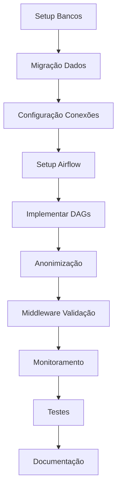

# PLANO DE IMPLEMENTAÇÃO: SEPARAÇÃO OPERACIONAL/ANALÍTICO

## 📌 ID: DEV1-IMPL-002
## 📅 Data Início Prevista: 20/02/2026
## 📅 Data Fim Prevista: 14/03/2026
## 👤 Responsável: DEV1
## 📄 Baseado em: DEV1-FUNC-002, DEV1-TEC-002
## ✅ Status Atual: NÃO INICIADO (0%)

---

## 1. VISÃO GERAL

### 1.1. Objetivo
Implementar separação completa entre dados operacionais (OLTP) e analíticos (OLAP) em todos os módulos INTELLICARE, com pipeline ETL automatizado e anonimização conforme LGPD.

### 1.2. Escopo
- 2 bancos PostgreSQL separados (operacional + analítico)
- Pipeline ETL com Apache Airflow
- Transformações com dbt
- Anonimização de dados sensíveis
- Middleware de validação de domínio
- Monitoramento completo

### 1.3. Estimativa Total
**40 horas** (5 dias úteis) distribuídas em 3 semanas

---

## 2. CRONOGRAMA DETALHADO

### 📅 Semana 1 (20/02 - 26/02): Infraestrutura

#### Dia 1-2: Setup de Bancos de Dados (8h)

**Dia 1 (4h): PostgreSQL Operacional**
- [ ] Instalar PostgreSQL 15+ (se necessário)
- [ ] Criar database `intellicare_operacional`
- [ ] Configurar parâmetros OLTP
- [ ] Criar schemas por módulo (florence, oswaldo, wanda, etc)
- [ ] Criar schema `_metadata` para governança
- [ ] Configurar backup diário + WAL continuous
- [ ] Testar conexões

**Dia 2 (4h): PostgreSQL Analítico**
- [ ] Criar database `intellicare_analitico`
- [ ] Instalar extensão TimescaleDB
- [ ] Configurar parâmetros OLAP
- [ ] Criar schemas analíticos (florence_analytics, oswaldo_analytics, etc)
- [ ] Criar schema `aggregates` para dados cross-módulo
- [ ] Configurar backup semanal + incremental
- [ ] Testar conexões

**Entregável**: 2 bancos PostgreSQL configurados e testados

#### Dia 3: Migração de Dados Existentes (4h)

- [ ] Identificar tabelas operacionais vs analíticas (2h)
  - Criar inventário de todas as tabelas
  - Classificar por domínio (operational/analytical)
  - Identificar PII level (none/low/medium/high)
  
- [ ] Criar tabela de metadados (1h)
  ```sql
  CREATE TABLE _metadata.table_domain (
      schema_name TEXT,
      table_name TEXT,
      domain TEXT CHECK (domain IN ('operational', 'analytical')),
      pii_level TEXT CHECK (pii_level IN ('none', 'low', 'medium', 'high')),
      retention_days INTEGER,
      PRIMARY KEY (schema_name, table_name)
  );
  ```

- [ ] Migrar dados existentes (1h)
  - Exportar dados atuais
  - Importar no banco operacional
  - Validar integridade

**Entregável**: Dados migrados e classificados

#### Dia 4: Configuração de Conexões (4h)

- [ ] Criar arquivo `.env.database` (1h)
  ```bash
  # Operacional
  OPERATIONAL_DB_HOST=localhost
  OPERATIONAL_DB_PORT=5432
  OPERATIONAL_DB_NAME=intellicare_operacional
  OPERATIONAL_DB_USER=intellicare_op
  OPERATIONAL_DB_PASSWORD=<secret>
  
  # Analítico
  ANALYTICAL_DB_HOST=localhost
  ANALYTICAL_DB_PORT=5433
  ANALYTICAL_DB_NAME=intellicare_analitico
  ANALYTICAL_DB_USER=intellicare_an
  ANALYTICAL_DB_PASSWORD=<secret>
  ```

- [ ] Implementar `database/connections.py` (2h)
  - SQLAlchemy engines (operational + analytical)
  - FastAPI dependencies
  - Connection pooling
  - Health checks

- [ ] Testar conexões em todos os módulos (1h)
  - Criar script de teste
  - Validar em cada módulo
  - Documentar

**Entregável**: Conexões configuradas e testadas

---

### 📅 Semana 2 (27/02 - 05/03): Pipeline ETL

#### Dia 5-6: Setup Apache Airflow (8h)

**Dia 5 (4h): Instalação e Configuração**
- [ ] Instalar Apache Airflow 2.8+
- [ ] Configurar executor (LocalExecutor ou CeleryExecutor)
- [ ] Configurar banco de metadados (PostgreSQL)
- [ ] Criar usuário admin
- [ ] Configurar conexões:
  - `intellicare_operacional`
  - `intellicare_analitico`
  - `prometheus_pushgateway`

**Dia 6 (4h): Estrutura do Projeto**
- [ ] Criar estrutura de diretórios:
  ```
  intellicare-etl/
  ├── dags/
  ├── plugins/
  ├── sql/
  │   ├── extract/
  │   ├── transform/
  │   └── load/
  ├── config/
  └── tests/
  ```
- [ ] Criar DAG de teste
- [ ] Validar execução
- [ ] Configurar logs

**Entregável**: Airflow funcionando com DAG de teste

#### Dia 7-8: Implementar DAGs por Módulo (8h)

**Dia 7 (4h): DAGs Florence e Oswaldo**
- [ ] `florence_operational_to_analytical.py` (2h)
  - Task 1: Extract incremental
  - Task 2: Anonymize
  - Task 3: Validate quality
  - Task 4: Generate aggregates
  - Task 5: Update metrics

- [ ] `oswaldo_operational_to_analytical.py` (2h)
  - Mesma estrutura adaptada para Oswaldo

**Dia 8 (4h): DAGs Wanda e Geralda**
- [ ] `wanda_operational_to_analytical.py` (2h)
- [ ] `geralda_operational_to_analytical.py` (2h)

**Entregável**: 4 DAGs implementados

#### Dia 9: Funções de Anonimização (4h)

- [ ] Implementar `plugins/anonymization.py` (3h)
  - `anonymize_patient_data()`: Hash de IDs
  - `categorize_resultado()`: Categorização de valores
  - `calculate_age_range()`: Faixas etárias
  - `get_patient_region()`: Generalização geográfica

- [ ] Testes de anonimização (1h)
  - Verificar irreversibilidade
  - Validar determinismo
  - Testar com dados reais

**Entregável**: Funções de anonimização testadas

---

### 📅 Semana 3 (06/03 - 14/03): Validação e Monitoramento

#### Dia 10: Middleware de Validação (4h)

- [ ] Implementar `DomainValidationMiddleware` (2h)
  - Validar acesso por domínio
  - Bloquear violações
  - Logar tentativas

- [ ] Integrar em todos os módulos (1h)
  - Adicionar middleware em `main.py`
  - Configurar domínio (operational/analytical)

- [ ] Testes de validação (1h)
  - Testar acesso correto
  - Testar bloqueio de violações

**Entregável**: Middleware funcionando em todos os módulos

#### Dia 11: Monitoramento (4h)

- [ ] Configurar métricas Prometheus (2h)
  - `operational_queries_total`
  - `analytical_queries_total`
  - `domain_violations_total`
  - `etl_records_processed`
  - `etl_duration_seconds`

- [ ] Criar dashboards Grafana (2h)
  - Dashboard "Domain Separation"
  - Dashboard "ETL Pipeline"
  - Alertas configurados

**Entregável**: Monitoramento completo

#### Dia 12: Testes de Integração (4h)

- [ ] Testes end-to-end (2h)
  - Criar dado operacional
  - Executar pipeline ETL
  - Validar dado analítico
  - Verificar anonimização

- [ ] Testes de performance (2h)
  - Pipeline completo < 4 horas
  - Queries operacionais < 100ms
  - Queries analíticas < 5s

**Entregável**: Testes passando

#### Dia 13: Documentação (4h)

- [ ] Manual do Administrador (2h)
  - Como configurar bancos
  - Como executar pipeline
  - Como monitorar
  - Troubleshooting

- [ ] Guia do Desenvolvedor (2h)
  - Como usar conexões
  - Como criar endpoints
  - Boas práticas
  - Exemplos de código

**Entregável**: Documentação completa

---

## 3. RECURSOS NECESSÁRIOS

### 3.1. Humanos
- **DEV1**: 40 horas (5 dias úteis)
- **Arquiteto de Dados**: 4 horas (revisão)
- **DPO (LGPD)**: 2 horas (validação anonimização)
- **Product Owner**: 2 horas (aprovação)

### 3.2. Infraestrutura
- **Servidores**:
  - PostgreSQL Operacional (16GB RAM, 4 CPU, 500GB SSD)
  - PostgreSQL Analítico (32GB RAM, 8 CPU, 1TB SSD)
  - Airflow (8GB RAM, 2 CPU, 100GB SSD)

- **Software**:
  - PostgreSQL 15+
  - TimescaleDB extension
  - Apache Airflow 2.8+
  - Python 3.11+
  - dbt (opcional)

### 3.3. Custos Estimados
- Infraestrutura cloud: ~R$ 2.000/mês
- Licenças: R$ 0 (tudo open source)
- **Total**: R$ 2.000/mês

---

## 4. DEPENDÊNCIAS

### 4.1. Dependências Externas
- ✅ Keycloak integrado (DEV1-IMPL-001 completo)
- ⏳ Infraestrutura cloud disponível
- ⏳ Acesso admin aos servidores

### 4.2. Dependências Internas
- ⏳ Aprovação desta especificação
- ⏳ Budget aprovado
- ⏳ Servidores provisionados

### 4.3. Dependências entre Tarefas



---

## 5. MARCOS (MILESTONES)

| Marco | Data Prevista | Status |
|-------|---------------|--------|
| M1: Bancos configurados | 22/02/2026 | ⏳ |
| M2: Dados migrados | 23/02/2026 | ⏳ |
| M3: Conexões testadas | 24/02/2026 | ⏳ |
| M4: Airflow funcionando | 27/02/2026 | ⏳ |
| M5: DAGs implementados | 01/03/2026 | ⏳ |
| M6: Anonimização validada | 02/03/2026 | ⏳ |
| M7: Middleware integrado | 06/03/2026 | ⏳ |
| M8: Monitoramento ativo | 07/03/2026 | ⏳ |
| M9: Testes completos | 08/03/2026 | ⏳ |
| M10: Documentação pronta | 10/03/2026 | ⏳ |
| M11: Aprovações obtidas | 14/03/2026 | ⏳ |

---

## 6. RISCOS E CONTINGÊNCIAS

### 6.1. Riscos Identificados

| ID | Risco | Prob | Impacto | Mitigação | Status |
|----|-------|------|---------|-----------|--------|
| R1 | Pipeline ETL lento (> 4h) | Média | Alto | Otimizar queries, CDC, paralelizar | ⏳ |
| R2 | Dados reidentificáveis | Baixa | Crítico | Auditoria LGPD, testes rigorosos | ⏳ |
| R3 | Performance operacional degradada | Média | Alto | Monitoramento, circuit breaker | ⏳ |
| R4 | Infraestrutura insuficiente | Média | Alto | Dimensionamento adequado, testes carga | ⏳ |
| R5 | Atraso na implementação | Média | Médio | Buffer de 20% no cronograma | ⏳ |

### 6.2. Plano de Contingência

**Se pipeline ETL ficar lento (> 4h)**:
1. Implementar CDC (Change Data Capture) com Debezium
2. Paralelizar processamento por módulo
3. Otimizar queries SQL (índices, particionamento)
4. Considerar processamento incremental (micro-batches)

**Se dados forem reidentificáveis**:
1. Parar pipeline imediatamente
2. Revisar funções de anonimização
3. Consultar especialista LGPD
4. Deletar dados comprometidos
5. Re-processar com anonimização corrigida

**Se performance operacional degradar**:
1. Verificar queries lentas (pg_stat_statements)
2. Adicionar índices necessários
3. Ajustar connection pool
4. Escalar recursos (vertical ou horizontal)

**Se infraestrutura for insuficiente**:
1. Monitorar métricas (CPU, RAM, Disk I/O)
2. Escalar verticalmente (mais recursos)
3. Considerar sharding (horizontal)
4. Otimizar configurações PostgreSQL

---

## 7. CRITÉRIOS DE ACEITAÇÃO

### 7.1. Funcional
- [ ] 2 bancos PostgreSQL separados (operacional + analítico)
- [ ] Pipeline ETL executando diariamente
- [ ] Dados anonimizados conforme LGPD
- [ ] Middleware bloqueando violações de domínio
- [ ] Todos os módulos usando conexões corretas

### 7.2. Não Funcional
- [ ] Pipeline ETL completo < 4 horas
- [ ] Queries operacionais < 100ms (p95)
- [ ] Queries analíticas < 5s (p95)
- [ ] Disponibilidade operacional > 99.9%
- [ ] Zero violações de domínio em produção

### 7.3. Segurança e Compliance
- [ ] Dados analíticos 100% anonimizados
- [ ] Auditoria LGPD aprovada
- [ ] Logs de acesso completos
- [ ] Backup/restore testados
- [ ] Disaster recovery plan documentado

### 7.4. Documentação
- [x] Especificação funcional
- [x] Especificação técnica
- [x] Plano de implementação (este documento)
- [ ] Manual do administrador
- [ ] Guia do desenvolvedor
- [ ] Runbook operacional

### 7.5. Aprovações
- [ ] Aprovação técnica (DEV1)
- [ ] Aprovação arquiteto de dados
- [ ] Aprovação DPO (LGPD)
- [ ] Aprovação Product Owner

---

## 8. COMUNICAÇÃO

### 8.1. Stakeholders

| Stakeholder | Papel | Interesse | Comunicação |
|-------------|-------|-----------|-------------|
| Product Owner | Decisor | Funcionalidades, prazos | Semanal |
| Arquiteto de Dados | Revisor | Qualidade técnica, performance | Sob demanda |
| DPO (LGPD) | Aprovador | Compliance, anonimização | Antes do go-live |
| Desenvolvedores | Usuários | Facilidade de uso, docs | Documentação |
| Infraestrutura | Suporte | Recursos, monitoramento | Diário |

### 8.2. Relatórios de Progresso

**Semanal** (toda sexta-feira):
- Progresso vs. planejado (%)
- Marcos atingidos
- Riscos identificados
- Bloqueios
- Próximos passos

**Ad-hoc**:
- Problemas críticos
- Mudanças de escopo
- Necessidade de recursos adicionais

---

## 9. MÉTRICAS DE ACOMPANHAMENTO

### 9.1. Progresso

```
Horas Planejadas:    40h
Horas Executadas:    0h
Horas Restantes:     40h
Progresso:           0%
```

### 9.2. Qualidade

```
Bancos Criados:           0/2   (0%)
DAGs Implementados:       0/4   (0%)
Módulos Integrados:       0/8   (0%)
Testes Passando:          0/10  (0%)
Documentação:             60%   (specs prontas)
```

### 9.3. Entregas

```
Infraestrutura:   ⏳ 0%
Pipeline ETL:     ⏳ 0%
Anonimização:     ⏳ 0%
Middleware:       ⏳ 0%
Monitoramento:    ⏳ 0%
Testes:           ⏳ 0%
Documentação:     ⏳ 60%
Aprovações:       ⏳ 0%
```

---

## 10. PRÓXIMAS AÇÕES IMEDIATAS

### Antes de Iniciar (Pré-requisitos)
1. **Obter aprovações** (1 dia)
   - Aprovação deste plano
   - Aprovação de budget
   - Aprovação de infraestrutura

2. **Provisionar recursos** (2 dias)
   - Servidores PostgreSQL (2x)
   - Servidor Airflow (1x)
   - Configurar rede/firewall
   - Configurar backups

### Primeira Semana (Prioridade ALTA)
3. **Setup de bancos** (2 dias)
   - PostgreSQL operacional
   - PostgreSQL analítico
   - Migração de dados

4. **Configurar conexões** (1 dia)
   - SQLAlchemy engines
   - FastAPI dependencies
   - Testes de conexão

### Segunda Semana (Prioridade ALTA)
5. **Setup Airflow** (2 dias)
   - Instalação e configuração
   - Estrutura de projeto
   - DAG de teste

6. **Implementar DAGs** (2 dias)
   - Florence, Oswaldo
   - Wanda, Geralda

7. **Anonimização** (1 dia)
   - Funções de anonimização
   - Testes com dados reais

### Terceira Semana (Prioridade MÉDIA)
8. **Middleware e monitoramento** (2 dias)
   - DomainValidationMiddleware
   - Métricas Prometheus
   - Dashboards Grafana

9. **Testes e documentação** (2 dias)
   - Testes de integração
   - Testes de performance
   - Manual do administrador

---

## 11. LIÇÕES APRENDIDAS (Antecipadas)

### Boas Práticas a Seguir
- ✅ Começar com infraestrutura sólida
- ✅ Testar anonimização com especialista LGPD desde o início
- ✅ Monitorar performance desde o dia 1
- ✅ Documentar decisões técnicas em tempo real
- ✅ Fazer testes de carga antes do go-live

### Armadilhas a Evitar
- ❌ Não subestimar tempo de setup de infraestrutura
- ❌ Não deixar anonimização para o final
- ❌ Não ignorar performance do pipeline
- ❌ Não esquecer de testar disaster recovery
- ❌ Não fazer big bang (migrar tudo de uma vez)

### Recomendações
- 💡 Começar com 1-2 módulos piloto
- 💡 Validar anonimização com dados reais
- 💡 Ter plano de rollback claro
- 💡 Monitorar métricas de negócio (não só técnicas)
- 💡 Envolver DPO desde o início

---

## 12. ESTRATÉGIA DE GO-LIVE

### 12.1. Abordagem Faseada (Recomendada)

**Fase 1: Piloto (1 módulo)**
- Módulo: `intellicare-florence` (análise clínica)
- Duração: 1 semana
- Objetivo: Validar pipeline completo
- Critério de sucesso: 0 erros, performance OK

**Fase 2: Expansão (3 módulos)**
- Módulos: `oswaldo`, `wanda`, `geralda`
- Duração: 1 semana
- Objetivo: Escalar pipeline
- Critério de sucesso: Performance mantida

**Fase 3: Completo (todos os módulos)**
- Módulos: `zilda`, `donabedian`, `comunicacao`, `core`
- Duração: 1 semana
- Objetivo: 100% dos módulos
- Critério de sucesso: Sistema estável

### 12.2. Rollback Plan

**Se encontrar problemas críticos**:
1. Parar pipeline ETL
2. Reverter conexões para banco único
3. Investigar problema
4. Corrigir
5. Re-testar em staging
6. Tentar novamente

**Critérios para Rollback**:
- Performance operacional degradada > 20%
- Dados corrompidos ou perdidos
- Violações de LGPD detectadas
- Pipeline falhando > 3 dias consecutivos

---

## 13. CHECKLIST DE PRÉ-GO-LIVE

### Infraestrutura
- [ ] Bancos PostgreSQL configurados e testados
- [ ] Backups automáticos funcionando
- [ ] Disaster recovery testado
- [ ] Monitoramento ativo
- [ ] Alertas configurados

### Código
- [ ] Pipeline ETL implementado
- [ ] Anonimização validada
- [ ] Middleware integrado
- [ ] Testes passando (100%)
- [ ] Code review completo

### Documentação
- [ ] Manual do administrador
- [ ] Guia do desenvolvedor
- [ ] Runbook operacional
- [ ] Troubleshooting guide
- [ ] Disaster recovery plan

### Aprovações
- [ ] Aprovação técnica
- [ ] Aprovação arquiteto de dados
- [ ] Aprovação DPO (LGPD)
- [ ] Aprovação Product Owner
- [ ] Aprovação infraestrutura

### Treinamento
- [ ] Equipe de desenvolvimento treinada
- [ ] Equipe de operações treinada
- [ ] Documentação acessível
- [ ] Suporte disponível

---

## 14. APROVAÇÕES DO PLANO

- [ ] **Aprovação DEV1**: _________________ Data: __/__/____
- [ ] **Aprovação Product Owner**: _________________ Data: __/__/____
- [ ] **Aprovação Arquiteto de Dados**: _________________ Data: __/__/____
- [ ] **Aprovação DPO (LGPD)**: _________________ Data: __/__/____
- [ ] **Aprovação Infraestrutura**: _________________ Data: __/__/____

---

## 📊 STATUS RESUMIDO

```
✅ Planejamento:      100%
⏳ Implementação:     0%
⏳ Testes:            0%
⏳ Documentação:      60%
⏳ Aprovações:        0%

PRÓXIMO MARCO: M1 - Bancos configurados (22/02/2026)
INÍCIO PREVISTO: 20/02/2026
```

**PLANO PRONTO PARA APROVAÇÃO** ✅

---

## 15. REFERÊNCIAS

### 15.1. Documentação Relacionada
- `01_KEYCLOAK_INTEGRACAO_FUNCIONAL.md`
- `01_KEYCLOAK_INTEGRACAO_TECNICA.md`
- `01_KEYCLOAK_INTEGRACAO_PLANO.md`
- `02_SEPARACAO_DADOS_FUNCIONAL.md`
- `02_SEPARACAO_DADOS_TECNICA.md`

### 15.2. Documentação Externa
- [PostgreSQL Documentation](https://www.postgresql.org/docs/)
- [TimescaleDB Documentation](https://docs.timescale.com/)
- [Apache Airflow Documentation](https://airflow.apache.org/docs/)
- [LGPD - Lei Geral de Proteção de Dados](https://www.planalto.gov.br/ccivil_03/_ato2015-2018/2018/lei/l13709.htm)
- [OWASP Data Anonymization Guide](https://owasp.org/www-community/controls/Data_Anonymization)

---

**Última Atualização**: 12/02/2026
**Versão**: 1.0
**Autor**: DEV1


