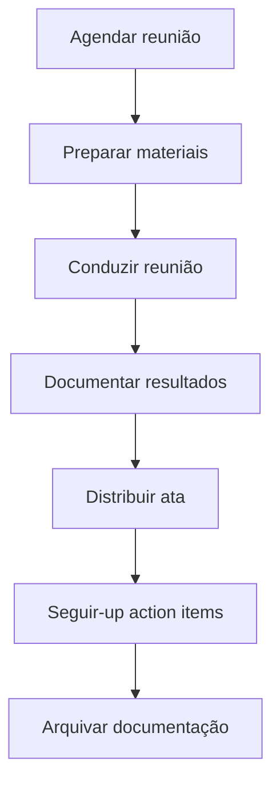
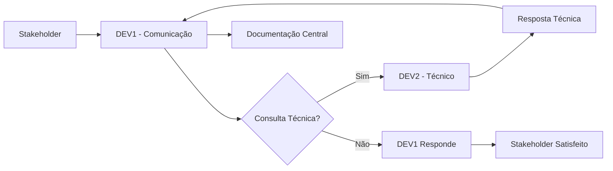

# ESPECIFICAÇÃO FUNCIONAL: PAPEL DE COMUNICAÇÃO - DEV1

## 📌 ID: DEV1-COM-001
## 🎯 Domínio: Gestão de Comunicação e Relacionamento
## 📅 Data: 15/02/2026
## 👤 Responsável: DEV1
## ⚠️ Prioridade: ALTA (Estratégico para projeto)
## ⏱️ Estimativa: 20 horas/semana

## 1. CONTEXTO E JUSTIFICATIVA

### 1.1. Por que DEV1 é ideal para este papel:
```
✅ Experiência comprovada na primeira etapa (validação + configuração)
✅ Visão completa da infraestrutura (OLTP/OLAP + Keycloak)
✅ Habilidade de planejamento detalhado (cronogramas dia a dia)
✅ Disciplina na execução (entregas no prazo)
✅ Documentação completa (código + processos)
```

### 1.2. Benefícios para o projeto:
```
🎯 DEV2 foca 100% em desenvolvimento técnico
🎯 Comunicação profissionalizada com stakeholders
🎯 Processo padronizado de validações
🎯 Documentação centralizada e organizada
🎯 Alinhamento garantido entre partes
```

## 2. PAPÉIS E RESPONSABILIDADES

### 2.1. Gestor de Relacionamento com Stakeholders
**Responsabilidades:**
```
1. Ponto de contato único para todos os stakeholders
2. Agendar e conduzir reuniões
3. Traduzir requisitos entre técnicos e especialistas
4. Gerenciar expectativas
5. Coletar e consolidar feedback
```

**Métricas de sucesso:**
```
✅ Taxa de satisfação dos stakeholders > 90%
✅ Tempo de resposta a consultas < 4 horas
✅ Reuniões agendadas com 48h antecedência
✅ Action items completados > 95%
```

### 2.2. Coordenador de Validações
**Responsabilidades:**
```
1. Preparar materiais para validações
2. Conduzir sessões de teste com especialistas
3. Documentar resultados e aprovações
4. Garantir que validações sejam completas
5. Seguir-up de action items
```

**Métricas de sucesso:**
```
✅ Validações concluídas no prazo
✅ Documentação de validação 100% completa
✅ Especialistas satisfeitos com processo
✅ Nenhum requisito mal interpretado
```

### 2.3. Apresentador Técnico
**Responsabilidades:**
```
1. Criar apresentações para diferentes públicos
2. Demonstrar funcionalidades do sistema
3. Explicar arquitetura e decisões técnicas
4. Responder perguntas técnicas
5. Adaptar linguagem para audiência
```

**Métricas de sucesso:**
```
✅ Apresentações claras e objetivas
✅ Demos funcionando sem problemas
✅ Perguntas respondidas adequadamente
✅ Audiência engajada e compreensiva
```

### 2.4. Documentador Central
**Responsabilidades:**
```
1. Manter documentação atualizada
2. Organizar repositório de documentos
3. Garantir consistência na documentação
4. Criar templates e padrões
5. Facilitar acesso à informação
```

**Métricas de sucesso:**
```
✅ Documentação 100% atualizada
✅ Tempo de localização de informação < 5 min
✅ Templates padronizados em uso
✅ Feedback positivo sobre clareza
```

## 3. PROCESSOS DE TRABALHO

### 3.1. Processo de Reunião


### 3.2. Processo de Validação
```
1. PRÉ-VALIDAÇÃO (DEV1):
   - Preparar casos de teste
   - Configurar ambiente de demo
   - Enviar materiais prévios
   - Confirmar agenda

2. VALIDAÇÃO (DEV1 + Especialista):
   - Demo guiada do sistema
   - Teste livre do especialista
   - Discussão de resultados
   - Coleta de feedback

3. PÓS-VALIDAÇÃO (DEV1):
   - Consolidar feedback
   - Documentar aprovações
   - Criar action items
   - Comunicar resultados
```

### 3.3. Processo de Comunicação Diária
```
MANHÃ (9:00):
- Revisar agenda do dia
- Responder emails pendentes
- Preparar para reuniões agendadas

TARDE (14:00):
- Conduzir reuniões agendadas
- Documentar resultados
- Atualizar status do projeto

FIM DO DIA (17:00):
- Consolidar aprendizados do dia
- Preparar agenda do próximo dia
- Atualizar documentação
- Comunicar progresso à equipe
```

## 4. FERRAMENTAS E TEMPLATES

### 4.1. Kit de Ferramentas
```
🎥 Videochamada: Google Meet / Zoom
📝 Colaboração: Miro / Figma / Google Docs
📅 Agenda: Google Calendar
📊 Projeto: Trello / Asana
📁 Documentação: Google Drive / Confluence
📞 Comunicação: Slack / Email
```

### 4.2. Templates Obrigatórios
```
1. TEMPLATE_AGENDA_REUNIAO.md
2. TEMPLATE_ATA_REUNIAO.md
3. TEMPLATE_VALIDACAO.md
4. TEMPLATE_APRESENTACAO.pptx
5. TEMPLATE_STATUS_PROJETO.md
6. TEMPLATE_FEEDBACK.md
```

### 4.3. Checklist de Qualidade
```
[ ] Agenda enviada com 24h antecedência
[ ] Materiais compartilhados previamente
[ ] Link da reunião funcionando
[ ] Backup plan preparado
[ ] Timebox definido para cada seção
[ ] Gravador configurado (se necessário)
[ ] Notetaker designado (se necessário)
[ ] Action items claros e atribuídos
```

## 5. INTEGRAÇÃO COM EQUIPE TÉCNICA

### 5.1. Alinhamento com DEV2
```
📅 Diário (15 min):
- Progresso técnico do dia
- Bloqueadores identificados
- Próximas prioridades
- Preparação para validações

📅 Semanal (30 min):
- Revisão da semana
- Planejamento da próxima semana
- Ajustes de cronograma
- Discussão de arquitetura
```

### 5.2. Fluxo de Comunicação Técnica


### 5.3. Handoff para Desenvolvimento
```
Quando DEV1 identifica novo requisito:
1. Documentar requisito claramente
2. Priorizar com stakeholders
3. Discutir viabilidade técnica com DEV2
4. Criar ticket no sistema de projeto
5. Acompanhar implementação
6. Validar com stakeholders
```

## 6. CRONOGRAMA DE IMPLEMENTAÇÃO

### Fase 1: Preparação (15-19/02)
```
Dia 1 (15/02): Aceitação do papel + treinamento inicial
Dia 2 (16/02): Criação de templates e ferramentas
Dia 3 (17/02): Treinamento com DEV2 (demo sistema)
Dia 4 (18/02): Simulação de reuniões
Dia 5 (19/02): Kit de comunicação completo
```

### Fase 2: Execução (22-26/02)
```
Dia 6 (22/02): Primeira reunião real (validação LGPD)
Dia 7 (23/02): Reunião com especialista clínico
Dia 8 (24/02): Apresentação para gestores
Dia 9 (25/02): Reunião técnica com arquitetos
Dia 10 (26/02): Consolidação da semana
```

### Fase 3: Otimização (a partir de 01/03)
```
- Análise de métricas de sucesso
- Refinamento de processos
- Expansão de responsabilidades
- Treinamento de sucessor (se necessário)
```

## 7. CRITÉRIOS DE ACEITAÇÃO

### 7.1. Para o Papel (DEV1):
```
✅ Aceita formalmente o papel
✅ Completa treinamento inicial
✅ Utiliza templates padrão
✅ Conduz primeira reunião com sucesso
✅ Mantém documentação atualizada
```

### 7.2. Para o Processo (Projeto):
```
✅ Comunicação mais eficiente
✅ Stakeholders satisfeitos
✅ Validações concluídas no prazo
✅ Documentação centralizada
✅ DEV2 com mais foco técnico
```

### 7.3. Para os Resultados (Business):
```
✅ Decisões mais rápidas
✅ Menor retrabalho
✅ Maior alinhamento
✅ Melhor qualidade das entregas
✅ ROI positivo do papel
```

## 8. RISCOS E MITIGAÇÕES

### 8.1. Riscos de Aceitação:
```
RISCO: DEV1 não quer assumir papel de comunicação
MITIGAÇÃO: Mostrar benefícios de crescimento profissional

RISCO: DEV2 se sente isolado das decisões
MITIGAÇÃO: Reuniões diárias de alinhamento

RISCO: Stakeholders querem falar diretamente com DEV2
MITIGAÇÃO: Estabelecer processo formal e educar stakeholders
```

### 8.2. Riscos Operacionais:
```
RISCO: Sobrecarga de trabalho para DEV1
MITIGAÇÃO: Definir limites claros e prioridades

RISCO: Informação perdida na tradução
MITIGAÇÃO: Documentação detalhada e validação cruzada

RISCO: Processo burocrático demais
MITIGAÇÃO: Manter agilidade e flexibilidade
```

### 8.3. Riscos de Qualidade:
```
RISCO: Demos com problemas técnicos
MITIGAÇÃO: Testes prévios e backup plans

RISCO: Documentação desatualizada
MITIGAÇÃO: Processo de atualização diária

RISCO: Feedback não capturado adequadamente
MITIGAÇÃO: Templates estruturados e follow-up
```

## 9. MÉTRICAS DE DESEMPENHO

### 9.1. Métricas Quantitativas:
```
📊 Número de reuniões conduzidas/semana
📊 Taxa de participação nas reuniões
📊 Tempo médio de reunião
📊 Action items completados no prazo
📊 Documentação gerada (páginas/semana)
📊 Tempo de resposta a consultas
```

### 9.2. Métricas Qualitativas:
```
⭐ Feedback dos stakeholders (survey mensal)
⭐ Clareza da comunicação (auto-avaliação)
⭐ Eficiência nas decisões (tempo de decisão)
⭐ Satisfação da equipe técnica (DEV2)
⭐ Qualidade das documentações (revisão por pares)
```

### 9.3. Métricas de Negócio:
```
💰 Redução no tempo de validação
💰 Redução no retrabalho
💰 Aumento na satisfação do cliente
💰 Melhoria na qualidade das entregas
💰 ROI do papel de comunicação
```

## 10. PLANO DE DESENVOLVIMENTO PROFISSIONAL

### 10.1. Habilidades a Desenvolver:
```
🗣️ Comunicação não-violenta
🎤 Apresentações eficazes
📋 Facilitação de reuniões
🤝 Gestão de stakeholders
📊 Documentação técnica
⚖️ Negociação e mediação
🔄 Gestão de conflitos
📈 Análise de métricas
```

### 10.2. Treinamentos Recomendados:
```
1. Curso: Comunicação Eficaz para Profissionais de TI (4h)
2. Curso: Facilitação de Reuniões Produtivas (3h)
3. Curso: Documentação Técnica para Não-Técnicos (2h)
4. Curso: Gestão de Expectativas de Stakeholders (3h)
5. Mentoria: Sessões com DEV2 sobre aspectos técnicos (5h)
```

### 10.3. Progressão de Carreira:
```
Fase 1 (0-3 meses): Gestor de Comunicação do Projeto
Fase 2 (3-6 meses): Coordenador de Projetos
Fase 3 (6-12 meses): Product Owner / Project Manager
Fase 4 (12+ meses): Liderança Técnica / Arquitetura
```

---

## 📋 CHECKLIST DE IMPLEMENTAÇÃO

### Semana 1 (15-19/02):
- [ ] DEV1 aceita formalmente o papel
- [ ] Templates básicos criados
- [ ] Ferramentas configuradas
- [ ] Treinamento inicial completo
- [ ] Kit de comunicação pronto

### Semana 2 (22-26/02):
- [ ] Primeira reunião conduzida com sucesso
- [ ] Processo estabelecido e documentado
- [ ] Feedback inicial coletado
- [ ] Ajustes realizados
- [ ] Métricas iniciais coletadas

### Semana 3 (01-05/03):
- [ ] Processo otimizado baseado em feedback
- [ ] Habilidades em desenvolvimento
- [ ] Resultados mensuráveis demonstrados
- [ ] Plano de crescimento definido
- [ ] Sucessor identificado (se necessário)

---

**STATUS**: 📋 **ESPECIFICAÇÃO FUNCIONAL PRONTA**
**PRÓXIMO PASSO**: **DEV1 REVISAR E ACEITAR PAPEL**
**BENEFÍCIO**: **CRESCIMENTO PROFISSIONAL + PROJETO MAIS EFICIENTE**
**IMPACTO**: **COMUNICAÇÃO PROFISSIONALIZADA, DECISÕES ACELERADAS**
