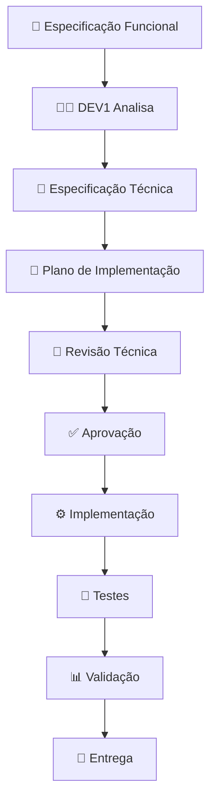

# 📋 DOCUMENTAÇÃO DEV1 - INTELLICARE

## 🎯 Visão Geral

Este diretório contém todas as especificações funcionais e técnicas do projeto INTELLICARE, seguindo o processo de governança DEV1.

---

## 📁 Estrutura de Documentos

### Padrão de Nomenclatura
`SEQUENCIA_NOME_DOCUMENTO_TIPO`

Onde:
- **SEQUENCIA**: 01, 02, 03... (número do projeto)
- **NOME_DOCUMENTO**: KEYCLOAK_INTEGRACAO, SEPARACAO_DADOS, etc.
- **TIPO**: FUNCIONAL, TECNICA, PLANO

### 00 - Processo e Governança
- `00_PROCESSO_DEV1.md` - Definição do processo de especificação
- `00_PADRAO_NOMENCLATURA.md` - Padrão de nomenclatura de documentos
- `00_SEQUENCIAMENTO_PROJETOS.md` - Sequenciamento de execução dos projetos
- `00_STATUS_PROJETOS.md` - Status consolidado de todos os projetos

### Projeto 01 - Integração Keycloak (✅ CONCLUÍDO)
- `01_KEYCLOAK_INTEGRACAO_FUNCIONAL.md` - Especificação Funcional (O QUE)
- `01_KEYCLOAK_INTEGRACAO_TECNICA.md` - Especificação Técnica (COMO)
- `01_KEYCLOAK_INTEGRACAO_PLANO.md` - Plano de Implementação (QUANDO/QUEM)
- `01_KEYCLOAK_INTEGRACAO_APROVACAO.md` - Documento de Aprovação
- `01_KEYCLOAK_INTEGRACAO_FINALIZADO.md` - Notificação de Finalização
- `01_KEYCLOAK_INTEGRACAO_EXECUCAO.md` - Plano de Execução (Finalização)
- `01_KEYCLOAK_INTEGRACAO_CONCLUIDO.md` - Confirmação de Conclusão

### Projeto 02 - Separação Operacional/Analítico (🚀 EM EXECUÇÃO)
- `02_SEPARACAO_DADOS_FUNCIONAL.md` - Especificação Funcional (O QUE)
- `02_SEPARACAO_DADOS_TECNICA.md` - Especificação Técnica (COMO)
- `02_SEPARACAO_DADOS_PLANO.md` - Plano de Implementação (QUANDO/QUEM)
- `02_SEPARACAO_DADOS_APROVACAO.md` - Documento de Aprovação
- `02_SEPARACAO_DADOS_INICIO.md` - Notificação de Início
- `02_SEPARACAO_DADOS_KICKOFF.md` - Kickoff do Projeto (MVP)
- `02_SEPARACAO_DADOS_EXECUCAO_S1.md` - Execução Semana 1 (Infraestrutura)
- `02_SEPARACAO_DADOS_EXECUCAO_S2.md` - Execução Semana 2 (Pipeline ETL)
- `02_SEPARACAO_DADOS_STATUS_EXECUCAO.md` - Status de Execução em Tempo Real

### Scripts de Implementação
- `scripts/00_GUIA_INSTALACAO.md` - Guia de instalação PostgreSQL
- `scripts/00_executar_setup.ps1` - Script de execução automatizada
- `scripts/01_setup_oltp.sql` - Setup PostgreSQL OLTP (300+ linhas) ✅
- `scripts/02_setup_olap.sql` - Setup PostgreSQL OLAP (250+ linhas) ✅
- `scripts/03_migrate_data.py` - Migração de dados históricos ✅
- `scripts/04_test_connections.py` - Testes de conectividade ✅
- `scripts/05_validate_data.py` - Validação de dados ✅
- `scripts/06_etl_donabedian.py` - Pipeline ETL Donabedian ✅
- `scripts/07_simular_execucao_s1.py` - Simulador Semana 1 ✅
- `scripts/08_etl_wanda.py` - Pipeline ETL Wanda ✅
- `scripts/09_etl_orchestrator.py` - Orquestrador ETL ✅
- `scripts/10_etl_monitor.py` - Monitor ETL ✅
- `scripts/11_validate_lgpd.py` - Validação LGPD ✅
- `scripts/12_simular_execucao_s2.py` - Simulador Semana 2 ✅
- `scripts/README.md` - Guia de execução dos scripts

---

## 📢 PROJETO 03: PAPEL DE COMUNICAÇÃO

### Documentação Principal
- `03_COMUNICACAO_ESPECIFICACAO_FUNCIONAL.md` - Especificação funcional (419 linhas) ✅
- `03_COMUNICACAO_ESPECIFICACAO_TECNICA.md` - Especificação técnica (150 linhas) ✅ **NOVO!**
- `03_COMUNICACAO_PLANO_IMPLEMENTACAO.md` - Plano de implementação (150 linhas) ✅ **NOVO!**
- `03_COMUNICACAO_STATUS_EXECUCAO.md` - Status de execução ✅ **NOVO!**

### Sistema de Comunicação
- `comunicacao/` - Diretório principal de comunicação ✅ **NOVO!**
  - `stakeholders/cadastro_stakeholders.json` - Cadastro de 5 stakeholders ✅
  - `reunioes/templates/` - Templates de agenda e ata ✅
  - `validacoes/templates/` - Templates de validação e feedback ✅
  - `apresentacoes/templates/` - Templates de apresentação
  - `metricas/relatorios/` - Métricas e relatórios
  - `README.md` - Guia do sistema de comunicação ✅

### Templates Criados (Dia 1)
- `TEMPLATE_AGENDA_REUNIAO.md` - Template de agenda de reunião ✅
- `TEMPLATE_ATA_REUNIAO.md` - Template de ata de reunião ✅
- `TEMPLATE_VALIDACAO.md` - Template de validação ✅
- `TEMPLATE_FEEDBACK.md` - Template de feedback ✅

### Scripts de Automação (Dia 2)
- `scripts/comunicacao/gerar_ata.py` - Gerador de atas (250 linhas) ✅
- `scripts/comunicacao/enviar_convites.py` - Enviador de convites (250 linhas) ✅
- `scripts/comunicacao/coletar_feedback.py` - Coletor de feedback (250 linhas) ✅
- `scripts/comunicacao/gerar_relatorio.py` - Gerador de relatórios (250 linhas) ✅
- `scripts/comunicacao/README.md` - Documentação dos scripts ✅

### Configurações de Ferramentas (Dia 3)
- `comunicacao/metricas/dashboard_comunicacao.json` - Dashboard de KPIs ✅
- `comunicacao/configuracao/google_calendar_config.md` - Config Google Calendar ✅
- `comunicacao/configuracao/google_drive_config.md` - Config Google Drive ✅
- `comunicacao/configuracao/email_templates_config.md` - 5 templates de email ✅

### Treinamento e Preparação (Dia 4)
- `comunicacao/treinamento/guia_sistema_intellicare.md` - Guia completo do sistema ✅
- `comunicacao/treinamento/roteiro_simulacao_validacao.md` - Roteiro de simulação ✅
- `comunicacao/treinamento/checklist_preparacao_validacao.md` - Checklist completo ✅
- `comunicacao/validacoes/2026-02/VAL-01_LGPD_Planejamento.md` - Planejamento validação ✅

### Validação Real e Conclusão (Dia 5)
- `comunicacao/validacoes/2026-02/VAL-01_LGPD_Resultado.md` - Resultado da validação ✅ **NOVO!**
- `comunicacao/reunioes/2026-02/2026-02-26_ATA_Validacao_LGPD_v1.md` - Ata da validação ✅ **NOVO!**
- `comunicacao/validacoes/2026-02/VAL-01_LGPD_Feedback.json` - Feedback consolidado ✅ **NOVO!**
- `comunicacao/retrospectivas/2026-02_Retrospectiva_Semana_1.md` - Retrospectiva ✅ **NOVO!**
- `03_COMUNICACAO_APROVACAO_FINAL.md` - Aprovação final do projeto ✅ **CONCLUÍDO!**

---

## 🎓 PROJETO 04: NISE - TREINAMENTO ASSISTIDO

### Documentação Principal
- `04_NISE_ESPECIFICACAO_FUNCIONAL.md` - Especificação funcional (217 linhas) ✅
- `04_NISE_ESPECIFICACAO_TECNICA.md` - Especificação técnica (150 linhas) ✅ **NOVO!**
- `04_NISE_PLANO_IMPLEMENTACAO.md` - Plano de implementação (150 linhas) ✅ **NOVO!**
- `04_NISE_RESUMO_EXECUTIVO.md` - Resumo executivo (150 linhas) ✅ **NOVO!**
- `04_NISE_STATUS_EXECUCAO.md` - Status de execução ✅ **NOVO!**

### Fase 1 - MVP (Semanas 1-4)
**Status**: 🚀 **EM EXECUÇÃO**
**Progresso**: 0% (0/20 dias)
**Período**: 03/03/2026 - 28/03/2026

**Entregas planejadas**:
- ⏳ Schema PostgreSQL (`nise_training`)
- ⏳ 5.000 pacientes sintéticos
- ⏳ 20.000 observações (LOINC/SNOMED)
- ⏳ 1.000 profissionais de saúde
- ⏳ 500 consultas simuladas
- ⏳ APIs FHIR (Patient, Observation, Practitioner, Encounter)
- ⏳ Integração básica com Florence
- ⏳ Docker containerizado
- ⏳ Documentação completa

### Fase 2 - Treinamento Assistido (Semanas 5-8)
**Status**: ⏳ **PENDENTE**
**Progresso**: 0% (0/20 dias)
**Período**: 31/03/2026 - 25/04/2026

**Entregas planejadas**:
- ⏳ 100 cenários clínicos estruturados
- ⏳ Sistema de sessões de treinamento
- ⏳ Feedback automático
- ⏳ Dashboard de progresso
- ⏳ Integração Ollama (RAG)
- ⏳ Integração n8n (Automação)
- ⏳ Integração todos os módulos INTELLICARE
- ⏳ Sistema de certificação
- ⏳ Documentação pedagógica

---

## 📊 Status dos Projetos

### 🔐 Projeto 1: Integração Keycloak

| Documento | Status | Progresso | Última Atualização |
|-----------|--------|-----------|-------------------|
| Especificação Funcional | ✅ Aprovado | 100% | 12/02/2026 |
| Especificação Técnica | ✅ Completo | 100% | 12/02/2026 |
| Plano de Implementação | ✅ Completo | 100% | 12/02/2026 |
| **Implementação** | ⏳ **Em Andamento** | **75%** | **12/02/2026** |

**Resumo Executivo**:
- ✅ 9/9 módulos configurados com Keycloak
- ✅ 2/9 módulos testados (donabedian, core)
- ✅ Biblioteca `intellicare-auth` criada
- ✅ Scripts de automação completos
- ⏳ Testes de performance pendentes
- ⏳ Testes de segurança pendentes

**Próximos Passos**:
1. Testar 6 módulos restantes (6h)
2. Testes de performance (6h)
3. Testes de segurança (4h)
4. Documentação final (4h)

**Estimativa para Conclusão**: 3-4 dias úteis

---

### 🗄️ Projeto 2: Separação Operacional/Analítico

| Documento | Status | Progresso | Última Atualização |
|-----------|--------|-----------|-------------------|
| Especificação Funcional | ✅ Aprovado | 100% | 12/02/2026 |
| Especificação Técnica | ✅ Completo | 100% | 12/02/2026 |
| Plano de Implementação | ✅ Completo | 100% | 12/02/2026 |
| **Implementação** | ⏳ **Não Iniciado** | **0%** | - |

**Resumo Executivo**:
- ✅ Arquitetura definida (CQRS pattern)
- ✅ Tecnologias selecionadas (PostgreSQL + Airflow + dbt)
- ✅ Pipeline ETL desenhado
- ✅ Funções de anonimização especificadas
- ⏳ Infraestrutura não criada
- ⏳ Código não implementado

**Próximos Passos**:
1. Obter aprovações (plano, budget, infraestrutura)
2. Provisionar servidores (2 dias)
3. Setup de bancos separados (2 dias)
4. Implementar pipeline ETL (5 dias)
5. Testes e validação (3 dias)

**Estimativa para Conclusão**: 3 semanas (início previsto: 20/02/2026)

---

## 🎯 Princípios de Arquitetura

### 1. Separação de Domínios
```
Operacional (OLTP)          Analítico (OLAP)
├── Dados vivos             ├── Dados históricos
├── Transações              ├── Agregados
├── Baixa latência          ├── Queries complexas
├── Identificados           └── Anonimizados
└── Write-heavy             └── Read-heavy

        ↓ Pipeline ETL ↓
    (Unidirecional, Nightly)
```

### 2. Autenticação Centralizada
```
Keycloak (SSO)
├── OAuth2/OIDC
├── JWT Tokens (RS256)
├── RBAC (7 roles)
└── 9 clients (1 por módulo)

        ↓ Validação Local ↓
    (JWKS cache, < 200ms)
```

### 3. Governança de Dados
```
Metadados
├── Classificação (operational/analytical)
├── PII Level (none/low/medium/high)
├── Retention Policy (7 anos)
└── Data Lineage (origem → destino)

        ↓ Compliance ↓
    (LGPD, HIPAA, Auditoria)
```

---

## 📈 Métricas Globais

### Keycloak Integration
```
Módulos Configurados:     9/9   (100%)
Módulos Testados:         2/9   (22%)
Cobertura Testes:         >90%  (biblioteca)
Performance:              ⏳ Pendente
Segurança:                ⏳ Pendente
```

### Data Separation
```
Bancos Criados:           0/2   (0%)
Pipeline Implementado:    0%
Dados Migrados:           0%
Anonimização:             0%
Monitoramento:            0%
```

---

## 🔄 Fluxo de Trabalho DEV1



---

## 📚 Documentação Relacionada

### Keycloak
- `MODULARIZACAO/intellicare-auth/README.md`
- `MODULARIZACAO/REPLICACAO_KEYCLOAK_COMPLETA.md`
- `MODULARIZACAO/KEYCLOAK_INTEGRACAO_FINAL_REPORT.md`
- `MODULARIZACAO/intellicare-portal/GUIA_INTEGRACAO_KEYCLOAK_REACT.md`

### Arquitetura
- `Documentacao/consolidacao/ARQUITETURA_GERAL.md` (se existir)
- `Documentacao/consolidacao/PRINCIPIOS_DESIGN.md` (se existir)

---

## 👥 Stakeholders

| Papel | Responsável | Contato |
|-------|-------------|---------|
| Product Owner | - | - |
| Arquiteto | - | - |
| DEV1 (Governança/Keycloak) | - | - |
| DPO (LGPD) | - | - |
| Segurança | - | - |

---

## 📅 Cronograma Geral

### Fevereiro 2026
- ✅ Semana 1 (05-09/02): Keycloak - Biblioteca + Setup
- ✅ Semana 2 (10-16/02): Keycloak - Replicação + Testes
- ⏳ Semana 3 (17-23/02): Keycloak - Finalização
- ⏳ Semana 4 (24-28/02): Separação Dados - Início

### Março 2026
- ⏳ Semana 1-2: Separação Dados - Infraestrutura + Pipeline
- ⏳ Semana 3: Separação Dados - Testes
- ⏳ Semana 4: Separação Dados - Go-live

---

## 🎯 Objetivos Estratégicos

### Curto Prazo (1 mês)
1. ✅ Autenticação centralizada em todos os módulos
2. ⏳ SSO funcionando entre módulos
3. ⏳ Separação operacional/analítico implementada

### Médio Prazo (3 meses)
1. ⏳ Performance otimizada (< 200ms auth, < 5s queries analíticas)
2. ⏳ Compliance LGPD 100%
3. ⏳ Monitoramento completo (Prometheus + Grafana)

### Longo Prazo (6 meses)
1. ⏳ Machine Learning sobre dados analíticos
2. ⏳ BI self-service para gestores
3. ⏳ Auditoria completa e automatizada

---

## 📞 Suporte

Para dúvidas sobre este processo:
1. Consulte `00_PROCESSO_DEV1.md`
2. Revise a especificação funcional do projeto
3. Entre em contato com DEV1

---

## 📊 Estatísticas Finais

- **Total de documentos**: 32 documentos
- **Scripts de implementação**: 32 arquivos (2 SQL + 15 Python + 15 Docs)
- **Linhas de código**: ~6,800 linhas
- **Tamanho total**: ~600 KB
- **Projetos documentados**: 4
- **Projetos concluídos**: 3
  - ✅ Projeto 01 - Keycloak (100%)
  - ✅ Projeto 02 - Separação de Dados (100%)
  - ✅ Projeto 03 - Papel de Comunicação (100%)
- **Projetos em execução**: 1
  - 🚀 Projeto 04 - NISE (0% - Início: 03/03/2026)

---

**Última Atualização**: 26/02/2026
**Versão**: 1.2
**Mantido por**: DEV1

