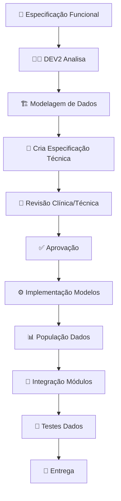
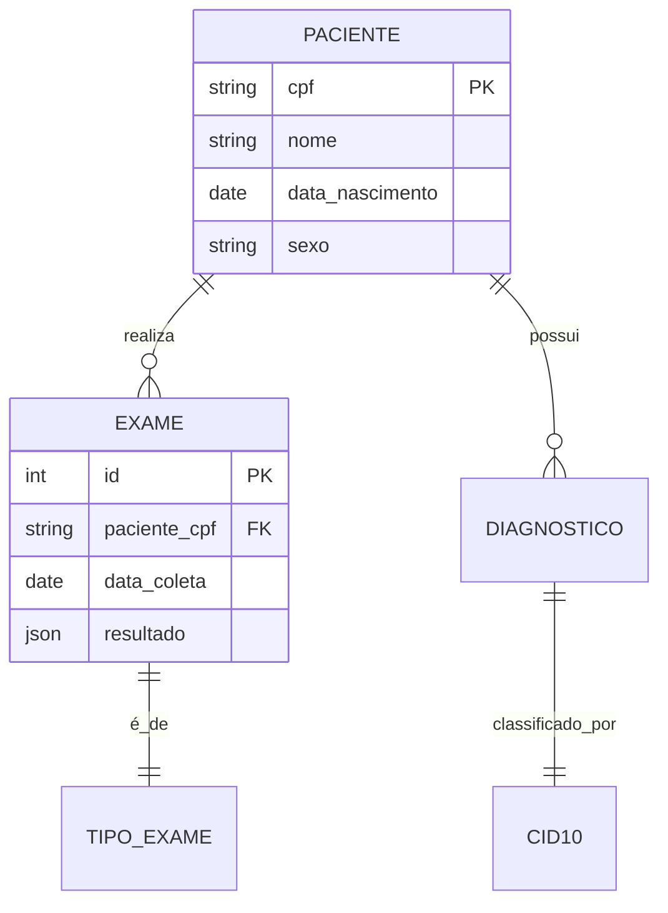

# 📋 PROCESSO DE ESPECIFICAÇÃO - DEV2 (Modelos/Dados)

## 🏗️ FLUXO DE TRABALHO



## 📁 ESTRUTURA DE DOCUMENTAÇÃO

### 1. ESPECIFICAÇÕES FUNCIONAIS (Input do Product Owner)
- `01_ESPECIFICACAO_FUNCIONAL_*.md` - O QUE fazer (domínio clínico)
- Fornecidas pelo PO/Especialista Clínico
- Descrevem requisitos do domínio médico

### 2. MODELAGEM DE DADOS
- `02_MODELAGEM_DADOS_*.md` - Modelos entidade-relacionamento
- Diagramas ER, normalização, relacionamentos
- Validação com especialistas clínicos

### 3. ESPECIFICAÇÕES TÉCNICAS (Output do DEV2)
- `03_ESPECIFICACAO_TECNICA_*.md` - COMO implementar
- Incluem: schemas SQLAlchemy, APIs, validações

### 4. PLANOS DE IMPLEMENTAÇÃO
- `04_PLANO_*.md` - Cronograma por módulo

### 5. DOCUMENTAÇÃO DE DADOS
- `05_DOCUMENTACAO_DADOS_*.md` - Dicionário de dados, exemplos

## 📋 TEMPLATES

### Template Especificação Funcional (Domínio Clínico):
```markdown
# ESPECIFICAÇÃO FUNCIONAL: [DOMÍNIO CLÍNICO]

## 📌 ID: DEV2-FUNC-[NUMERO]
## 🏥 Domínio: [Cardiologia/Oncologia/etc.]
## 📅 Data: [DATA]
## 👤 Responsável Clínico: [NOME]
## 👨‍💻 Responsável Técnico: [DEV2]

## 1. CONTEXTO CLÍNICO
[Descrição do domínio médico]

## 2. ENTIDADES PRINCIPAIS
### 2.1. [Entidade 1 - ex: Paciente]
**Atributos**:
- nome: string (obrigatório)
- data_nascimento: date (obrigatório)
- cpf: string (único, validado)

**Regras Clínicas**:
- Paciente deve ter pelo menos um contato de emergência
- Histórico médico obrigatório para maiores de 18 anos

### 2.2. [Entidade 2 - ex: Exame Laboratorial]
**Atributos**:
- tipo_exame: enum (hemograma, glicemia, etc.)
- resultado: json (estruturado por tipo)
- data_coleta: datetime
- valor_referencia: json (faixas por idade/sexo)

## 3. FLUXOS CLÍNICOS
### 3.1. Fluxo: Solicitação → Coleta → Resultado → Laudo


**Regras**:
- Tempo máximo entre coleta e resultado: 24h
- Laudo assinado digitalmente

## 4. VALIDAÇÕES CLÍNICAS
### 4.1. Validações de Dados
- Glicemia em jejum: 70-99 mg/dL (normal)
- Pressão arterial: sistólica < 120, diastólica < 80

### 4.2. Alertas Automáticos
- Valores fora da faixa: alerta amarelo
- Valores críticos: alerta vermelho + notificação

## 5. INTEGRAÇÕES
### 5.1. Com outros módulos
- Florence → Oswaldo (exames → diagnóstico crônico)
- Oswaldo → Geralda (diagnóstico → acompanhamento)

### 5.2. Com sistemas externos
- TASY (prontuário eletrônico)
- Laboratórios (resultados via HL7)

## 6. DADOS DE TESTE
### 6.1. Perfis de Pacientes
- Paciente A: 45 anos, hipertenso, sem comorbidades
- Paciente B: 68 anos, diabético, cardiopata

### 6.2. Casos Clínicos
- Caso 1: Infarto agudo do miocárdio
- Caso 2: Diabetes descompensada

## 7. ENTREGÁVEIS
- [ ] Modelos SQLAlchemy
- [ ] APIs REST
- [ ] Dados de teste realistas
- [ ] Integrações com outros módulos
- [ ] Documentação clínica-técnica

## 8. MÉTRICAS DE QUALIDADE
- Cobertura de testes: > 90%
- Dados anonimizados: 100%
- Performance queries: < 100ms
- Validações clínicas: 100% implementadas
```

### Template Modelagem de Dados:
```markdown
# MODELAGEM DE DADOS: [DOMÍNIO]

## 📌 ID: DEV2-MOD-[NUMERO]

## 1. DIAGRAMA ENTIDADE-RELACIONAMENTO


## 2. NORMALIZAÇÃO
### 2.1. 1ª Forma Normal
- [ ] Atômicos
- [ ] Sem grupos repetitivos

### 2.2. 2ª Forma Normal
- [ ] Dependência completa da PK

### 2.3. 3ª Forma Normal
- [ ] Sem dependências transitivas

## 3. SCHEMAS PROPOSTOS
### 3.1. Tabela: pacientes
```sql
CREATE TABLE pacientes (
    cpf VARCHAR(11) PRIMARY KEY,
    nome VARCHAR(255) NOT NULL,
    data_nascimento DATE NOT NULL,
    sexo CHAR(1) CHECK (sexo IN ('M', 'F', 'O')),
    created_at TIMESTAMP DEFAULT CURRENT_TIMESTAMP,
    updated_at TIMESTAMP DEFAULT CURRENT_TIMESTAMP
);
```

### 3.2. Tabela: exames
```sql
CREATE TABLE exames (
    id SERIAL PRIMARY KEY,
    paciente_cpf VARCHAR(11) REFERENCES pacientes(cpf),
    tipo_exame VARCHAR(50) NOT NULL,
    data_coleta TIMESTAMP NOT NULL,
    resultado JSONB NOT NULL,
    valor_referencia JSONB,
    created_at TIMESTAMP DEFAULT CURRENT_TIMESTAMP
);

CREATE INDEX idx_exames_paciente ON exames(paciente_cpf);
CREATE INDEX idx_exames_data ON exames(data_coleta);
```

## 4. RELACIONAMENTOS
### 4.1. Cardinalidades
- Paciente : Exame = 1:N
- Exame : TipoExame = N:1

### 4.2. Constraints
- FK com CASCADE DELETE? [SIM/NÃO]
- Unique constraints
- Check constraints

## 5. PERFORMANCE
### 5.1. Índices Propostos
- pacientes(cpf)
- exames(paciente_cpf, data_coleta)
- exames(tipo_exame, data_coleta)

### 5.2. Particionamento
- Por data? [SIM/NÃO]
- Por tipo de exame? [SIM/NÃO]

## 6. MIGRAÇÃO
### 6.1. Scripts de Migração
```python
# alembic migration
def upgrade():
    op.create_table(...)

def downgrade():
    op.drop_table(...)
```

### 6.2. Dados Iniciais
- Pacientes de teste: 100
- Exames por paciente: 5-20
- Período: últimos 2 anos
```

## 🎯 PRÓXIMOS PASSOS

1. **DEV2 recebe** especificações funcionais clínicas
2. **DEV2 modela** dados com validação clínica
3. **Cria especificação técnica** com schemas
4. **Revisão** com especialista clínico + técnico
5. **Aprovação** formal
6. **Implementação** modelos + dados
7. **Testes** com dados realistas
8. **Entrega** com documentação completa

---

**STATUS**: ✅ ESTRUTURA PRONTA PARA RECEBER ESPECIFICAÇÕES