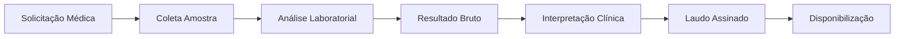
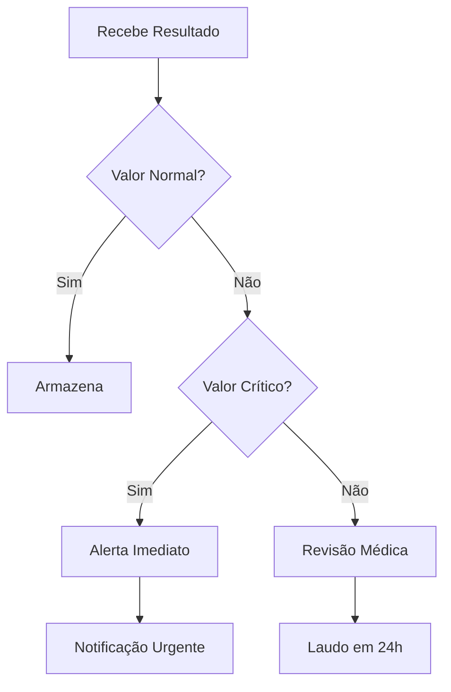

# ESPECIFICAÇÃO FUNCIONAL: CUSTOMIZAÇÃO MÓDULO FLORENCE

## 📌 ID: DEV2-FUNC-001
## 🏥 Domínio: Análise Clínica e Laboratorial
## 📅 Data: 12/02/2026
## 👤 Responsável Clínico: Especialista em Patologia Clínica
## 👨‍💻 Responsável Técnico: DEV2
## ⚠️ Prioridade: ALTA
## ⏱️ Estimativa PO: 35 horas

## 1. CONTEXTO CLÍNICO
O módulo Florence é responsável pela análise clínica e interpretação de exames laboratoriais e de imagem. Atualmente possui modelos genéricos que precisam ser customizados para o domínio médico real, com validações clínicas, alertas automáticos e integração com protocolos institucionais.

## 2. ENTIDADES PRINCIPAIS

### 2.1. Paciente
**Atributos**:
- cpf: VARCHAR(11) PRIMARY KEY (validado)
- nome_completo: VARCHAR(255) NOT NULL
- data_nascimento: DATE NOT NULL
- sexo_biologico: ENUM('M', 'F') NOT NULL
- tipo_sanguineo: ENUM('A+', 'A-', 'B+', 'B-', 'AB+', 'AB-', 'O+', 'O-')
- alergias: JSONB (lista de alergias medicamentosas)
- comorbidades: JSONB (histórico de doenças)

**Regras Clínicas**:
- Paciente deve ter pelo menos um contato de emergência
- Histórico de alergias obrigatório para prescrição
- Idade calculada automaticamente a partir da data_nascimento

### 2.2. Exame Laboratorial
**Atributos**:
- id: SERIAL PRIMARY KEY
- paciente_cpf: VARCHAR(11) FOREIGN KEY
- tipo_exame: ENUM('HEMOGRAMA', 'GLICEMIA', 'UREIA', 'CREATININA', 'TGO', 'TGP', 'TSH', 'LIPIDOGRAMA')
- data_coleta: TIMESTAMP NOT NULL
- data_resultado: TIMESTAMP
- resultado: JSONB (estruturado por tipo de exame)
- valor_referencia: JSONB (faixas por idade/sexo)
- unidade_medida: VARCHAR(20)
- metodo: VARCHAR(50)
- laboratorio: VARCHAR(100)

**Regras Clínicas**:
- Tempo máximo entre coleta e resultado: 24h para urgências
- Validação de faixa etária para valores de referência
- Alertas automáticos para valores críticos

### 2.3. Laudo
**Atributos**:
- id: SERIAL PRIMARY KEY
- exame_id: INTEGER FOREIGN KEY
- medico_responsavel: VARCHAR(100) NOT NULL
- crm: VARCHAR(20) NOT NULL
- conclusao: TEXT
- recomendacoes: JSONB
- data_emissao: TIMESTAMP DEFAULT NOW()
- assinatura_digital: BYTEA

**Regras Clínicas**:
- Laudo só pode ser emitido por médico com CRM ativo
- Assinatura digital obrigatória
- Recomendações baseadas em protocolos institucionais

## 3. FLUXOS CLÍNICOS

### 3.1. Fluxo: Solicitação → Coleta → Análise → Laudo


**Regras**:
- Tempo total do fluxo: < 48h para rotina, < 4h para urgência
- Validação em cada etapa
- Rastreabilidade completa

### 3.2. Fluxo: Triagem de Resultados


## 4. VALIDAÇÕES CLÍNICAS

### 4.1. Valores de Referência (Exemplos)
```yaml
hemograma:
  hemoglobina:
    masculino:
      adulto: 13.5-17.5 g/dL
      idoso: 12.0-16.0 g/dL
    feminino:
      adulto: 12.0-15.5 g/dL
      idoso: 11.5-15.0 g/dL
  leucocitos:
    todos: 4000-11000 /mm³

glicemia:
  jejum:
    normal: 70-99 mg/dL
    pre_diabetes: 100-125 mg/dL
    diabetes: ≥126 mg/dL
  pos_prandial:
    normal: <140 mg/dL
    diabetes: ≥200 mg/dL
```

### 4.2. Alertas Automáticos
**Níveis de Alerta**:
- ⚠️ **Amarelo**: Valor fora da referência, mas não crítico
- 🚨 **Vermelho**: Valor crítico, ação imediata necessária
- 🔴 **Preto**: Valor incompatível com a vida

**Exemplos**:
- Glicemia > 500 mg/dL → 🚨 Vermelho
- Potássio > 6.5 mEq/L → 🔴 Preto
- Hemoglobina < 7.0 g/dL → 🚨 Vermelho

### 4.3. Validações Cruzadas
- Creatinina elevada + ureia elevada = possível insuficiência renal
- TGO/TGP elevados + bilirrubina elevada = possível hepatite
- Glicemia elevada + hemoglobina glicada elevada = diabetes descompensada

## 5. MODELOS DE DADOS ESPECÍFICOS

### 5.1. Hemograma Completo
```python
class Hemograma(BaseModel):
    hemoglobina: float  # g/dL
    hematocrito: float  # %
    leucocitos: float   # /mm³
    neutrofilos: float  # %
    linfocitos: float   # %
    monocitos: float    # %
    eosinofilos: float  # %
    basofilos: float    # %
    plaquetas: float    # /mm³
    vcm: float          # fL
    hcm: float          # pg
    chcm: float         # g/dL
    rdw: float          # %
    
    @validator('hemoglobina')
    def validate_hemoglobina(cls, v, values):
        if v < 5.0:
            raise ValueError('Valor incompatível com a vida')
        if v > 20.0:
            raise ValueError('Valor fisiologicamente impossível')
        return v
```

### 5.2. Lipidograma
```python
class Lipidograma(BaseModel):
    colesterol_total: float      # mg/dL
    hdl: float                   # mg/dL (bom)
    ldl: float                   # mg/dL (ruim)
    triglicerides: float         # mg/dL
    nao_hdl: Optional[float]     # mg/dL
    
    @property
    def risco_cardiaco(self) -> str:
        """Calcula risco cardiovascular"""
        if self.ldl > 190 or self.colesterol_total > 240:
            return 'ALTO'
        elif self.ldl > 160:
            return 'MODERADO-ALTO'
        else:
            return 'BAIXO-MODERADO'
```

## 6. INTEGRAÇÕES

### 6.1. Com Módulo Oswaldo (Doenças Crônicas)
- Florence detecta alteração → Oswaldo atualiza estágio da doença
- Exemplo: Creatinina elevada → DRC estágio 3

### 6.2. Com Módulo Geralda (Acompanhamento)
- Resultado crítico → Geralda notifica paciente/médico
- Laudo com recomendações → Geralda cria lembretes

### 6.3. Com Sistemas Externos
- **TASY**: Importação de exames via HL7
- **PACS**: Imagens médicas (DICOM)
- **Laboratórios**: Resultados via API/HL7

## 7. DADOS DE TESTE

### 7.1. Perfis de Pacientes
```yaml
paciente_001:
  nome: "João Silva"
  idade: 62
  sexo: "M"
  comorbidades: ["Hipertensão", "Diabetes Tipo 2"]
  exames:
    - tipo: "HEMOGRAMA"
      resultado:
        hemoglobina: 14.2
        hematocrito: 42.1
    - tipo: "GLICEMIA"
      resultado: 185  # diabetes descompensada

paciente_002:
  nome: "Maria Santos"
  idade: 45
  sexo: "F"
  comorbidades: ["Hipotireoidismo"]
  exames:
    - tipo: "TSH"
      resultado: 8.5  # hipotireoidismo
```

### 7.2. Casos Clínicos
1. **Caso Diabetes Descompensada**:
   - Glicemia: 320 mg/dL
   - HbA1c: 9.5%
   - Alertas: 🚨 Vermelho
   - Ação: Notificar endocrinologista urgente

2. **Caso Anemia Grave**:
   - Hemoglobina: 6.8 g/dL
   - Hematócrito: 21%
   - Alertas: 🔴 Preto
   - Ação: Transfusão urgente

## 8. PROTOCOLOS INSTITUCIONAIS

### 8.1. Protocolo de Interpretação
- **CID-10**: E11 (Diabetes mellitus tipo 2)
- **Critérios**: Glicemia ≥126 mg/dL (jejum) ou HbA1c ≥6.5%
- **Ações**:
  1. Confirmar com novo exame
  2. Encaminhar endocrinologia
  3. Iniciar educação em diabetes
  4. Agendar retorno em 30 dias

### 8.2. Fluxo de Alertas
```yaml
nivel_vermelho:
  notificacoes:
    - medico_solicitante: SMS + Email
    - enfermeira_plantao: Sistema
    - paciente: SMS (se consentir)
  prazos:
    - notificacao: Imediata (< 5 min)
    - acao: < 1 hora
    - registro: < 15 min
```

## 9. ENTREGÁVEIS

### 9.1. Modelos de Dados
- [ ] SQLAlchemy models para todas entidades
- [ ] Pydantic schemas com validação clínica
- [ ] Migrations (Alembic) para criação de tabelas
- [ ] Indexes otimizados para queries clínicas

### 9.2. APIs
- [ ] CRUD completo para exames/laudos
- [ ] Endpoint de interpretação automática
- [ ] API de alertas e notificações
- [ ] Integração com outros módulos

### 9.3. Dados de Teste
- [ ] 100 pacientes com perfis variados
- [ ] 500+ exames com resultados realistas
- [ ] Casos clínicos completos (10+)
- [ ] Dados anonimizados para desenvolvimento

### 9.4. Documentação
- [ ] Dicionário de dados clínicos
- [ ] Guia de validações e alertas
- [ ] Exemplos de uso da API
- [ ] Troubleshooting clínico

## 10. MÉTRICAS DE QUALIDADE

### Clínicas:
- ✅ Validações clínicas: 100% implementadas
- ✅ Alertas automáticos: funcionando
- ✅ Integração protocolos: completa
- ✅ Rastreabilidade: end-to-end

### Técnicas:
- ✅ Cobertura testes: > 90%
- ✅ Performance queries: < 100ms
- ✅ Disponibilidade API: 99.9%
- ✅ Documentação: completa

### Segurança:
- ✅ Dados anonimizados: 100%
- ✅ Auditoria: logs completos
- ✅ LGPD: conformidade total
- ✅ Assinatura digital: implementada

---

## 📋 APROVAÇÕES

- [ ] **Aprovação Técnica (DEV2)**: _________________ Data: __/__/____
- [ ] **Aprovação Clínica**: _________________ Data: __/__/____
- [ ] **Aprovação Product Owner**: _________________ Data: __/__/____

## 🔄 PRÓXIMOS PASSOS

1. DEV2 analisa e cria modelagem de dados
2. Revisão com especialista clínico
3. Criação da especificação técnica
4. Implementação faseada
5. Testes com dados reais
6. Validação clínica final

---

**STATUS**: 📄 ESPECIFICAÇÃO FUNCIONAL PRONTA PARA ANÁLISE TÉCNICA