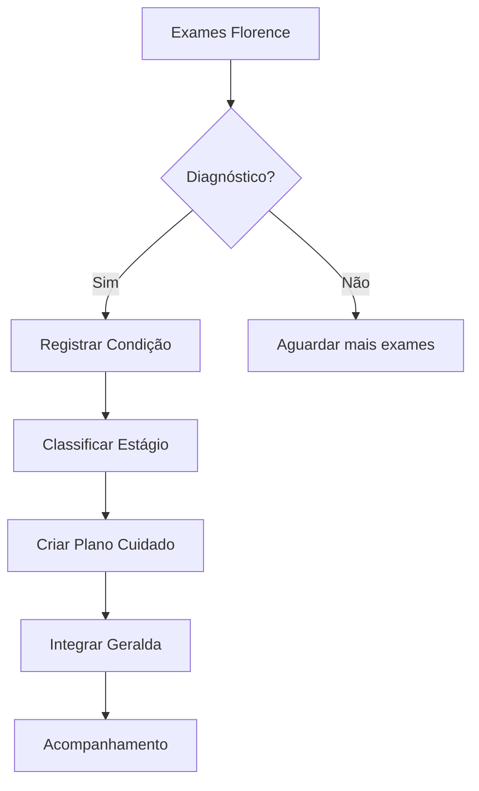
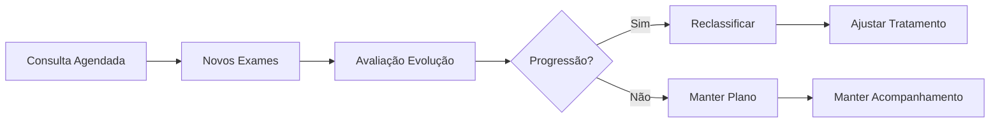

# ESPECIFICAÇÃO FUNCIONAL: CUSTOMIZAÇÃO MÓDULO OSWALDO

## 📌 ID: DEV2-FUNC-002
## 🏥 Domínio: Doenças Crônicas e Gerenciamento de Condições
## 📅 Data: 12/02/2026
## 👤 Responsável Clínico: Especialista em Medicina Interna/Clínica Médica
## 👨‍💻 Responsável Técnico: DEV2
## ⚠️ Prioridade: ALTA
## ⏱️ Estimativa PO: 30 horas

## 1. CONTEXTO CLÍNICO
O módulo Oswaldo gerencia doenças crônicas, acompanhamento longitudinal de pacientes e estadiamento de condições. Deve integrar com Florence (exames) para diagnóstico automático e com Geralda para acompanhamento. Foco em doenças prevalentes no SUS: Hipertensão, Diabetes, DRC, ICC, DPOC.

## 2. ENTIDADES PRINCIPAIS

### 2.1. Condição Crônica
**Atributos**:
- id: SERIAL PRIMARY KEY
- paciente_cpf: VARCHAR(11) FOREIGN KEY
- cid10: VARCHAR(10) NOT NULL (ex: I10, E11, N18)
- data_diagnostico: DATE NOT NULL
- medico_diagnosticador: VARCHAR(100)
- crm_diagnosticador: VARCHAR(20)
- confirmacao_exames: BOOLEAN DEFAULT FALSE
- gravidade_inicial: ENUM('LEVE', 'MODERADA', 'GRAVE', 'MUITO_GRAVE')

**Regras Clínicas**:
- Diagnóstico requer confirmação por exames (integração Florence)
- CID-10 validado contra tabela oficial
- Médico diagnosticador deve ter CRM ativo

### 2.2. Estadiamento/Classificação
**Atributos**:
- id: SERIAL PRIMARY KEY
- condicao_id: INTEGER FOREIGN KEY
- sistema_classificacao: VARCHAR(50) (ex: 'NYHA', 'KDIGO', 'ABCD')
- estagio: VARCHAR(20) (ex: 'I', 'II', 'III', 'IV')
- data_classificacao: DATE NOT NULL
- criterios: JSONB (critérios usados para classificação)
- exames_suporte: JSONB (IDs dos exames que suportam)

**Regras Clínicas**:
- Reclassificação periódica obrigatória
- Baseada em exames atuais (não históricos)
- Documentação completa dos critérios

### 2.3. Plano de Cuidado
**Atributos**:
- id: SERIAL PRIMARY KEY
- condicao_id: INTEGER FOREIGN KEY
- data_inicio: DATE NOT NULL
- data_revisao: DATE
- objetivos: JSONB (objetivos SMART)
- intervencoes: JSONB (lista de intervenções)
- medicamentos: JSONB (esquema terapêutico)
- educacao_saude: JSONB (materiais educativos)

**Regras Clínicas**:
- Personalizado por paciente e condição
- Alinhado com protocolos institucionais
- Revisão periódica obrigatória

## 3. DOENÇAS ESPECÍFICAS

### 3.1. Hipertensão Arterial Sistêmica (HAS) - CID-10: I10
**Classificação**:
```yaml
estagio_1:
  pressao: 140-159/90-99 mmHg
  risco: Baixo-Moderado
  acoes:
    - Mudança estilo de vida
    - Reavaliar em 1 mês

estagio_2:
  pressao: 160-179/100-109 mmHg
  risco: Alto
  acoes:
    - Iniciar farmacoterapia
    - Reavaliar em 2 semanas

estagio_3:
  pressao: ≥180/≥110 mmHg
  risco: Muito Alto
  acoes:
    - Tratamento imediato
    - Avaliação urgente
```

### 3.2. Diabetes Mellitus Tipo 2 - CID-10: E11
**Classificação (HbA1c)**:
- Bem controlado: < 7.0%
- Moderado: 7.0-8.5%
- Mal controlado: > 8.5%
- Crítico: > 10.0%

### 3.3. Doença Renal Crônica (DRC) - CID-10: N18
**Estadiamento KDIGO**:
```yaml
g1:
  tfge: ≥90
  descricao: Normal ou alto

g2:
  tfge: 60-89
  descricao: Levemente diminuída

g3a:
  tfge: 45-59
  descricao: Leve a moderadamente diminuída

g3b:
  tfge: 30-44
  descricao: Moderada a severamente diminuída

g4:
  tfge: 15-29
  descricao: Severamente diminuída

g5:
  tfge: <15
  descricao: Falência renal
```

## 4. FLUXOS CLÍNICOS

### 4.1. Fluxo: Diagnóstico → Estadiamento → Plano


### 4.2. Fluxo: Reclassificação Periódica


## 5. INTEGRAÇÕES

### 5.1. Com Florence (Exames)
- **Entrada**: Resultados de exames para diagnóstico
- **Processamento**: Interpretação automática para estadiamento
- **Exemplo**: Creatinina → TFGe → Estágio DRC

### 5.2. Com Geralda (Acompanhamento)
- **Saída**: Plano de cuidado → Lembretes/Educação
- **Feedback**: Adesão ao tratamento → Reajuste plano

### 5.3. Com Wanda (Orquestração)
- **Coordenação**: Fluxos complexos entre especialidades
- **Escalonamento**: Casos graves para atenção especializada

## 6. ALGORITMOS DE DECISÃO

### 6.1. Algoritmo HAS
```python
def classificar_has(pressao_sistolica: float, pressao_diastolica: float) -> dict:
    """Classifica Hipertensão Arterial"""
    if pressao_sistolica >= 180 or pressao_diastolica >= 110:
        return {
            'estagio': '3',
            'risco': 'MUITO_ALTO',
            'acao': 'TRATAMENTO_IMEDIATO',
            'prazo': 'URGENTE'
        }
    elif pressao_sistolica >= 160 or pressao_diastolica >= 100:
        return {
            'estagio': '2',
            'risco': 'ALTO',
            'acao': 'INICIAR_FARMACOTERAPIA',
            'prazo': '2_SEMANAS'
        }
    elif pressao_sistolica >= 140 or pressao_diastolica >= 90:
        return {
            'estagio': '1',
            'risco': 'BAIXO_MODERADO',
            'acao': 'MUDANCA_ESTILO_VIDA',
            'prazo': '1_MES'
        }
    else:
        return {'estagio': 'NORMAL', 'risco': 'BAIXO'}
```

### 6.2. Algoritmo DRC (TFGe)
```python
def calcular_tfge(creatinina: float, idade: int, sexo: str, raca: str = 'não negra') -> dict:
    """Calcula TFGe usando fórmula CKD-EPI"""
    # Implementação fórmula CKD-EPI
    k = 0.7 if sexo == 'F' else 0.9
    alpha = -0.329 if sexo == 'F' else -0.411
    
    if creatinina / k <= 1:
        tfge = 141 * ((creatinina / k) ** alpha)
    else:
        tfge = 141 * ((creatinina / k) ** -1.209)
    
    # Ajustes
    tfge *= (0.993 ** idade)
    if sexo == 'F':
        tfge *= 1.018
    if raca == 'negra':
        tfge *= 1.159
    
    # Classificação KDIGO
    if tfge >= 90:
        estagio = 'G1'
    elif tfge >= 60:
        estagio = 'G2'
    elif tfge >= 45:
        estagio = 'G3a'
    elif tfge >= 30:
        estagio = 'G3b'
    elif tfge >= 15:
        estagio = 'G4'
    else:
        estagio = 'G5'
    
    return {'tfge': round(tfge, 2), 'estagio': estagio}
```

## 7. DADOS DE TESTE

### 7.1. Pacientes com Condições Crônicas
```yaml
paciente_has:
  nome: "Carlos Oliveira"
  idade: 58
  condicoes:
    - cid10: "I10"
      data_diagnostico: "2023-05-15"
      classificacao:
        sistema: "HAS"
        estagio: "2"
        pressao: "165/102"
      plano:
        medicamentos: ["Losartana 50mg", "Hidroclorotiazida 25mg"]
        acompanhamento: "Mensal"

paciente_drc:
  nome: "Ana Costa"
  idade: 72
  condicoes:
    - cid10: "N18"
      data_diagnostico: "2022-11-30"
      classificacao:
        sistema: "KDIGO"
        estagio: "G3b"
        tfge: 38.5
      plano:
        dieta: "Restrição proteína"
        medicamentos: ["Sevelamer"],
        encaminhamento: "Nefrologia"
```

### 7.2. Evoluções Temporais
```yaml
paciente_diabetes_evolucao:
  paciente: "Maria Silva"
  condicao: "E11"
  timeline:
    "2023-01":
      hba1c: 7.2
      classificacao: "Moderado"
    "2023-07":
      hba1c: 6.8
      classificacao: "Bem controlado"
    "2024-01":
      hba1c: 8.9
      classificacao: "Mal controlado"
      acao: "Revisar tratamento"
```

## 8. PROTOCOLOS INSTITUCIONAIS

### 8.1. Protocolo HAS
```yaml
fluxo_atendimento:
  primeira_consulta:
    - Confirmar diagnóstico (≥2 medidas)
    - Avaliar risco cardiovascular
    - Solicitar exames: creatinina, glicemia, lipidograma
    - Iniciar mudança estilo de vida
  retorno:
    leve: 1 mês
    moderado: 2 semanas
    grave: 1 semana
  metas:
    pressao: < 140/90 mmHg (< 130/80 se diabético/DRC)
    reavaliacao: Anual se controlado
```

### 8.2. Protocolo Diabetes
```yaml
monitoramento:
  hba1c:
    controlado: 6 meses
    descontrolado: 3 meses
  pes_pe_diabetico:
    frequencia: Anual
  fundo_olho:
    frequencia: Anual
  microalbuminuria:
    frequencia: Anual
```

## 9. ENTREGÁVEIS

### 9.1. Modelos de Dados
- [ ] SQLAlchemy models para condições/estadiamentos/planos
- [ ] Schemas Pydantic com validação clínica
- [ ] Migrations com constraints clínicas
- [ ] Indexes para queries temporais

### 9.2. Algoritmos Clínicos
- [ ] Classificação HAS (completa)
- [ ] Cálculo TFGe (CKD-EPI)
- [ ] Classificação diabetes (HbA1c)
- [ ] Algoritmos outras doenças

### 9.3. APIs
- [ ] CRUD condições crônicas
- [ ] Endpoint classificação automática
- [ ] API criação planos de cuidado
- [ ] Integração Florence/Geralda

### 9.4. Dados de Teste
- [ ] 50 pacientes com condições crônicas
- [ ] 200+ classificações/estadiamentos
- [ ] 100+ planos de cuidado
- [ ] Evoluções temporais (6 meses)

### 9.5. Documentação
- [ ] Guia doenças crônicas
- [ ] Protocolos institucionais
- [ ] Exemplos algoritmos
- [ ] Integração com outros módulos

## 10. MÉTRICAS DE QUALIDADE

### Clínicas:
- ✅ Diagnósticos validados por exames: 100%
- ✅ Classificação automática funcionando
- ✅ Planos personalizados: por paciente/condição
- ✅ Integração Florence/Geralda: completa

### Técnicas:
- ✅ Cobertura testes: > 90%
- ✅ Performance algoritmos: < 100ms
- ✅ Disponibilidade API: 99.9%
- ✅ Dados anonimizados: 100%

### Operacionais:
- ✅ Rastreabilidade diagnósticos: end-to-end
- ✅ Alertas reclassificação: automáticos
- ✅ Documentação protocolos: completa
- ✅ Conformidade LGPD: total

---

## 📋 APROVAÇÕES

- [ ] **Aprovação Técnica (DEV2)**: _________________ Data: __/__/____
- [ ] **Aprovação Clínica (Medicina Interna)**: _________________ Data: __/__/____
- [ ] **Aprovação Product Owner**: _________________ Data: __/__/____

## 🔄 PRÓXIMOS PASSOS

1. DEV2 analisa e cria modelagem dados
2. Revisão com especialista doenças crônicas
3. Desenvolvimento algoritmos clínicos
4. Implementação APIs
5. Testes com dados reais
6. Integração com Florence/Geralda

---

**STATUS**: 📄 ESPECIFICAÇÃO FUNCIONAL PRONTA PARA ANÁLISE TÉCNICA