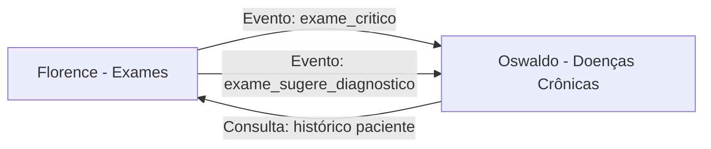

# ESPECIFICAÇÃO FUNCIONAL: MÓDULO OSWALDO - DOENÇAS CRÔNICAS

## 📌 ID: DEV2-FUNC-002
## 🏥 Domínio: Gerenciamento de Doenças Crônicas
## 📅 Data: 15/02/2026
## 👤 Responsável: DEV2
## ⚠️ Prioridade: ALTA (Próximo após Florence)
## ⏱️ Estimativa: 56 horas (7 dias)

## 1. CONTEXTO E INTEGRAÇÃO COM FLORENCE

### 1.1. Relação Florence → Oswaldo


### 1.2. Fluxo Clínico Integrado
```
1. Florence detecta exame crítico
2. Evento enviado para Oswaldo
3. Oswaldo verifica se paciente tem condição crônica relacionada
4. Se não tem, sugere diagnóstico
5. Se tem, verifica se precisa reclassificação
6. Atualiza plano de cuidado
7. Gera alertas para equipe clínica
```

## 2. CASOS DE USO PRINCIPAIS

### 2.1. UC-OSW-001: Diagnóstico Automático de Condição Crônica
**Descrição**: Sistema sugere diagnóstico baseado em exames críticos do Florence
**Fluxo**:
```
Exame crítico (Florence) → Análise padrões (Oswaldo) → Sugestão diagnóstico → Validação médica
```

### 2.2. UC-OSW-002: Classificação/Estadiamento
**Descrição**: Classifica estágio da doença baseado em critérios clínicos
**Exemplos**:
- HAS: Estágio 1, 2, 3 (SBC)
- DRC: G1-G5 (KDIGO)
- Diabetes: Controlado, Moderado, Descontrolado

### 2.3. UC-OSW-003: Plano de Cuidado Personalizado
**Descrição**: Cria plano terapêutico baseado no estágio e características do paciente
**Componentes**:
- Objetivos SMART
- Intervenções farmacológicas
- Intervenções não-farmacológicas
- Educação em saúde
- Follow-up schedule

### 2.4. UC-OSW-004: Acompanhamento e Reclassificação
**Descrição**: Monitora evolução e reclassifica quando necessário
**Gatilhos**:
- Novos exames do Florence
- Consultas de acompanhamento
- Mudança em medicamentos
- Eventos adversos

### 2.5. UC-OSW-005: Alertas de Descontrole
**Descrição**: Gera alertas quando condição está descontrolada
**Exemplos**:
- PA > 180/110 mmHg
- HbA1c > 10%
- TFGe < 15 mL/min

## 3. MODELOS DE DADOS

### 3.1. CondicaoCronica
```python
class CondicaoCronica(BaseModel):
    id: int
    paciente_cpf: str  # Link com Florence
    cid10: str  # Código CID-10
    data_diagnostico: date
    medico_diagnosticador: str
    confirmacao_exames: bool  # Confirmado por exames do Florence
    gravidade_inicial: str  # LEVE, MODERADA, GRAVE
    # Relacionamentos
    estadiamentos: List[Estadiamento]
    plano_cuidado: PlanoCuidado
    acompanhamentos: List[Acompanhamento]
```

### 3.2. Estadiamento
```python
class Estadiamento(BaseModel):
    id: int
    condicao_cronica_id: int
    sistema_classificacao: str  # NYHA, KDIGO, ABCD, etc
    estagio: str  # I, II, III, IV, G1, G2, etc
    data_classificacao: date
    criterios: Dict  # Critérios usados para classificação
    exames_suporte: List[Dict]  # Exames do Florence que suportam
```

### 3.3. PlanoCuidado
```python
class PlanoCuidado(BaseModel):
    id: int
    condicao_cronica_id: int
    data_inicio: date
    data_revisao: date
    objetivos: List[Dict]  # Objetivos SMART
    intervencoes: List[Dict]  # Farmacológicas e não-farmacológicas
    medicamentos: List[Dict]
    educacao_saude: List[Dict]
    status: str  # ATIVO, REVISADO, SUSPENSO, ENCERRADO
```

### 3.4. Acompanhamento
```python
class Acompanhamento(BaseModel):
    id: int
    paciente_cpf: str
    condicao_cronica_id: int
    data_acompanhamento: date
    medico_id: int
    pressao_arterial: str  # Formato: SYS/DIA
    glicemia: float
    peso_kg: float
    observacoes: List[Dict]
    medicamentos_vigentes: List[Dict]
```

## 4. ALGORITMOS CLÍNICOS

### 4.1. Classificação HAS (Hipertensão)
```python
def classificar_has(pa_sistolica: int, pa_diastolica: int) -> str:
    """Classifica HAS segundo diretrizes SBC"""
    if pa_sistolica >= 180 or pa_diastolica >= 110:
        return "ESTAGIO_3"
    elif pa_sistolica >= 160 or pa_diastolica >= 100:
        return "ESTAGIO_2"
    elif pa_sistolica >= 140 or pa_diastolica >= 90:
        return "ESTAGIO_1"
    else:
        return "NORMAL"
```

### 4.2. Classificação DRC (Doença Renal Crônica)
```python
def classificar_drc(tfge: float) -> str:
    """Classifica DRC segundo KDIGO"""
    if tfge >= 90:
        return "G1"
    elif tfge >= 60:
        return "G2"
    elif tfge >= 45:
        return "G3a"
    elif tfge >= 30:
        return "G3b"
    elif tfge >= 15:
        return "G4"
    else:
        return "G5"
```

### 4.3. Classificação Diabetes
```python
def classificar_diabetes(hba1c: float) -> str:
    """Classifica controle glicêmico"""
    if hba1c < 7.0:
        return "BEM_CONTROLADO"
    elif hba1c <= 8.5:
        return "MODERADO"
    elif hba1c <= 10.0:
        return "MAL_CONTROLADO"
    else:
        return "CRITICO"
```

## 5. INTEGRAÇÃO COM FLORENCE

### 5.1. Eventos Recebidos de Florence
```python
# 1. Exame crítico detectado
{
    "event_type": "exame_critico",
    "exame_id": 123,
    "paciente_cpf": "12345678901",
    "parametro_critico": "glicemia",
    "valor": 450,
    "nivel_alerta": "VERMELHO"
}

# 2. Exame sugere diagnóstico
{
    "event_type": "exame_sugere_diagnostico",
    "exame_id": 124,
    "paciente_cpf": "12345678901",
    "padrao_sugerido": "diabetes",
    "confianca": 0.85,
    "exames_suporte": ["glicemia", "hba1c"]
}

# 3. Novo exame disponível
{
    "event_type": "exame_novo",
    "exame_id": 125,
    "paciente_cpf": "12345678901",
    "tipo_exame": "funcao_renal",
    "parametros": {"creatinina": 2.1, "tfge": 35}
}
```

### 5.2. APIs Expostas por Oswaldo
```python
# 1. Consultar condições do paciente
GET /api/v1/oswaldo/paciente/{cpf}/condicoes

# 2. Criar nova condição
POST /api/v1/oswaldo/condicoes

# 3. Classificar/estadiar condição
POST /api/v1/oswaldo/condicoes/{id}/classificar

# 4. Criar plano de cuidado
POST /api/v1/oswaldo/condicoes/{id}/plano-cuidado

# 5. Registrar acompanhamento
POST /api/v1/oswaldo/acompanhamentos

# 6. Listar alertas pendentes
GET /api/v1/oswaldo/alertas/pendentes
```

## 6. FLUXOS DE TRABALHO CLÍNICO

### 6.1. Fluxo: Diagnóstico Novo
```
1. Recebe evento de Florence (exame crítico/sugestão)
2. Verifica se paciente já tem condição relacionada
3. Se não tem, cria condição em estado "PENDENTE_VALIDACAO"
4. Notifica médico para validação
5. Após validação, muda para "CONFIRMADO"
6. Classifica estágio inicial
7. Cria plano de cuidado
```

### 6.2. Fluxo: Reclassificação
```
1. Recebe novos exames do Florence
2. Verifica se alteram classificação atual
3. Se alteram, cria novo estadiamento
4. Atualiza plano de cuidado se necessário
5. Gera alerta se piora significativa
```

### 6.3. Fluxo: Acompanhamento
```
1. Agenda consultas baseado no plano
2. Registra dados da consulta
3. Avalia adesão ao tratamento
4. Ajusta plano se necessário
5. Agenda próximo acompanhamento
```

## 7. REGRAS DE NEGÓCIO

### 7.1. Validações Clínicas
```
1. Diagnóstico requer confirmação por exames (Florence)
2. Classificação segue diretrizes oficiais (SBC, KDIGO, etc)
3. Planos devem ter objetivos SMART
4. Revisões periódicas obrigatórias
5. Alertas para valores incompatíveis com vida
```

### 7.2. Regras de Integração
```
1. Todos os diagnósticos referenciam exames do Florence
2. Reclassificação automática quando novos exames disponíveis
3. Alertas sincronizados entre módulos
4. Dados anonimizados conforme LGPD
```

## 8. INTERFACE COM USUÁRIO

### 8.1. Dashboard Clínico
```
Componentes:
- Lista de pacientes por condição/estágio
- Alertas prioritários
- Planos vencidos para revisão
- Métricas de controle
- Timeline clínica por paciente
```

### 8.2. Tela de Paciente
```
Seções:
1. Resumo: Condições atuais, últimos exames
2. Histórico: Linha do tempo de classificações
3. Plano atual: Objetivos, intervenções, medicamentos
4. Acompanhamentos: Consultas recentes
5. Alertas: Issues ativas
```

### 8.3. Tela de Condição
```
Detalhes:
- CID-10, data diagnóstico, médico
- Histórico de estadiamentos
- Plano de cuidado atual
- Próximas ações
- Exames relevantes (link Florence)
```

## 9. CRONOGRAMA DE IMPLEMENTAÇÃO

### Fase 1: Core (Dias 1-3)
```
Dia 1: Modelos SQLAlchemy + Schemas Pydantic
Dia 2: APIs CRUD básicas
Dia 3: Integração com Florence (consumir eventos)
```

### Fase 2: Algoritmos (Dias 4-5)
```
Dia 4: Implementar classificações (HAS, DRC, Diabetes)
Dia 5: Lógica de reclassificação automática
```

### Fase 3: Fluxos (Dias 6-7)
```
Dia 6: Planos de cuidado + Acompanhamentos
Dia 7: Alertas + Dashboard + Polimento
```

## 10. CRITÉRIOS DE ACEITAÇÃO

### Técnicos:
```
✅ Integração com Florence funcionando
✅ APIs REST documentadas (Swagger)
✅ Testes com >90% cobertura
✅ Performance: <100ms P99 para APIs principais
✅ Conformidade LGPD (herdar anonimização Florence)
```

### Clínicos:
```
✅ Algoritmos validados por especialista
✅ Fluxos de trabalho clinicamente corretos
✅ Alertas com sensibilidade/especificidade adequadas
✅ Planos de cuidado seguem diretrizes
✅ Interface intuitiva para profissionais
```

### Operacionais:
```
✅ Monitoramento integrado (herdar Florence)
✅ Logs para auditoria
✅ Backup/restore procedures
✅ Documentação para usuários
✅ Treinamento básico preparado
```

## 11. RISCOS E MITIGAÇÕES

### Riscos Técnicos:
```
1. Complexidade integração Florence → Mitigação: Eventos já definidos
2. Performance com muitos pacientes → Mitigação: Indexação adequada
3. Concorrência em atualizações → Mitigação: Lock otimista
```

### Riscos Clínicos:
```
1. Falsos positivos em diagnósticos → Mitigação: Validação médica obrigatória
2. Alertas excessivos → Mitigação: Thresholds ajustáveis
3. Planos genéricos → Mitigação: Templates personalizáveis
```

### Riscos Operacionais:
```
1. Resistência a mudança → Mitigação: Treinamento + suporte
2. Carga de trabalho extra → Mitigação: Automação máxima
3. Conformidade regulatória → Mitigação: Seguir diretrizes oficiais
```

---

**STATUS**: 📋 **ESPECIFICAÇÃO FUNCIONAL PRONTA**
**PRÓXIMO PASSO**: **DEV2 INICIAR IMPLEMENTAÇÃO IMEDIATAMENTE**
**INTEGRAÇÃO**: **USA EVENTOS JÁ IMPLEMENTADOS NO FLORENCE**
**PRAZO**: **7 DIAS (56 HORAS) - CONCLUSÃO ESTIMADA: 22/02**
