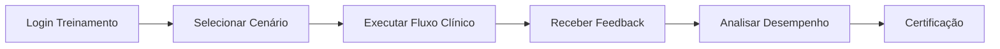
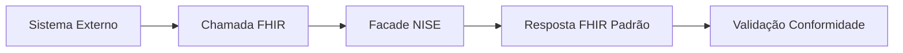

# ESPECIFICAÇÃO FUNCIONAL: MÓDULO NISE - TREINAMENTO ASSISTIDO

## 📌 ID: NISE-FUNC-001
## 🎯 Domínio: Treinamento Assistido e Simulação FHIR
## 📅 Data: 12/02/2026
## 👤 Responsável: Arquiteto/Product Owner
## ⚠️ Prioridade: MÉDIA (Planejamento Futuro)
## ⏱️ Estimativa PO: 60 horas

## 1. CONTEXTO E JUSTIFICATIVA

### 1.1. Homenagem a Nise da Silveira
**Por que Nise?**
- Psiquiatra brasileira pioneira na terapia ocupacional
- Método "aprender fazendo" e desenvolvimento de habilidades
- Representa paciência, observação e método prático de ensino
- Alinhado com filosofia de treinamento assistido

### 1.2. Objetivo do Módulo
Criar um ambiente de **treinamento assistido** para:
1. **Simulação realista** do sistema INTELLICARE
2. **Treinamento de profissionais** de saúde
3. **Validação de integrações** FHIR
4. **Testes de cenários clínicos complexos**
5. **Capacitação em interoperabilidade** RNDS/SUS

## 2. ARQUITETURA TÉCNICA

### 2.1. Stack Tecnológica
```
┌─────────────────────────────────────────────┐
│           MÓDULO NISE (Treinamento)         │
├─────────────────────────────────────────────┤
│  FastAPI + fhir.resources + psycopg         │
│  PostgreSQL (schema dedicado)               │
│  pgvector para RAG no treinamento           │
│  Docker para isolamento                     │
│  Integração com Ollama/n8n                  │
└─────────────────────────────────────────────┘
```

### 2.2. Banco de Dados Dedicado
**Schema PostgreSQL exclusivo para treinamento**:
```sql
-- Schema separado para não interferir com produção
CREATE SCHEMA nise_training;

-- Tabelas FHIR normalizadas
CREATE TABLE nise_training.patients (
    id SERIAL PRIMARY KEY,
    fhir_id VARCHAR(64) UNIQUE,
    name_given VARCHAR(100),
    name_family VARCHAR(100),
    birth_date DATE,
    gender VARCHAR(20),
    cns VARCHAR(15),  -- Cartão Nacional de Saúde
    data JSONB        -- FHIR Patient completo
);

CREATE TABLE nise_training.observations (
    id SERIAL PRIMARY KEY,
    fhir_id VARCHAR(64) UNIQUE,
    patient_ref VARCHAR(64),
    code_loinc VARCHAR(20),
    code_text TEXT,
    value_quantity NUMERIC,
    effective_date DATE,
    data JSONB        -- FHIR Observation completo
);
```

### 2.3. Facade FHIR em Python
**Exposição de endpoints REST FHIR padrão**:
```python
# Endpoints FHIR compatíveis
GET    /fhir/Patient/{id}          # Buscar paciente
GET    /fhir/Patient?name={nome}   # Buscar por nome
GET    /fhir/Observation/{id}      # Buscar observação
POST   /fhir/Patient              # Criar paciente (simulação)
GET    /fhir/metadata             # CapabilityStatement
```

## 3. DADOS DE TREINAMENTO

### 3.1. Fontes de Dados Sintéticos

#### 3.1.1. Dados Brasileiros (RNDS/SUS)
```python
# Características:
- CPFs/CNS válidos (algoritmo módulo 11)
- Nomes brasileiros (Faker pt_BR)
- Municípios IBGE
- Códigos LOINC/SNOMED BR
- ValueSets oficiais RNDS
```

#### 3.1.2. Volumes Iniciais
```
✅ 5.000 pacientes sintéticos
✅ 20.000 observações (RELs)
✅ 1.000 profissionais de saúde
✅ 500 consultas simuladas
✅ 100 cenários clínicos complexos
```

### 3.2. Scripts de Geração
```python
# generate_rnds_data.py
- Gera pacientes com CNS válido
- Gera RELs (Resultados de Exame Laboratorial)
- Adere a perfis RNDS FHIR
- Usa códigos LOINC/SNOMED oficiais
```

## 4. CASOS DE USO PRINCIPAIS

### 4.1. UC-NISE-001: Treinamento de Profissionais
**Objetivo**: Capacitar profissionais no uso do INTELLICARE
**Fluxo**:


### 4.2. UC-NISE-002: Simulação de Integração FHIR
**Objetivo**: Testar integrações com sistemas externos
**Fluxo**:


### 4.3. UC-NISE-003: Cenários Clínicos Complexos
**Objetivo**: Treinar tomada de decisão em casos complexos
**Exemplos**:
- Paciente com HAS + Diabetes + DRC
- Interações medicamentosas complexas
- Emergências hipertensivas
- Descompensação diabética

### 4.4. UC-NISE-004: Validação RNDS/SUS
**Objetivo**: Garantir conformidade com padrões brasileiros
**Itens validados**:
- Formato CNS
- Códigos municipais IBGE
- ValueSets oficiais
- Perfis FHIR RNDS

## 5. INTEGRAÇÕES

### 5.1. Com Módulos Existentes
```
Florence (Exames) → NISE (Treinamento exames)
Oswaldo (Doenças crônicas) → NISE (Treinamento gestão)
Geralda (Acompanhamento) → NISE (Treinamento follow-up)
Wanda (Orquestração) → NISE (Treinamento fluxos)
```

### 5.2. Com Ferramentas de IA
```
Ollama: RAG para suporte ao treinamento
n8n: Automação de fluxos de treinamento
pgvector: Busca semântica em cenários
```

### 5.3. Com Sistemas Externos
```
FHIR Servers (hapi.fhir.org)
RNDS Homologação
Sistemas TASY/PACS simulados
```

## 6. COMPONENTES DO MÓDULO

### 6.1. Backend (FastAPI)
```
src/nise/
├── api/
│   ├── fhir_routes.py      # Endpoints FHIR
│   ├── training_routes.py  # Endpoints treinamento
│   └── simulation_routes.py # Endpoints simulação
├── services/
│   ├── fhir_service.py     # Lógica FHIR
│   ├── training_service.py # Lógica treinamento
│   └── data_generator.py   # Geração dados sintéticos
├── models/
│   ├── fhir_models.py      # Modelos FHIR
│   └── training_models.py  # Modelos treinamento
└── database/
    └── connections.py      # Conexão PostgreSQL
```

### 6.2. Banco de Dados
```sql
-- Schema nise_training
├── patients              # Pacientes sintéticos
├── observations          # Observações/RELs
├── practitioners         # Profissionais saúde
├── encounters            # Consultas simuladas
├── conditions            # Condições clínicas
├── medications           # Medicamentos
├── procedures            # Procedimentos
└── training_scenarios    # Cenários de treinamento
```

### 6.3. Frontend (Opcional - Futuro)
```
Interface web para:
- Seleção de cenários
- Execução de treinamentos
- Visualização de resultados
- Dashboard de desempenho
```

## 7. FLUXOS DE TREINAMENTO

### 7.1. Fluxo Básico de Treinamento
```yaml
etapa_1_selecao:
  - Login no ambiente de treinamento
  - Selecionar perfil (médico, enfermeiro, técnico)
  - Escolher módulo (Florence, Oswaldo, etc)
  - Selecionar cenário clínico

etapa_2_execucao:
  - Executar fluxo clínico completo
  - Interagir com sistema simulado
  - Tomar decisões clínicas
  - Registrar ações

etapa_3_avaliacao:
  - Receber feedback automático
  - Analisar erros cometidos
  - Verificar conformidade com protocolos
  - Obter pontuação

etapa_4_certificacao:
  - Atingir pontuação mínima
  - Completar todos os cenários obrigatórios
  - Receber certificado de capacitação
```

### 7.2. Cenários de Dificuldade Progressiva
```yaml
nivel_iniciante:
  - Casos simples (hipertensão estágio 1)
  - Fluxos lineares
  - Feedback imediato
  - Dicas contextuais

nivel_intermediario:
  - Casos complexos (múltiplas comorbidades)
  - Decisões com trade-offs
  - Integração entre módulos
  - Validação de protocolos

nivel_avancado:
  - Emergências clínicas
  - Recursos limitados
  - Pressão de tempo
  - Tomada de decisão sob estresse
```

## 8. MÉTRICAS DE SUCESSO

### 8.1. Métricas de Treinamento
```
✅ Taxa de conclusão: > 90%
✅ Tempo médio por cenário: < 30 minutos
✅ Pontuação média: > 80%
✅ Satisfação do usuário: > 4.5/5
```

### 8.2. Métricas Técnicas
```
✅ Latência FHIR API: < 100ms
✅ Disponibilidade: 99.9%
✅ Volume de dados: 10k+ registros
✅ Conformidade FHIR: 100%
```

### 8.3. Métricas de Negócio
```
✅ Redução de erros em produção: > 50%
✅ Tempo de onboarding: reduzido em 70%
✅ Adoção de novos protocolos: acelerada em 60%
✅ Conformidade regulatória: garantida
```

## 9. ROADMAP DE IMPLEMENTAÇÃO

### Fase 1: MVP (Mês 1)
```
✅ Semana 1-2: Infraestrutura básica
  - Schema PostgreSQL dedicado
  - FastAPI facade FHIR
  - Scripts de dados sintéticos básicos

✅ Semana 3-4: Funcionalidades core
  - Endpoints FHIR Patient/Observation
  - Geração dados RNDS
  - Integração básica com Florence
```

### Fase 2: Treinamento Assistido (Mês 2)
```
⏳ Semana 5-6: Sistema de treinamento
  - Cenários clínicos estruturados
  - Feedback automático
  - Dashboard de desempenho

⏳ Semana 7-8: Integrações avançadas
  - Todos os módulos INTELLICARE
  - Ollama para suporte RAG
  - n8n para automação fluxos
```

### Fase 3: Produção (Mês 3)
```
⏳ Semana 9-10: Refinamento
  - Otimização performance
  - Expansão cenários
  - Melhoria feedback

⏳ Semana 11-12: Go-live
  - Treinamento equipes
  - Monitoramento
  - Coleta feedback
```

## 10. RISCOS E MITIGAÇÕES

### 10.1. Riscos Técnicos
| Risco | Probabilidade | Impacto | Mitigação |
|-------|---------------|---------|-----------|
| Performance FHIR facade | Média | Alto | Cache, índices, otimização queries |
| Qualidade dados sintéticos | Baixa | Médio | Validação com especialistas clínicos |
| Integração com módulos existentes | Média | Alto | APIs bem definidas, testes de integração |

### 10.2. Riscos Operacionais
| Risco | Probabilidade | Impacto | Mitigação |
|-------|---------------|---------|-----------|
| Adoção pelos usuários | Média | Alto | Gamificação, incentivos, facilidade de uso |
| Manutenção cenários | Alta | Médio | Ferramentas de autoria, reutilização |
| Atualização conforme mudanças regulatórias | Alta | Alto | Processo ágil, monitoramento RNDS |

## 11. PRÓXIMOS PASSOS

### Imediatos (Esta Semana):
1. **Incluir no roadmap** do projeto INTELLICARE
2. **Definir responsável** técnico para o módulo
3. **Estimar recursos** necessários
4. **Priorizar** em relação a outros módulos

### Curto Prazo (Próximas 2 Semanas):
5. **Criar especificação técnica** detalhada
6. **Definir arquitetura** de integração
7. **Estimar cronograma** realista
8. **Alocar budget** (se necessário)

### Médio Prazo (1 Mês):
9. **Iniciar implementação** após aprovação
10. **Desenvolver MVP**
11. **Testar com usuários piloto**
12. **Coletar feedback** para ajustes

---

## 📊 RESUMO DO VALOR

### Para o INTELLICARE:
✅ **Ambiente seguro** para treinamento sem risco a produção
✅ **Validação antecipada** de integrações e protocolos
✅ **Capacitação escalável** de profissionais
✅ **Conformidade garantida** com padrões RNDS/SUS

### Para os Usuários:
✅ **Aprendizado prático** em ambiente controlado
✅ **Feedback imediato** sobre decisões clínicas
✅ **Preparação para situações complexas**
✅ **Certificação** de competências

### Para a Organização:
✅ **Redução de erros** em produção
✅ **Aceleração de adoção** de novos protocolos
✅ **Padronização** de práticas clínicas
✅ **Compliance regulatório** facilitado

---

**STATUS**: 📄 **ESPECIFICAÇÃO FUNCIONAL INICIAL CRIADA**
**PRÓXIMO PASSO**: **INCLUIR NO ROADMAP E DEFINIR PRIORIDADE**

**OBSERVAÇÃO**: Este módulo representa uma **evolução estratégica** do INTELLICARE, transformando-o de um sistema operacional para uma **plataforma completa de capacitação** em saúde digital.
