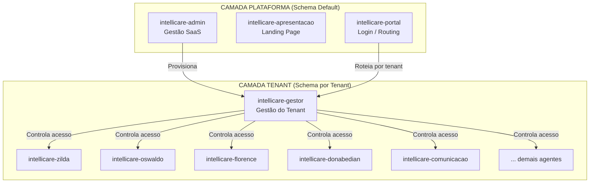
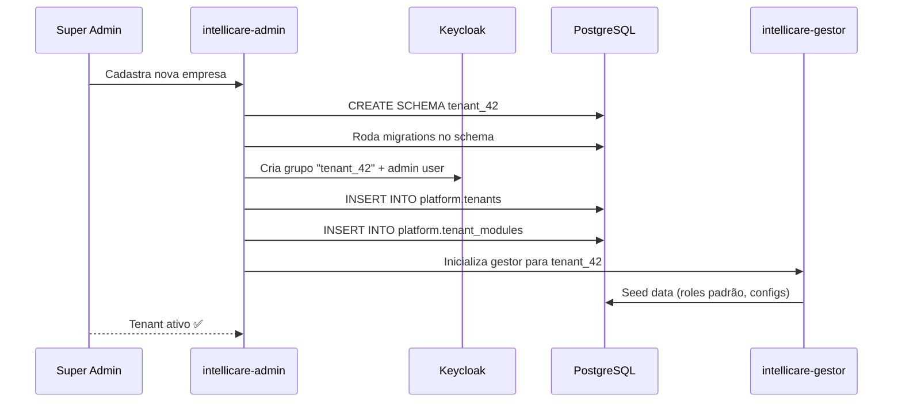

# Análise de Impacto — Multi-Tenancy no IntelliCare

> **Data:** 2026-02-20 | **Autor:** Antigravity AI  
> **Escopo:** Avaliação arquitetural de todos os módulos da modularização

---

## 1. Contexto

A modularização atual do IntelliCare já oferece **isolamento funcional** entre módulos (Zilda, Oswaldo, Florence, Comunicação, etc.), cada um com seu próprio repositório, API e configuração. Porém, todos operam sob a premissa de **um único tenant** (uma organização/hospital). Para atender múltiplas organizações na mesma infra (**multi-tenancy**), precisamos expandir essa separação em **duas camadas de governança**.

---

## 2. Arquitetura de 2 Camadas



### 2.1 — Classificação dos Módulos

| Camada | Módulo | Schema | Responsabilidade |
|---|---|---|---|
| **Plataforma** | `intellicare-admin` 🆕 | `default` / `platform` | Cadastro de empresas, planos, billing, super-admin |
| **Plataforma** | `intellicare-apresentacao` | `default` | Landing page, marketing, onboarding |
| **Plataforma** | `intellicare-portal` | `default` | Login, roteamento JWT → tenant |
| **Plataforma** | `intellicare-auth` | Keycloak (realm único) | SSO, JWT com claim `tenant_id` |
| **Tenant** | `intellicare-gestor` 🆕 | `tenant_{id}` | Gestão de usuários, permissões, configurações do tenant |
| **Tenant** | `intellicare-zilda` | `tenant_{id}` | Validação CNES, dados do estabelecimento |
| **Tenant** | `intellicare-oswaldo` | `tenant_{id}` | Perfis epidemiológicos |
| **Tenant** | `intellicare-florence` | `tenant_{id}` | Indicadores assistenciais |
| **Tenant** | `intellicare-donabedian` | `tenant_{id}` | Qualidade (7 Pilares) |
| **Tenant** | `intellicare-comunicacao` | `tenant_{id}` | SMS, Email, WhatsApp, Push |
| **Tenant** | `intellicare-geralda` | `tenant_{id}` | Atenção primária |
| **Tenant** | `intellicare-wanda` | `tenant_{id}` | Assistente IA |

---

## 3. `intellicare-admin` — Módulo de Administração (NOVO)

### O que controla:

| Funcionalidade | Descrição |
|---|---|
| **Cadastro de Empresas** | CRUD de tenants (hospital, UBS, clínica) |
| **Planos e Billing** | Tipo de plano, limites de uso, cobrança |
| **Provisionamento** | Criar schema, seed data, ativar módulos |
| **Super-Admin** | Impersonar tenant, auditoria global, métricas |
| **Módulos Ativos** | Controlar quais módulos cada tenant contratou |
| **Limites de Uso** | Nº de usuários, SMS/mês, storage |

### Dados no schema `platform`:

```
platform.tenants           → id, nome, cnpj, plano, status, created_at
platform.tenant_plans      → id, nome, modulos_inclusos, limites, preco
platform.billing_records   → tenant_id, periodo, valor, status_pagamento
platform.tenant_modules    → tenant_id, module_name, enabled, config_json
platform.audit_global      → quem fez o que, quando, em qual tenant
```

---

## 4. `intellicare-gestor` — Módulo de Gestão do Tenant (NOVO)

### O que controla:

| Funcionalidade | Descrição |
|---|---|
| **Usuários do Tenant** | CRUD de profissionais (médicos, enfermeiros, admin-local) |
| **Permissões (RBAC)** | Quem acessa qual módulo, qual funcionalidade |
| **Setores/Unidades** | Estrutura organizacional interna |
| **Configurações** | Preferências do tenant (canais de comunicação, templates) |
| **Dashboards** | Visão gerencial para o admin-local |
| **Auditoria Local** | Logs de acesso dos profissionais do tenant |

### Dados no schema `tenant_{id}`:

```
tenant_{id}.users          → id, keycloak_id, nome, cargo, setor, ativo
tenant_{id}.roles          → id, nome, permissoes_json
tenant_{id}.user_roles     → user_id, role_id
tenant_{id}.sectors        → id, nome, tipo (UTI, enfermaria, etc.)
tenant_{id}.preferences    → chave, valor (configs do tenant)
tenant_{id}.audit_local    → user_id, acao, recurso, timestamp
```

---

## 5. Fluxo de Onboarding



---

## 6. Estratégia de Isolamento de Dados

| Tipo de Dado | Estratégia | Justificativa |
|---|---|---|
| Dados clínicos (pacientes) | **Schema por tenant** | LGPD — isolamento máximo |
| Configurações do tenant | **Schema por tenant** | Personalização por empresa |
| Logs de comunicação | **Schema por tenant** | Volume alto, isolamento necessário |
| Cadastro de empresas | **Schema `platform`** | Dado da plataforma, não do tenant |
| Billing/Financeiro | **Schema `platform`** | Operação SaaS centralizada |
| Métricas/Prometheus | **Label `tenant`** | Compartilhado com filtro |
| Cache Redis | **Prefixo `tenant:{id}:`** | Isolamento lógico |

---

## 7. Impacto por Módulo (Atualizado)

| Módulo | Impacto | Esforço | Prioridade |
|---|---|---|---|
| `intellicare-core` | 🔴 Alto | 3-5 dias | P0 |
| `intellicare-auth` | 🟡 Médio | 2-3 dias | P0 |
| `intellicare-admin` 🆕 | 🔴 Alto (novo) | 8-12 dias | P0 |
| `intellicare-gestor` 🆕 | 🔴 Alto (novo) | 6-8 dias | P1 |
| `intellicare-portal` | 🟡 Médio | 3-4 dias | P1 |
| `intellicare-comunicacao` | 🔴 Alto | 5-7 dias | P1 |
| `intellicare-zilda` | 🟡 Médio | 2-3 dias | P2 |
| Demais agentes (×6) | 🟡 Médio | 2-3 dias cada | P2 |
| Infra (DB/Redis/KC) | 🟡 Médio | 3-4 dias | P0 |
| **TOTAL** |  | **~45-60 dias** |  |

---

## 8. O Que Já Temos a Favor

1. **Módulos independentes** — cada um com API/config separados
2. **`BaseModuleConfig`** — ponto central para injetar `tenant_id`
3. **Keycloak** — basta adicionar claim `tenant_id` no JWT
4. **Schemas PostgreSQL** — já usamos schema por módulo, extensível para schema por tenant
5. **`intellicare-apresentacao`** — já existe como módulo de plataforma
6. **`intellicare-portal`** — já faz roteamento, expande para roteamento por tenant

---

## 9. Riscos

> [!WARNING]
> - **LGPD:** Dados clínicos entre tenants NUNCA devem vazar. Schema isolation é obrigatório.
> - **Migrations:** Cada tenant precisa de migrations independentes (script de provisionamento automatizado).
> - **Billing:** Precisa definir modelo de cobrança antes de implementar (por usuário? por módulo? por uso?).
> - **Onboarding automático:** Sem automação, o custo operacional de adicionar tenants escala linearmente.

---

## 10. Roadmap Sugerido

| Fase | Entrega | Estimativa |
|---|---|---|
| **F0** | `TenantContext` no core + claim KC + infra DB | 1 semana |
| **F1** | `intellicare-admin` (CRUD tenants, provisioning) | 2 semanas |
| **F2** | `intellicare-gestor` (RBAC local, config tenant) | 1.5 semanas |
| **F3** | Portal multi-tenant (login → routing → tenant) | 1 semana |
| **F4** | Adaptar comunicação + módulos clínicos | 2 semanas |
| **F5** | Billing + dashboards + auditoria global | 2 semanas |
