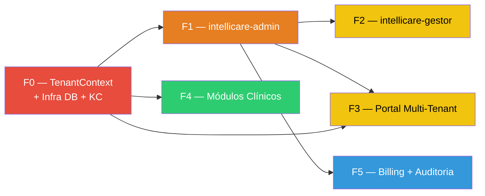

# Multi-Tenancy — Desenvolvimento

> Índice de fases para adequação multi-tenant do IntelliCare.

---

## Mapa de Dependências

## Tabela de Dependências e Paralelização

| Fase | Depende de | Pode rodar em paralelo com | DEVs sugeridos |
|---|---|---|---|
| **F0** | Nenhuma (base) | — | DEV 1 (core) |
| **F1** | F0 | F4 (após F0 pronto) | DEV 2 |
| **F2** | F0, F1 | F3, F5 | DEV 2 ou DEV 3 |
| **F3** | F0, F1 | F2, F4 | DEV 3 (frontend) |
| **F4** | F0 | F1, F3 | DEV 1 ou DEV 4 |
| **F5** | F1 | F2, F4 | DEV 5 |

> [!IMPORTANT]
> **F0 é bloqueante para TODAS as fases.** Após F0, até 3 DEVs podem trabalhar em paralelo.

---

## Fases

| Fase | Diretório | Status | Estimativa |
|---|---|---|---|
| [F0 — TenantContext + Infra](./F0_TENANT_CONTEXT/) | `F0_TENANT_CONTEXT/` | ⏳ Pendente | 1 semana |
| [F1 — intellicare-admin](./F1_INTELLICARE_ADMIN/) | `F1_INTELLICARE_ADMIN/` | ⏳ Pendente | 2 semanas |
| [F2 — intellicare-gestor](./F2_INTELLICARE_GESTOR/) | `F2_INTELLICARE_GESTOR/` | ⏳ Pendente | 1.5 semanas |
| [F3 — Portal Multi-Tenant](./F3_PORTAL_MULTI_TENANT/) | `F3_PORTAL_MULTI_TENANT/` | ⏳ Pendente | 1 semana |
| [F4 — Módulos Clínicos](./F4_MODULOS_CLINICOS/) | `F4_MODULOS_CLINICOS/` | ⏳ Pendente | 2 semanas |
| [F5 — Billing + Auditoria](./F5_BILLING_AUDITORIA/) | `F5_BILLING_AUDITORIA/` | ⏳ Pendente | 2 semanas |

---

## Indice de Arquivos (Atual)

### F0_TENANT_CONTEXT
- `20260220-0915_ESPECIFICACAO_FUNCIONAL.md`
- `20260220-0916_ESPECIFICACAO_TECNICA.md`
- `20260220-0833_PLANO_IMPLEMENTACAO.md`

### F1_INTELLICARE_ADMIN
- `20260220-0835_ESPECIFICACAO_FUNCIONAL.md`
- `20260220-0835_ESPECIFICACAO_TECNICA.md`
- `20260220-0835_PLANO_IMPLEMENTACAO.md`

### F2_INTELLICARE_GESTOR
- `20260220-0839_ESPECIFICACAO_FUNCIONAL.md`
- `20260220-0839_ESPECIFICACAO_TECNICA.md`
- `20260220-0839_PLANO_IMPLEMENTACAO.md`

### F3_PORTAL_MULTI_TENANT
- `20260220-0917_ESPECIFICACAO_FUNCIONAL.md`
- `20260220-0918_ESPECIFICACAO_TECNICA.md`
- `20260220-0840_PLANO_IMPLEMENTACAO.md`

### F4_MODULOS_CLINICOS
- `20260220-0841_ESPECIFICACAO_FUNCIONAL.md`
- `20260220-0842_ESPECIFICACAO_TECNICA.md`
- `20260220-0842_PLANO_IMPLEMENTACAO.md`

### F5_BILLING_AUDITORIA
- `20260220-0843_ESPECIFICACAO_FUNCIONAL.md`
- `20260220-0843_ESPECIFICACAO_TECNICA.md`
- `20260220-0843_PLANO_IMPLEMENTACAO.md`

---

## Estrutura de cada Fase

Cada pasta contém 3 documentos obrigatórios:

| Documento | Propósito | Público Alvo |
|---|---|---|
| `YYYYMMDD-HHMM_ESPECIFICACAO_FUNCIONAL.md` | **O que** fazer — Requisitos, regras de negócio, fluxos | PO, DEV, QA |
| `YYYYMMDD-HHMM_ESPECIFICACAO_TECNICA.md` | **Como** fazer — Arquitetura, classes, contratos, SQL | DEV |
| `YYYYMMDD-HHMM_PLANO_IMPLEMENTACAO.md` | **Quando** fazer — Tasks, ordem, critérios de aceite | DEV, Planner |
