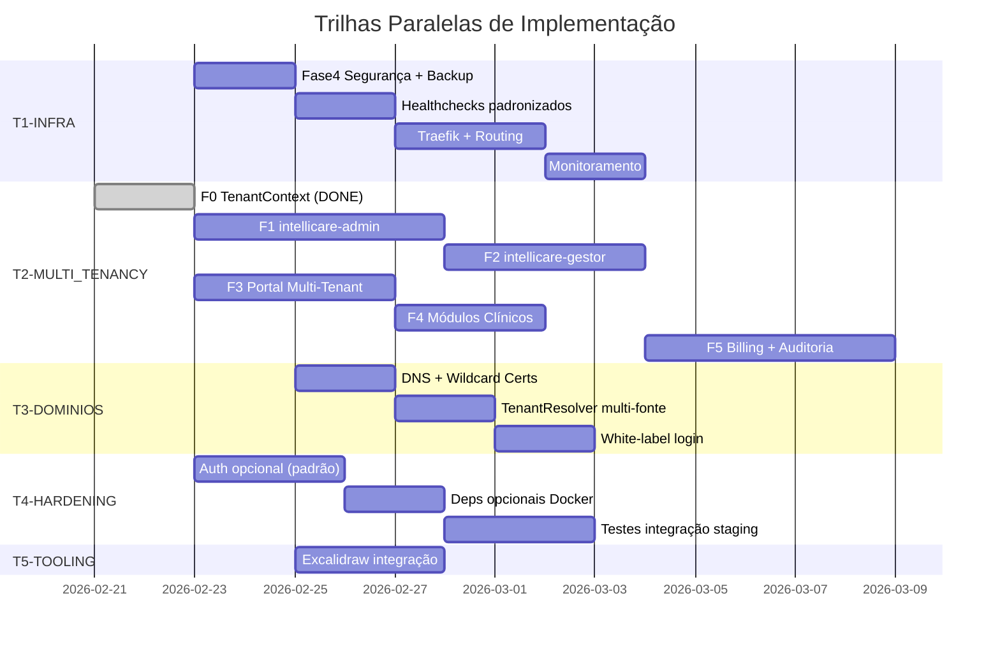

# Roadmap de Implementação Paralela

**Criado:** 2026-02-22 19:46  
**Objetivo:** Organizar todas as frentes pendentes em trilhas paralelas com fases independentes.

---

## Visão Geral das Trilhas

## Regra de Paralelismo

| Trilha | Depende de | Pode iniciar com |
|--------|-----------|-------------------|
| **T1-INFRA** | Nenhuma | Imediatamente |
| **T2-MULTI_TENANCY** | F0 (✅ done) | F1+F3 em paralelo agora |
| **T3-DOMINIOS** | T1 (Traefik) parcial | DNS pode iniciar agora |
| **T4-HARDENING** | Nenhuma | Imediatamente |
| **T5-TOOLING** | Nenhuma | Imediatamente |

## Prioridade Recomendada

| Prioridade | Trilha | Justificativa |
|-----------|--------|---------------|
| 🔴 Urgente | **T1-INFRA** (Fase4 Segurança) | Servidor exposto, risco zero de quebrar código |
| 🔴 Urgente | **T4-HARDENING** (Auth opcional) | Containers unhealthy, já tem padrão definido |
| 🟡 Alta | **T2-MULTI_TENANCY** (F1+F3) | Core do produto, F0 já está pronto |
| 🟢 Normal | **T3-DOMINIOS** | Precisa de T1.Traefik primeiro |
| 🟢 Normal | **T5-TOOLING** | Nice-to-have, zero impacto em prod |
