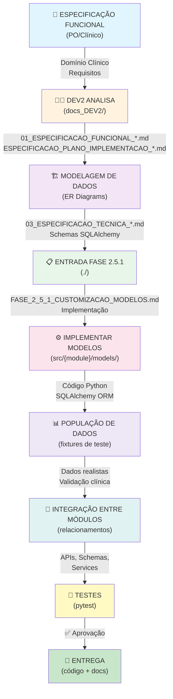

# 🔗 INTEGRAÇÃO: PROCESSO DEV2 + FASE 2.5.1

**Objetivo**: Conectar o processo DEV2 (especificação técnica) com a Fase 2.5.1 (implementação de modelos)

---

## 🏗️ FLUXO INTEGRADO



---

## 📋 MAPEAMENTO: DOCUMENTAÇÃO DEV2 → FASE 2.5.1

### **Entrada (Do Process DEV2)**
```
docs_DEV2/
├── 01_FLORENCE_ESPECIFICACAO_FUNCIONAL.md
│   └── Requisitos clínicos (Análise Clínica)
├── 01_FLORENCE_ESPECIFICACAO_PLANO_IMPLEMENTACAO.md
│   └── Diagramas ER + Relacionamentos
└── 01_FLORENCE_ESPECIFICACAO_TECNICA.md
    └── Schemas SQLAlchemy prontos
```

### **Processamento (Fase 2.5.1)**
```
./
├── FASE_2_5_1_CUSTOMIZACAO_MODELOS.md
│   └── Templates por domínio (baseados em DEV2)
└── intellicare-florence/
    └── src/florence/
        ├── models/
        │   ├── __init__.py
        │   └── clinical_analysis.py  ← Implementação da spec
        ├── schemas/
        │   └── clinical_analysis.py  ← Validação Pydantic
        └── api/routes/
            └── clinical.py           ← Endpoints
```

### **Saída (Entrega)**
```
./
├── intellicare-florence/
│   └── src/florence/              [Código + Testes]
├── MODELOS_IMPLEMENTADOS.md       [Registro]
├── TESTES_EXECUTADOS.md           [Validação]
└── DOCUMENTACAO_COMPLETA.md       [Entrega Final]
```

---

## 🔄 CICLO POR MÓDULO (FASE 2.5.1)

### **Passo 1: DEV2 Fornece Especificação**
```markdown
📄 docs_DEV2/
├── 01_FLORENCE_ESPECIFICACAO_FUNCIONAL.md
│   - ID: DEV2-FUNC-001
│   - Domínio: Análise Clínica
│   - Entidades principais
│   - Fluxos clínicos
│   - Validações clínicas
│   - Dados de teste
│
├── 01_FLORENCE_ESPECIFICACAO_PLANO_IMPLEMENTACAO.md
│   - Diagrama ER (mermaid)
│   - Normalização (1FN, 2FN, 3FN)
│   - Schemas SQL
│   - Relacionamentos
│   - Índices e performance
│
└── 01_FLORENCE_ESPECIFICACAO_TECNICA.md
    - Schemas SQLAlchemy (pronto para usar)
    - APIs REST endpoints
    - Validações Pydantic
    - Exemplo de implementação
```

**Checklist DEV2**:
- [ ] Especificação funcional completa
- [ ] Diagrama ER validado clinicamente
- [ ] Schemas SQL otimizados
- [ ] Exemplos de dados de teste
- [ ] Documentação clínica-técnica

---

### **Passo 2: Implementação (Fase 2.5.1)**

**A. Copiar Especificação DEV2**
```bash
# Diretório pronto para receber specs DEV2
cd C:\DOCSHARE\INTELLICARE\intellicare-florence\docs/
# Copiar 01_ESPECIFICACAO_FUNCIONAL_*.md
# Copiar ESPECIFICACAO_PLANO_IMPLEMENTACAO_*.md
# Copiar 03_ESPECIFICACAO_TECNICA_*.md
```

**B. Implementar Modelos**
```python
# src/florence/models/clinical_analysis.py
# Baseado em 01_FLORENCE_ESPECIFICACAO_TECNICA.md

from sqlalchemy import Column, String, Float, DateTime, ForeignKey
from .base import BaseModel

class ClinicalAnalysis(BaseModel):
    """Implementação da spec DEV2-FUNC-001"""
    __tablename__ = "clinical_analyses"
    
    # Campos especificados em DEV2
    patient_id = Column(String, ForeignKey("patients.id"), nullable=False)
    analysis_type = Column(String, nullable=False)  # enum de ESPECIFICACAO_PLANO_IMPLEMENTACAO
    result = Column(String, nullable=False)
    # ... validações de 01_ESPECIFICACAO_FUNCIONAL
```

**C. Criar Schemas de Validação**
```python
# src/florence/schemas/clinical_analysis.py
# Baseado em 01_FLORENCE_ESPECIFICACAO_TECNICA.md

from pydantic import BaseModel, validator

class ClinicalAnalysisCreate(BaseModel):
    patient_id: str
    analysis_type: str
    result: str
    
    # Validações clínicas de 01_ESPECIFICACAO_FUNCIONAL
    @validator('analysis_type')
    def validate_type(cls, v):
        valid_types = ["Lab", "Image", "Physical"]  # de DEV2
        if v not in valid_types:
            raise ValueError(f"Tipo inválido: {v}")
        return v
```

**D. Criar APIs**
```python
# src/florence/api/routes/clinical.py
# Endpoints de 01_FLORENCE_ESPECIFICACAO_TECNICA.md

@router.post("/api/v1/clinical/analysis")
async def create_analysis(
    analysis: ClinicalAnalysisCreate,
    db: Session = Depends(get_db)
):
    """Criar análise clínica (conforme DEV2-FUNC-001)"""
    # Implementação de regras clínicas de 01_ESPECIFICACAO_FUNCIONAL
```

---

### **Passo 3: Testes com Dados Realistas**

**A. Usar dados de teste de DEV2**
```python
# tests/test_clinical_analysis.py
# Dados de 01_ESPECIFICACAO_FUNCIONAL

TEST_CASES = {
    "paciente_45_anos": {  # Caso clínico de DEV2
        "paciente": {"nome": "João Silva", "idade": 45},
        "analise": {"tipo": "Lab", "resultado": "Normal"},
        "esperado": "✅ Aprovado"
    },
    "paciente_68_anos": {  # Caso clínico de DEV2
        "paciente": {"nome": "Maria Santos", "idade": 68},
        "analise": {"tipo": "Lab", "resultado": "Crítico"},
        "esperado": "⚠️ Alerta"
    }
}
```

**B. Validar regras clínicas**
```python
# Validações de 01_ESPECIFICACAO_FUNCIONAL
assert analise.resultado in ["Normal", "Anormal", "Crítico"]
assert analise.paciente.idade >= 0
assert analise.data_coleta <= datetime.now()
```

---

### **Passo 4: Documentação de Entrega**

**Criar**:
```markdown
# DOCUMENTACAO_FLORENCE_COMPLETA.md

## Origem: DEV2
- [ ] Especificação Funcional
- [ ] Modelagem de Dados
- [ ] Especificação Técnica

## Implementação: Fase 2.5.1
- [ ] Modelos SQLAlchemy
- [ ] Schemas Pydantic
- [ ] APIs REST
  - [ ] GET /api/v1/clinical/analysis/{id}
  - [ ] POST /api/v1/clinical/analysis
  - [ ] PUT /api/v1/clinical/analysis/{id}
  - [ ] DELETE /api/v1/clinical/analysis/{id}

## Testes
- [ ] Testes unitários (95%+ cobertura)
- [ ] Testes de integração
- [ ] Validações clínicas

## Dados
- [ ] Dados de teste (100 pacientes)
- [ ] Fixtures realistas
- [ ] Anonimização (100%)

## Conformidade
- [ ] Regras clínicas implementadas
- [ ] Alertas automáticos funcionando
- [ ] Performance < 100ms
```

---

## 📊 CRONOGRAMA INTEGRADO

### Timeline por Módulo (3.5h cada)

| Módulo | DEV2 Prepara | Fase 2.5.1 Implementa | Testes | Entrega |
|--------|--------------|----------------------|--------|---------|
| **Florence** | 01_FUNC + 02_MOD + 03_TEC | Modelos + Schemas + API | pytest | Código + Docs |
| **Oswaldo** | 01_FUNC + 02_MOD + 03_TEC | Modelos + Schemas + API | pytest | Código + Docs |
| **Auth** | 01_FUNC + 02_MOD + 03_TEC | Modelos + Schemas + API | pytest | Código + Docs |
| **Zilda** | 01_FUNC + 02_MOD + 03_TEC | Modelos + Schemas + API | pytest | Código + Docs |
| **Geralda** | 01_FUNC + 02_MOD + 03_TEC | Modelos + Schemas + API | pytest | Código + Docs |
| **Comunicação** | 01_FUNC + 02_MOD + 03_TEC | Modelos + Schemas + API | pytest | Código + Docs |
| **Portal** | 01_FUNC + 02_MOD + 03_TEC | Modelos + Schemas + API | pytest | Código + Docs |
| **Wanda** | 01_FUNC + 02_MOD + 03_TEC | Modelos + Schemas + API | pytest | Código + Docs |

---

## 🎯 HANDOFF DEV2 → FASE 2.5.1

### O que DEV2 deve entregar:

```markdown
# ENTREGÁVEIS DEV2

Para cada módulo ({module}):

1. 📄 01_ESPECIFICACAO_FUNCIONAL_{module}.md
   - ID: DEV2-FUNC-###
   - Entidades principais com atributos
   - Regras clínicas e validações
   - Fluxos de dados
   - Dados de teste (casos clínicos)
   - Integrações com outros módulos

2. 📊 02_OSWALDO_ESPECIFICACAO_PLANO_IMPLEMENTACAO_{module}.md
   - Diagrama ER (mermaid)
   - Tabelas em SQL
   - Relacionamentos e cardinalidades
   - Índices e constraints
   - Normalização validada

3. ⚙️ 03_ESPECIFICACAO_TECNICA_{module}.md
   - Schemas SQLAlchemy (código pronto)
   - Schemas Pydantic
   - Endpoints REST
   - Exemplos de payload
   - Regras de validação em código

4. 📋 04_PLANO_{module}.md
   - Timeline
   - Dependências entre tabelas
   - Dados iniciais (seed data)
   - Checklist de testes
```

### O que Fase 2.5.1 faz com isso:

```markdown
# PROCESSO FASE 2.5.1

1. Receber documentação DEV2
2. Copiar schema SQLAlchemy → models/{domain}.py
3. Copiar schema Pydantic → schemas/{domain}.py
4. Implementar rotas → api/routes/{domain}.py
5. Criar testes com dados de DEV2 → tests/
6. Validar integrações → services/
7. Executar testes → pytest
8. Gerar documentação de entrega
```

---

## 🚀 COMECE AQUI

### 1. Para DEV2 (Clínico/Arquiteto):
```bash
cd C:\DOCSHARE\INTELLICARE\Documentacao\consolidacao\docs_DEV2\

# Use os templates:
# - template_01_ESPECIFICACAO_FUNCIONAL.md
# - template_02_OSWALDO_ESPECIFICACAO_PLANO_IMPLEMENTACAO.md
# - template_03_ESPECIFICACAO_TECNICA.md

# Comece com Florence (Análise Clínica)
# Crie: 01_FLORENCE_ESPECIFICACAO_FUNCIONAL.md
```

### 2. Para Fase 2.5.1 (Dev):
```bash
cd C:\DOCSHARE\INTELLICARE\

# Aguarde especificações DEV2
# Quando receober, comece:
# 1. Copiar 01_FLORENCE_ESPECIFICACAO_TECNICA.md → docs/
# 2. Implementar models/clinical_analysis.py
# 3. Implementar schemas/clinical_analysis.py
# 4. Implementar api/routes/clinical.py
# 5. Rodar testes: pytest tests/
```

---

## 📌 CHECKLIST INTEGRAÇÃO

### DEV2 Antes de Passar para Fase 2.5.1:
- [ ] Especificação Funcional completa (todos os campos)
- [ ] Diagrama ER validado com clínico
- [ ] Normalização aprovada (3FN)
- [ ] Schemas SQLAlchemy prontos para copiar
- [ ] Dados de teste realistas (casos clínicos)
- [ ] Casos de erro mapeados
- [ ] Integrações identificadas

### Fase 2.5.1 Ao Receber:
- [ ] Copiar documentação DEV2 para docs/
- [ ] Criar models baseado em schema
- [ ] Criar schemas Pydantic baseado em spec técnica
- [ ] Criar APIs baseado em endpoints DE DEV2
- [ ] Criar testes baseado em dados de teste
- [ ] Validar regras clínicas funcionam
- [ ] Executar testes: pytest
- [ ] Documentar entrega

---

## 🎓 EXEMPLO: FLORENCE

### DEV2 Fornece:
```
docs_DEV2/
├── 01_FLORENCE_ESPECIFICACAO_FUNCIONAL.md
│   ├── Entidade: ClinicalAnalysis
│   ├── Atributos: analysis_type, result, value, status
│   ├── Regra clínica: "Resultado crítico gera alerta"
│   └── Dados teste: Paciente 45 anos com glicemia anormal
│
├── 01_FLORENCE_ESPECIFICACAO_PLANO_IMPLEMENTACAO.md
│   ├── Tabela: clinical_analyses
│   ├── FK: patient_id
│   ├── Índice: (patient_id, analysis_date)
│   └── Constraint: CHECK (status IN (...))
│
└── 01_FLORENCE_ESPECIFICACAO_TECNICA.md
    ├── Model SQLAlchemy (pronto para copiar)
    ├── Schema Pydantic (pronto para copiar)
    ├── Endpoint: POST /api/v1/clinical/analysis
    └── Validação: glicemia entre 70-99 mg/dL
```

### Fase 2.5.1 Implementa:
```bash
# 1. Copiar spec técnica
cp docs_DEV2/01_FLORENCE_ESPECIFICACAO_TECNICA.md docs/

# 2. Criar models/clinical_analysis.py
# (copiar classe ClinicalAnalysis de 03_ESPECIFICACAO_TECNICA)

# 3. Criar schemas/clinical_analysis.py
# (copiar validações Pydantic de 03_ESPECIFICACAO_TECNICA)

# 4. Criar api/routes/clinical.py
# (implementar endpoints de 03_ESPECIFICACAO_TECNICA)

# 5. Criar tests/test_clinical_analysis.py
# (usar dados de 01_ESPECIFICACAO_FUNCIONAL)

# 6. Testar
pytest tests/test_clinical_analysis.py -v

# 7. Entregar
# ✅ código + documentação
```

---

**Status**: ✅ **PROCESSO INTEGRADO PRONTO**

*Use este documento para coordenar DEV2 (specs) com Fase 2.5.1 (implementação)*


